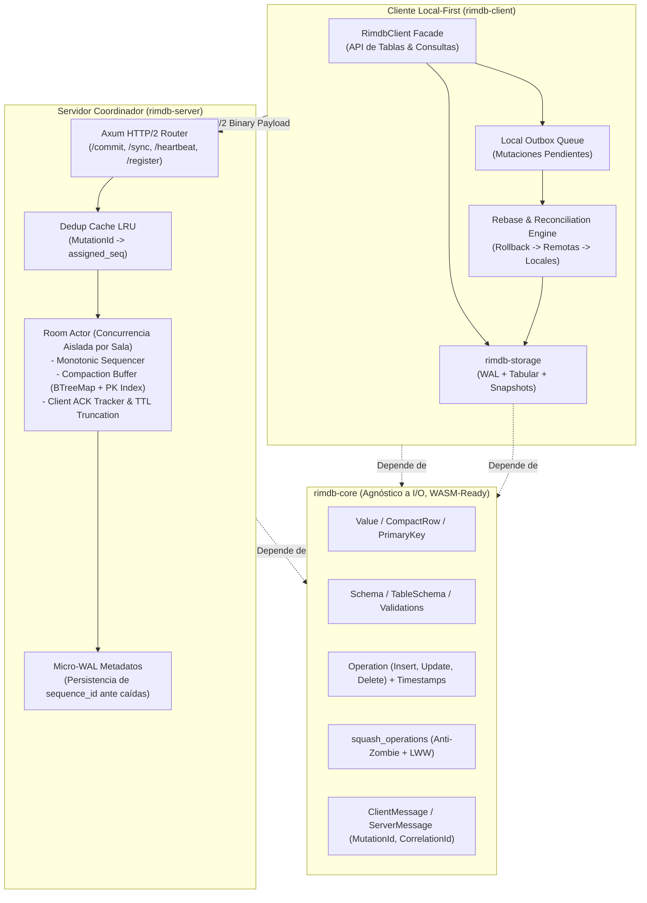

# PROPOSAL.md: Hoja de Ruta y Propuesta de Arquitectura Técnica

**Proyecto:** `RimDB` (Motor de Base de Datos Distribuida Local-First)  
**Fecha de Actualización:** 20 de Septiembre de 2026  
**Documentos Relacionados:** [ARCHITECTURE.md](file:///Users/Santiago/OtherProjects/client-distributed-db/ARCHITECTURE.md) | [EVALUATION.md](file:///Users/Santiago/OtherProjects/client-distributed-db/EVALUATION.md)  
**Estado:** Propuesta Técnica de Consenso — Fase 1 Completada / Fases 2 a 4 Planificadas

---

## 1. Cambios Ya Realizados

*A continuación se listan únicamente los títulos de los cambios técnicos y estructurales completados y verificados con veredicto unánime de los 4 subagentes:*

* Renombrado global del proyecto y de todos los paquetes a `rimdb` (`rimdb-core`, `rimdb-server`, `rimdb-client`).
* Eliminación total de asignaciones de cadenas en heap en `Ord for Value` mediante discriminante directo `type_order(&self) -> u8` en $O(1)$.
* Optimización de `PrimaryKey` en la pila de memoria (*stack*) utilizando `SmallVec<[Value; 2]>`.
* Incorporación de variantes de datos fundamentales: `Value::Null`, `Value::Timestamp(i64)` y `Value::Bytes(bytes::Bytes)` (*zero-copy*).
* Estructuración de tuplas posicionales densas mediante `CompactRow` (`Vec<Value>`) y mantención de `RowBuilder`.
* Validación estricta de columnas obligatorias no nulas (`nullable: false`) y rechazo de `Value::Null` explícito en `validate_row`.
* Validación exhaustiva de tipos de datos y aridad de componentes de clave primaria en `validate_update` y `validate_delete`.
* Implementación de la Regla Anti-Zombi en `squash_operations` (rechazo formal de operaciones `Update` sobre entidades con `Delete` previo).
* Incorporación de marca de tiempo (`timestamp: u64`) en `Operation::Insert` para simetría y resolución determinista Last-Write-Wins (LWW).
* Fusión de atributos campo por campo en colisiones `Update + Update` gobernada por resolución LWW.
* Contrato de red con identificador unívoco de mutación `MutationId: [u8; 16]` para idempotencia estricta (*Exactly-Once*) en `Commit` y `CommitAck`.
* Incorporación de identificador de correlación `CorrelationId: u64` para soporte de multiplexación asíncrona de solicitudes y respuestas.
* Mecanismos de control de flujo y paginación en streaming (`max_batch_size: u32` en `Sync` y bandera `has_more: bool` en `SyncBatch`).
* Blindaje defensivo del códec binario con límite de 16 MB contra ataques de agotamiento de memoria (DoS) mediante `bincode::DefaultOptions`.
* Ampliación de la suite de pruebas unitarias a 17 casos de prueba exhaustivos cubriendo todas las nuevas invariantes relacionales y de protocolo.
* Limpieza total de advertencias y pase sin fallos en `cargo clippy --workspace --all-targets -- -D warnings`.
* Auditoría técnica formal multidimensional con dictamen de **APROBADO** emitido independientemente por los 4 subagentes especialistas.
* Limpieza de directorios `.git` anidados e inicialización del repositorio Git raíz con `.gitignore` unificado.
* Centralización de `rimdb-core` en `[workspace.dependencies]` y herencia de dependencias en `rimdb-server` y `rimdb-client`.
* Activación de políticas de seguridad y lints de workspace con `unsafe_code = "forbid"` en todos los crates.
* Validación estricta y defensiva de aridad en `from_compact_row` retornando `ValidationError::CompactRowArityMismatch`.
* Incorporación de prueba unitaria negativa contra ataques DoS por mensajes que declaran exceder el límite de 16 MB.
* Documentación y recomendación formal del constructor `Operation::insert_with_timestamp` con marcas de tiempo monótonas o HLC.

---

## 2. Resumen Ejecutivo del Estado del Proyecto

RimDB ha superado con éxito la **Fase 1 (Reestructuración y Blindaje de Core)**. El crate [`rimdb-core`](file:///Users/Santiago/OtherProjects/client-distributed-db/crates/core) ha sido saneado de todos los anti-patrones críticos identificados en la evaluación inicial:
- Se eliminó el overhead de CPU y memoria en ordenamiento de valores.
- Se cerró la anomalía de consistencia de tuplas zombi en el algoritmo de squashing.
- Se consolidó el contrato de red con garantías formales de idempotencia y multiplexación.
- Se mantiene el desacoplamiento estricto de I/O, garantizando que el núcleo compile hacia WebAssembly (`wasm32-unknown-unknown`).

El proyecto se encuentra ahora en posición para avanzar hacia la implementación de las capas de persistencia local en disco, concurrencia por actores en el servidor y sincronización optimista reactiva en el cliente.

---

## 3. Arquitectura del Sistema (Consenso de 4 Crates)

El sistema se estructura en 4 crates con fronteras de responsabilidad estrictas:

```
┌─────────────────────────────────────────────────────────────────────────────────────────┐
│                                 ESPACIO DE TRABAJO RIMDB                                │
├────────────────────────────────┬────────────────────────────────────────────────────────┤
│ Crate                          │ Responsabilidad y Restricciones                         │
├────────────────────────────────┼────────────────────────────────────────────────────────┤
│ 1. `crates/core`               │ Dominio puro, tipos (`Value`, `CompactRow`), esquemas, │
│    (`rimdb-core`)              │ operaciones, squashing, protocolo binario. Cero I/O.   │
│                                │ Compatible con WASM (`wasm32-unknown-unknown`).        │
├────────────────────────────────┼────────────────────────────────────────────────────────┤
│ 2. `crates/storage`            │ Motor de persistencia tabular local. Formato de archivo │
│    (`rimdb-storage`)           │ `room_{id}.rimdb`, Write-Ahead Log (WAL) con CRC32,    │
│    [PENDIENTE - FASE 2]        │ índice primario en RAM y snapshots con `zstd`.         │
├────────────────────────────────┼────────────────────────────────────────────────────────┤
│ 3. `crates/server`             │ Servidor coordinador y secuenciador monótono. Modelo de │
│    (`rimdb-server`)            │ actores Tokio por sala (*Room*), buffer efímero con     │
│    [PENDIENTE - FASE 3]        │ squashing, dedup LRU, micro-WAL y HTTP/2 sobre Axum.   │
├────────────────────────────────┼────────────────────────────────────────────────────────┤
│ 4. `crates/client`             │ Biblioteca y motor Local-First para aplicaciones.       │
│    (`rimdb-client`)            │ Fachada reactiva, Outbox local, pipeline de rebase     │
│    [PENDIENTE - FASE 4]        │ optimista, transporte dual (Nativo HTTP/2 / Fetch Web). │
└────────────────────────────────┴────────────────────────────────────────────────────────┘
```



---

## 4. Catálogo Detallado de Cambios Pendientes

A partir de los informes técnicos de evaluación y verificación emitidos por los subagentes, se detallan a continuación las tareas e implementaciones que restan por ejecutar agrupadas por componente y fase:

### 4.1. Higiene del Workspace y Configuración Base (Inmediato)

* **Limpieza de submódulos Git anidados:**
  Eliminar los directorios residuales `.git/` presentes dentro de `crates/core`, `crates/server` y `crates/client` para unificar el control de versiones en el repositorio raíz.
* **Inicialización del repositorio Git raíz:**
  Inicializar un repositorio Git unificado en la raíz del workspace con un `.gitignore` estándar para Rust (ignorando `/target`, `*.rimdb`, `*.wal`, `.DS_Store`, etc.).
* **Centralización de dependencias internas en Cargo:**
  Declarar `rimdb-core = { path = "crates/core" }` en `[workspace.dependencies]` del archivo raíz [`Cargo.toml`](file:///Users/Santiago/OtherProjects/client-distributed-db/Cargo.toml) para que `rimdb-server`, `rimdb-client` y el futuro `rimdb-storage` consuman la versión canónica vía `{ workspace = true }`.
* **Configuración de lints corporativos de workspace:**
  Agregar la sección `[workspace.lints.rust]` en el `Cargo.toml` raíz con `unsafe_code = "forbid"` para garantizar la seguridad de memoria de todo el código de almacenamiento y red.

### 4.2. Refinamientos Pendientes en `rimdb-core`

* **Validación defensiva de aridad en `from_compact_row`:**
  Añadir validación explícita para rechazar conversiones si la longitud de valores en `CompactRow` no coincide exactamente con el número de columnas definidas en `TableSchema`:
  ```rust
  if compact.values.len() != self.columns.len() {
      return Err(ValidationError::CompactRowArityMismatch {
          table: self.name.clone(),
          expected: self.columns.len(),
          actual: compact.values.len(),
      });
  }
  ```
* **Constructores de operaciones con sellado temporal obligatorio:**
  Desaconsejar o deprecicar el uso de `Operation::insert` con timestamp en cero. Integrar un constructor primario que exija marca temporal monótona o Reloj Lógico Híbrido (HLC).
* **Evolución hacia Newtypes para identificadores de dominio:**
  Reemplazar los alias `type RoomId = String` y `type ClientId = String` por structs tipo tupla opacos (`pub struct RoomId(pub String);`, `pub struct ClientId(pub String);`) para prevenir errores de inversión de argumentos en tiempo de compilación.
* **Prueba unitaria negativa de DoS en `lib.rs`:**
  Incorporar un test unitario que verifique que intentar decodificar un payload binario que declare un tamaño mayor a `MAX_MESSAGE_SIZE` retorne inmediatamente un error de límite de memoria sin intentar alocar buffers en heap.
* **Evaluación de política LWW a nivel de Celda (CRDT Celular):**
  Si el caso de uso requiere que múltiples clientes modifiquen campos disjuntos de la misma tupla de forma concurrente preservando procedencias temporales independientes por campo, migrar `Operation::Update` a `fields: BTreeMap<String, FieldMutation>` donde `FieldMutation { value: Value, timestamp: u64 }`.

---

### 4.3. Motor de Almacenamiento Local: `rimdb-storage` (Fase 2)

* **Creación del crate `crates/storage` (`rimdb-storage`):**
  Configurar el manifiesto `Cargo.toml` con dependencias: `rimdb-core`, `tokio`, `async-trait`, `zstd`, `crc32fast`, `thiserror`, `bytes`.
* **Definición del contrato `trait StorageEngine`:**
  Interfaz asíncrona desacoplada que soportará tanto la implementación en disco como el backend en memoria para pruebas:
  ```rust
  #[async_trait]
  pub trait StorageEngine: Send + Sync {
      async fn open_room(&self, room_id: &str, schema: Schema) -> Result<(), StorageError>;
      async fn append_wal(&self, room_id: &str, op: &SequencedOperation) -> Result<u64, StorageError>;
      async fn get_by_pk(&self, room_id: &str, table: &str, pk: &PrimaryKey) -> Result<Option<CompactRow>, StorageError>;
      async fn scan_table(&self, room_id: &str, table: &str) -> Result<Vec<(PrimaryKey, CompactRow)>, StorageError>;
      async fn create_snapshot(&self, room_id: &str) -> Result<Vec<u8>, StorageError>;
      async fn apply_snapshot(&self, room_id: &str, snapshot_data: &[u8]) -> Result<(), StorageError>;
      async fn get_last_synced_seq(&self, room_id: &str) -> Result<u64, StorageError>;
      async fn set_last_synced_seq(&self, room_id: &str, seq: u64) -> Result<(), StorageError>;
  }
  ```
* **Formato de archivo tabular nativo por sala (`room_{id}.rimdb`):**
  - **Cabecera (Header):** Magic bytes (`RIM1`), versión de formato (`u16`), identificador de esquema, `snapshot_seq: u64`, `head_seq: u64`.
  - **Bloque de Snapshot Base:** Dump binario consolidado de las tuplas de todas las tablas comprimido con Zstandard.
  - **Bloque Append-Only Delta Log (WAL):** Segmento al final del archivo donde cada mutación local commiteada o remota recibida se agrega secuencialmente precedida por su longitud en bytes (`u32`) y suma de verificación CRC32 (`u32`).
* **Índice primario en memoria con recuperación por Replay:**
  Al inicializar una sala, leer el snapshot base y reproducir (*replay*) el WAL secuencialmente para levantar en memoria un mapa de punteros rápidos `HashMap<(TableName, PrimaryKey), FileOffset>` para resolución de lecturas en $O(1)$.
* **Exportador y restaurador de snapshots con Zstandard (`zstd`):**
  Módulos de compresión y descompresión de streaming para permitir volcados compactos del estado completo de la sala.
* **Worker de compactación local en segundo plano:**
  Lógica de mantenimiento que, cuando el tamaño del segmento WAL supera 3 veces el tamaño del snapshot base, genera un nuevo snapshot consolidado y trunca el log sin bloquear las lecturas locales.
* **Mock en memoria (`MemoryStorageEngine`):**
  Implementación sobre `BTreeMap` en memoria para ejecución veloz de pruebas unitarias y de integración sin tocar el sistema de archivos.

---

### 4.4. Servidor de Coordinación: `rimdb-server` (Fase 3)

* **Modelo de Concurrencia: Actor Tokio por Sala (`RoomActor`):**
  - Cada sala activa es gestionada por un actor independiente ejecutándose en su propia tarea de Tokio, recibiendo comandos a través de un canal `mpsc::Sender<RoomCommand>`.
  - Concurrencia libre de bloqueos (*lock-free sharding*): sin contención de cerrojos (`RwLock`/`Mutex`) entre diferentes salas.
* **Secuenciador Monótono Atómico:**
  Asignación determinista de un `sequence_id` continuo y estrictamente incremental para cada mutación aceptada en la sala.
* **Caché LRU de deduplicación de mutaciones:**
  Registro de los últimos $N$ `mutation_id` procesados en la sala con su `assigned_seq` correspondiente para garantizar semántica **Exactly-Once** y responder idempotentemente ante reintentos de red del cliente.
* **Buffer de compactación en memoria con índice de claves primarias:**
  Buffer estructurado mediante `BTreeMap<u64, SequencedOperation>` y un índice secundario de `PrimaryKey` para resolver consultas `/sync` mediante búsqueda por rango y ejecutar squashing de operaciones redundantes sobre clientes retrasados.
* **Micro-WAL de persistencia de secuencia:**
  Persistencia ultraligera y asíncrona del último `sequence_id` emitido en disco para resistir reinicios o caídas inesperadas del proceso servidor sin perder la monotonía de la secuencia.
* **Router y Endpoints HTTP/2 en Axum:**
  - `POST /rooms/{room_id}/register`: Registro inicial del cliente, retorno del `head_seq` actual y validación de compatibilidad de esquemas.
  - `POST /rooms/{room_id}/commit`: Recepción de mutación binaria con `MutationId`, validación contra esquema, secuenciación atómica y retorno de `CommitAck`.
  - `POST /rooms/{room_id}/sync`: Petición de deltas a partir de `last_ack_seq`, empaquetado paginado (`max_batch_size`) y envío de `SyncBatch`.
  - `POST /rooms/{room_id}/heartbeat`: Actualización del cursor `last_ack_seq` del cliente para la gestión de retención del log.
  - `GET /rooms/{room_id}/events`: Canal Server-Sent Events (SSE) para notificar inmediatamente a clientes en línea sobre la existencia de nuevos deltas disponibles.
* **Tarea periódica de retención y purga (Eviction Worker):**
  Cálculo periódico del cursor mínimo activo entre los clientes conectados (`min_ack_seq`) y truncado seguro de las mutaciones del buffer en memoria con secuencia menor o igual a dicho valor.

---

### 4.5. Biblioteca Cliente y Reconciliación: `rimdb-client` (Fase 4)

* **Fachada ergonómica de usuario (`RimdbClient`, `Database`, `TableHandle`):**
  API tipada para aplicaciones Rust:
  ```rust
  let db = RimdbClient::open("room_42", config).await?;
  let users = db.table("users")?;
  
  // Inserción optimista local inmediata (<1ms de latencia)
  let pk = users.insert(row).await?;
  
  // Consulta directa sobre almacenamiento local
  let user = users.get(&pk).await?;
  ```
* **Cola de salida local persistente (*Outbox*):**
  Almacenamiento de mutaciones locales pendientes de confirmación en disco. Cada mutación recibe un `mutation_id` persistente y sobrevive al cierre o caída de la aplicación cliente.
* **Pipeline de reconciliación y *Rebase* local optimista:**
  Algoritmo transaccional para procesar deltas remotos del servidor cuando el cliente tiene mutaciones locales pendientes:
  1. *Rollback temporal:* Deshace el efecto de las mutaciones optimistas locales aún no commiteadas.
  2. *Aplicar remotas:* Aplica el lote de `SequencedOperation` recibido del servidor en estricto orden monótono.
  3. *Re-aplicar locales:* Re-ejecuta secuencialmente las operaciones locales de la cola Outbox sobre el nuevo estado base.
  4. *Notificación:* Emite eventos de mutación a los suscriptores reactivos de la interfaz de usuario.
* **Capa de transporte desacoplada (`trait TransportClient`):**
  - Implementación nativa con `reqwest` utilizando HTTP/2 persistente.
  - Implementación web mediante llamadas a la API `fetch` de navegador usando `web-sys` bajo compilación WebAssembly (`cfg(target_arch = "wasm32")`).
* **Gestor de arranque con Snapshot Base:**
  Mecanismo para que clientes recién instalados o con un cursor demasiado atrasado (*BehindCompaction*) descarguen directamente el snapshot consolidado de la sala en vez de procesar deltas masivos.

---

### 4.6. Pruebas de Integración de Extremo a Extremo y Verificación E2E (Fase 5)

* **Suite de integración Cliente-Servidor:**
  Simulación de red en local con múltiples instancias de `RimdbClient` interactuando contra un `rimdb-server` en Tokio.
* **Pruebas de tolerancia a particiones y modo offline:**
  Verificación de clientes que operan sin red, generan escrituras optimistas locales, se reconectan y ejecutan el pipeline de rebase convergiendo deterministamente con el resto del cluster.
* **Pruebas de estrés y límites de carga:**
  Comprobación de la barrera de 16 MB con paquetes maliciosos, límites de paginación con deltas masivos y validación de retención del buffer de compactación bajo saturación.
* **Validación de compilación cruzada hacia WebAssembly:**
  Ejecución de `cargo build --target wasm32-unknown-unknown -p rimdb-core` y `cargo check --target wasm32-unknown-unknown -p rimdb-client --no-default-features --features wasm` en el pipeline de integración continua.

---

## 5. Cronograma Secuencial de Implementación (Roadmap)

```
┌─────────────────────────────────────────────────────────────────────────────┐
│ FASE 1: Core Refactoring & Hotfixes [COMPLETADA Y AUDITADA]                 │
│ [x] Corrección de Ord for Value sin alocaciones en heap (O(1)).             │
│ [x] PrimaryKey en stack con SmallVec y tuplas densas CompactRow.            │
│ [x] Tipos fundamentales Null, Timestamp y Bytes (zero-copy).                │
│ [x] Validación estricta de esquemas, columnas requeridas y tipos de PK.     │
│ [x] Implementación de Regla Anti-Zombi y timestamps simétricos en squashing.│
│ [x] Contrato de protocolo con MutationId, CorrelationId y paginación.       │
│ [x] Blindaje DoS a 16MB y 15 pruebas unitarias exhaustivas en rimdb-core.   │
├─────────────────────────────────────────────────────────────────────────────┤
│ FASE 1.5: Higiene de Workspace y Preparación Inmediata [COMPLETADA]         │
│ [x] Eliminar directorios .git anidados en crates/core, server y client.     │
│ [x] Inicializar repositorio Git unificado en la raíz con .gitignore.        │
│ [x] Centralizar rimdb-core en [workspace.dependencies] del Cargo.toml raíz. │
│ [x] Configurar [workspace.lints.rust] con unsafe_code = "forbid".           │
│ [x] Añadir validación de aridad en from_compact_row y test negativo de DoS. │
├─────────────────────────────────────────────────────────────────────────────┤
│ FASE 2: Motor de Almacenamiento Local (rimdb-storage)                       │
│ [ ] Crear el crate crates/storage (rimdb-storage) con dependencias base.    │
│ [ ] Definir el contrato formal trait StorageEngine.                         │
│ [ ] Implementar formato de archivo room_{id}.rimdb con header mágico RIM1.  │
│ [ ] Implementar Write-Ahead Log (WAL) append-only con checksums CRC32.      │
│ [ ] Implementar índice primario en RAM y reconstrucción vía replay.         │
│ [ ] Implementar compresión/descompresión de snapshots con Zstandard (zstd). │
│ [ ] Implementar worker de compactación en segundo plano y mock en memoria.  │
├─────────────────────────────────────────────────────────────────────────────┤
│ FASE 3: Servidor Coordinador y Secuenciador (rimdb-server)                  │
│ [ ] Implementar actor de Tokio por Room (concurrencia sin cerrojos globales)│
│ [ ] Implementar secuenciador monótono atómico de mutaciones por sala.       │
│ [ ] Implementar caché LRU de deduplicación de MutationId (Exactly-Once).    │
│ [ ] Implementar buffer de compactación en RAM con índice de claves primarias│
│ [ ] Implementar Micro-WAL para persistencia de sequence_id ante caídas.     │
│ [ ] Implementar router y handlers HTTP/2 en Axum (/commit, /sync, etc.).    │
│ [ ] Implementar tarea de retención de log basada en ACK y canal SSE.        │
├─────────────────────────────────────────────────────────────────────────────┤
│ FASE 4: Cliente Local-First y Reconciliación (rimdb-client)                 │
│ [ ] Diseñar la fachada pública RimdbClient, Database y TableHandle.         │
│ [ ] Implementar cola de salida local Outbox con persistencia en storage.    │
│ [ ] Desarrollar el pipeline de Rebase optimista (rollback -> apply -> redo).│
│ [ ] Implementar adaptadores de red TransportClient (Reqwest HTTP/2 / WASM). │
│ [ ] Implementar onboarding de salas mediante descarga de snapshots base.    │
├─────────────────────────────────────────────────────────────────────────────┤
│ FASE 5: Pruebas de Integración E2E y Universalidad                          │
│ [ ] Batería de pruebas E2E multi-cliente con simulación de particiones.     │
│ [ ] Pruebas de estrés y límites de carga de memoria y concurrencia.         │
│ [ ] Validación de compilación para navegadores web (wasm32-unknown-unknown).│
└─────────────────────────────────────────────────────────────────────────────┘
```

---

## 6. Matriz de Trazabilidad Técnica

La siguiente tabla mapea el origen de cada requerimiento pendiente según la recomendación del especialista correspondiente y el componente de destino:

| Requerimiento Técnico Pendiente | Especialista Proponente | Crate Destino | Prioridad |
| :--- | :--- | :--- | :---: |
| Limpieza de `.git` anidados e inicialización raíz | Arquitectura / Rust | Workspace raíz | **Alta** |
| Centralización de `rimdb-core` en dependencias de workspace | Arquitectura | Workspace raíz | **Alta** |
| Activación de lint `unsafe_code = "forbid"` | Arquitectura | Workspace raíz | **Media** |
| Validación de aridad defensiva en `from_compact_row` | Base de Datos | `rimdb-core` | **Media** |
| Test unitario negativo para límite de tamaño DoS | Sistemas Distribuidos | `rimdb-core` | **Media** |
| Tipado estricto con Newtypes (`RoomId`, `ClientId`) | Arquitectura / Rust | `rimdb-core` | **Media** |
| Creación de `trait StorageEngine` e implementación tabular | Base de Datos / Arq. | `rimdb-storage` | **Alta** |
| Write-Ahead Log (WAL) con suma de verificación CRC32 | Base de Datos / Arq. | `rimdb-storage` | **Alta** |
| Snapshots comprimidos con `zstd` | Base de Datos | `rimdb-storage` | **Alta** |
| Modelo de actores Tokio por sala (*Room Actor*) | Sist. Distribuidos / Arq. | `rimdb-server` | **Alta** |
| Caché LRU de deduplicación por `MutationId` | Sist. Distribuidos | `rimdb-server` | **Alta** |
| Micro-WAL de secuencias para tolerancia a caídas | Sist. Distribuidos / DB | `rimdb-server` | **Media** |
| Cola Outbox persistente y pipeline de Rebase local | Sist. Distribuidos / DB | `rimdb-client` | **Alta** |
| Abstracción de transporte dual Nativo (HTTP/2) y WASM (Fetch) | Arquitectura | `rimdb-client` | **Alta** |
| Batería de pruebas E2E de partición y concurrencia | Sist. Distribuidos / Rust | Workspace / Tests | **Alta** |
