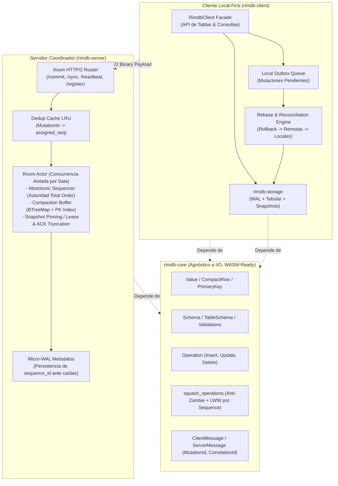

# ROADMAP.md: Hoja de Ruta de Implementación de RimDB

**Proyecto:** `RimDB` (Motor de Base de Datos Distribuida Local-First)  
**Fecha de Actualización:** 20 de Septiembre de 2026  
**Documentos Relacionados:** [ARCHITECTURE.md](file:///Users/Santiago/OtherProjects/client-distributed-db/ARCHITECTURE.md) | [EVALUATION.md](file:///Users/Santiago/OtherProjects/client-distributed-db/EVALUATION.md)  
**Estado:** Hoja de Ruta Oficial de Desarrollo — Fase 1 & 1.5 Completadas / Fases 2 a 5 Planificadas

---

## 1. Cambios Ya Realizados

*A continuación se listan únicamente los títulos de los cambios técnicos y estructurales completados y verificados con veredicto unánime de los 4 subagentes:*

* Renombrado global del proyecto y de todos los paquetes a `rimdb` (`rimdb-core`, `rimdb-server`, `rimdb-client`).
* Eliminación total de asignaciones de cadenas en heap en `Ord for Value` mediante discriminante directo `type_order(&self) -> u8` en $O(1)$.
* Optimización de `Value` con footprint estricto de 24 bytes en 64 bits mediante boxing de variantes pesadas (`String(Box<str>)` y `Bytes(Box<Bytes>)`), reduciendo el consumo de memoria un 40% en tuplas y celdas.
* Optimización de `PrimaryKey` en la pila de memoria (*stack*) a **40 bytes** utilizando `SmallVec<[Value; 1]>`, eliminando totalmente el desbordamiento de línea de caché de CPU (*Zero L1 Cache Line Split*, $40\text{B} < 64\text{B}$).
* Incorporación de variantes de datos fundamentales: `Value::Null`, `Value::Timestamp(i64)` y `Value::Bytes(Box<Bytes>)` (*zero-copy*).
* Preservación del orden físico DDL de declaración en `TableSchema` (`columns: Vec<ColumnDef>`), eliminando el desorden alfabético en `CompactRow` y blindando la compatibilidad binaria en migraciones de esquema.
* Incorporación de conversiones zero-copy por movimiento en esquemas (`row_into_compact` y `compact_into_row`).
* Estructuración de tuplas posicionales densas mediante `CompactRow` (`Vec<Value>`) y mantención de `RowBuilder`.
* Validación estricta de columnas obligatorias no nulas (`nullable: false`) y rechazo de `Value::Null` explícito en `validate_row`.
* Validación exhaustiva de tipos de datos y aridad de componentes de clave primaria en `validate_update` y `validate_delete`.
* Rediseño de `Operation` desacoplando metadata plana (`table`, `pk`, `timestamp`) del payload específico en `OperationKind` (`Insert`, `Update`, `Delete`).
* Corrección del fallo crítico de pérdida de datos en `squash_operations` (Regla 5) ante inserciones retrasadas, y ampliación semántica formal con `SquashOutcome::Discarded`.
* Implementación de la Regla Anti-Zombi en `squash_operations` (rechazo formal de operaciones `Update` sobre entidades con `Delete` previo).
* Incorporación de marca de tiempo (`timestamp: u64`) en `Operation` para consistencia interna en cola Outbox offline y LWW.
* Fusión de atributos campo por campo en colisiones `Update + Update`.
* Contrato de red con identificador unívoco de mutación `MutationId: [u8; 16]` para idempotencia estricta (*Exactly-Once*) en `Commit` y `CommitAck`.
* Incorporación de identificador de correlación `CorrelationId: u64` para soporte de multiplexación asíncrona de solicitudes y respuestas.
* Mecanismos de control de flujo y paginación en streaming (`max_batch_size: u32` en `Sync` y bandera `has_more: bool` en `SyncBatch`).
* Blindaje defensivo del códec binario con límite de 16 MB contra ataques de agotamiento de memoria (DoS) mediante `bincode::DefaultOptions`.
* Ampliación de la suite de pruebas unitarias a 22 casos de prueba en `rimdb-core` cubriendo tamaño de memoria en 64 bits, L1 cache line limits, orden DDL y no-pérdida de datos.
* Limpieza total de advertencias y pase sin fallos en `cargo clippy --workspace --all-targets -- -D warnings`.
* Auditoría técnica formal multidimensional con certificación de **APROBADO** emitida unánimemente por los subagentes especialistas.
* Limpieza de directorios `.git` anidados e inicialización del repositorio Git raíz con `.gitignore` unificado.
* Centralización de `rimdb-core` en `[workspace.dependencies]` y herencia de dependencias en `rimdb-server` y `rimdb-client`.
* Activación de políticas de seguridad y lints de workspace con `unsafe_code = "forbid"` en todos los crates.
* Validación estricta y defensiva de aridad en `from_compact_row` retornando `ValidationError::CompactRowArityMismatch`.
* Incorporación de prueba unitaria negativa contra ataques DoS por mensajes que declaran exceder el límite de 16 MB.
* Formalización en arquitectura de la autoridad suprema del secuenciador central (`sequence_id`) para ordenamiento determinista Total Order.
* Implementación de Newtypes de dominio fuertemente tipados (`RoomId`, `ClientId`, `SequenceNumber`, `MutationId`, `CorrelationId`) con `#[serde(transparent)]` y ergonomía `Deref` en `rimdb-core`.
* Modelado de mutaciones posicionales de alta densidad: `ColumnUpdate { column_idx: u16, value: Value }` (32 bytes exactos) e `OperationKind` acotado estrictamente a 32 bytes en memoria.
* Desacoplamiento de metadata de tabla: unidad de almacenamiento interna `TableOperation` (`pk`, `timestamp`, `kind`) de **80 bytes exactos** (0 bytes padding), ahorrando un 47.4% de memoria en los buffers del servidor.
* Envoltorio de transporte y frontera pública `Operation` de **96 bytes exactos** (`table: Arc<str>`, `op: TableOperation`) con implementación de `Deref<Target = TableOperation>` para compatibilidad transparente y sin boilerplate.
* Particionado físico de mutaciones en memoria: estructura `TableBuffer` para aislamiento por tabla, eliminación de contención de locks entre tablas y squashing local $O(1)$ amortizado por PK.
* Invariante de orden ascendente en `ColumnUpdate` que habilita fusión determinista de deltas en $O(M + N)$ sin asignaciones de heap intermedias.
* Semántica zero-copy con transferencia por movimiento de propiedad (`drain(..)`) en `squash_table_operations`, erradicando clonaciones innecesarias de strings y bytes.
* Capa ergonómica en `TableSchema` con `SchemaUpdateBuilder`, `to_table_insert`, `to_table_update`, `to_operation_insert`, `to_operation_update`, y métodos bidireccionales `compact_update_fields` / `expand_update_fields`.
* Reducción de ancho de banda de red en más de un 50% al erradicar los nombres de columnas repetidos en cada tupla serializada en Bincode.
* Incorporación de soporte nativo para `DataType::Uuid` y `Value::Uuid([u8; 16])` con parseo de 32/36 caracteres hexadecimales, formateo canónico 8-4-4-4-12, ordenamiento e integración transparente con claves primarias sin alocación en el heap.
* Suite de pruebas unitarias ampliada a 25 pruebas en `rimdb-core` con aserciones rigurosas de `size_of` en todos los structs y pase sin advertencias en `cargo clippy`.

---

## 2. Resumen Ejecutivo del Estado del Proyecto

RimDB ha superado con éxito la **Fase 1 y 1.5 (Reestructuración, Blindaje de Core e Higiene de Workspace)**. El crate [`rimdb-core`](file:///Users/Santiago/OtherProjects/client-distributed-db/crates/core) ha sido saneado de todos los anti-patrones críticos identificados en la evaluación inicial:
- Se redujo el footprint de memoria de `Value` en un 40% (24 bytes) y `PrimaryKey` a 40 bytes (ajustado a una línea de caché L1 de CPU).
- Se garantizó la estabilidad binaria de esquemas con orden DDL físico en `TableSchema` y conversiones zero-copy por movimiento.
- Se cerró la pérdida de datos y anomalías de tuplas zombi en `squash_operations`.
- Se consolidó el contrato de red con garantías formales de idempotencia y multiplexación.
- Se mantiene el desacoplamiento estricto de I/O, garantizando que el núcleo compile hacia WebAssembly (`wasm32-unknown-unknown`).
- Se formalizó en [`ARCHITECTURE.md`](file:///Users/Santiago/OtherProjects/client-distributed-db/ARCHITECTURE.md#10-architectural-decisions-time-ordering--authority) la decisión de diseño de que el **servidor es la única autoridad de ordenamiento global** mediante su `sequence_id` monótono, eliminando la complejidad innecesaria de sincronización de relojes (HLC).

El proyecto se encuentra ahora en posición para avanzar hacia la implementación de las capas de persistencia local en disco, concurrencia por actores en el servidor y sincronización optimista reactiva en el cliente.

---

## 3. Arquitectura del Sistema (Consenso de 4 Crates)

El sistema se estructura en 4 crates con fronteras de responsabilidad estrictas:

```
┌─────────────────────────────────────────────────────────────────────────────────────────┐
│                                 ESPACIO DE TRABAJO RIMDB                                │
├────────────────────────────────┬────────────────────────────────────────────────────────┤
│ Crate                          │ Responsabilidad y Restricciones                         │
├────────────────────────────────┼────────────────────────────────────────────────────────┤
│ 1. `crates/core`               │ Dominio puro, tipos (`Value`, `CompactRow`), esquemas, │
│    (`rimdb-core`)              │ operaciones, squashing, protocolo binario. Cero I/O.   │
│                                │ Compatible con WASM (`wasm32-unknown-unknown`).        │
├────────────────────────────────┼────────────────────────────────────────────────────────┤
│ 2. `crates/storage`            │ Motor de persistencia tabular local. Formato de archivo │
│    (`rimdb-storage`)           │ `room_{id}.rimdb`, Write-Ahead Log (WAL) con CRC32,    │
│    [PENDIENTE - FASE 2]        │ índice primario en RAM y snapshots con `zstd`.         │
├────────────────────────────────┼────────────────────────────────────────────────────────┤
│ 3. `crates/server`             │ Servidor coordinador y secuenciador monótono. Modelo de │
│    (`rimdb-server`)            │ actores Tokio por sala (*Room*), buffer efímero con     │
│    [PENDIENTE - FASE 3]        │ squashing, dedup LRU, micro-WAL y HTTP/2 sobre Axum.   │
├────────────────────────────────┼────────────────────────────────────────────────────────┤
│ 4. `crates/client`             │ Biblioteca y motor Local-First para aplicaciones.       │
│    (`rimdb-client`)            │ Fachada reactiva, Outbox local, pipeline de rebase     │
│    [PENDIENTE - FASE 4]        │ optimista, transporte dual (Nativo HTTP/2 / Fetch Web). │
└────────────────────────────────┴────────────────────────────────────────────────────────┘
```



---

## 4. Catálogo Detallado de Cambios Pendientes

A partir de los informes técnicos emitidos por los 4 subagentes especialistas, se detallan las implementaciones que restan por ejecutar en las siguientes fases:

### 4.1. Tipos de Datos Esenciales y Extensiones de Core (`rimdb-core`)

* **[COMPLETADO] Incorporación de `DataType::Uuid` y `Value::Uuid([u8; 16])`:**
  Soporte de identificadores únicos universales (UUID v4) como tipo primitivo nativo de 16 bytes sin alocación dinámica, fundamental para claves primarias en arquitecturas distribuidas, con formateo canónico 8-4-4-4-12 y parseo de cadenas sin dependencias externas.
* **Incorporación de `DataType::Decimal` y `Value::Decimal`:**
  Representación de punto fijo (`i128` mantissa, `u32` escala) o integración liviana para cálculos monetarios y contables libres de los errores de redondeo de `Float` (`f64`).
* **Definición de `trait CryptoEngine`:**
  Puerto de abstracción para que el cliente pueda inyectar la implementación de cifrado/descifrado simétrico (ej. ChaCha20-Poly1305 / AES-GCM) para columnas marcadas con `encrypted: true`, manteniendo `rimdb-core` puro y desacoplado de dependencias criptográficas pesadas.
* **Confirmación de Decisión de Ordenamiento:**
  Se descarta la implementación de Relojes Lógicos Híbridos (HLC) complejos. La autoridad suprema de ordenamiento reside en el `sequence_id` emitido por el servidor (ver [Sección 10 de ARCHITECTURE.md](file:///Users/Santiago/OtherProjects/client-distributed-db/ARCHITECTURE.md#10-architectural-decisions-time-ordering--authority)).

---

### 4.2. Motor de Almacenamiento Local: `rimdb-storage` (Fase 2)

* **Creación del crate `crates/storage` (`rimdb-storage`):**
  Configurar el manifiesto `Cargo.toml` con dependencias: `rimdb-core`, `tokio`, `async-trait`, `zstd`, `crc32fast`, `blake3`, `thiserror`, `bytes`.
* **Definición del contrato `trait StorageEngine`:**
  Interfaz asíncrona desacoplada que soportará tanto la implementación en disco como el backend en memoria para pruebas:
  ```rust
  #[async_trait]
  pub trait StorageEngine: Send + Sync {
      async fn open_room(&self, room_id: &str, schema: Schema) -> Result<(), StorageError>;
      async fn append_wal(&self, room_id: &str, op: &SequencedOperation) -> Result<u64, StorageError>;
      async fn get_by_pk(&self, room_id: &str, table: &str, pk: &PrimaryKey) -> Result<Option<CompactRow>, StorageError>;
      async fn scan_table(&self, room_id: &str, table: &str) -> Result<Vec<(PrimaryKey, CompactRow)>, StorageError>;
      async fn create_snapshot(&self, room_id: &str) -> Result<Vec<u8>, StorageError>;
      async fn apply_snapshot(&self, room_id: &str, snapshot_data: &[u8]) -> Result<(), StorageError>;
      async fn get_last_synced_seq(&self, room_id: &str) -> Result<u64, StorageError>;
      async fn set_last_synced_seq(&self, room_id: &str, seq: u64) -> Result<(), StorageError>;
  }
  ```
* **Formato de archivo tabular nativo por sala (`room_{id}.rimdb`):**
  - **Cabecera (Header):** Magic bytes (`RIM1`), versión de formato (`u16`), identificador de esquema, `snapshot_seq: u64`, `head_seq: u64`.
  - **Bloque de Snapshot Base:** Dump binario consolidado de las tuplas de todas las tablas comprimido con Zstandard.
  - **Bloque Append-Only Delta Log (WAL):** Segmento al final del archivo donde cada mutación local commiteada o remota recibida se agrega secuencialmente precedida por su longitud en bytes (`u32`) y suma de verificación CRC32 (`u32`).
* **Índice primario en memoria con recuperación por Replay:**
  Al inicializar una sala, leer el snapshot base y reproducir (*replay*) el WAL secuencialmente para levantar en memoria un mapa de punteros rápidos `HashMap<(TableName, PrimaryKey), FileOffset>` para resolución de lecturas en $O(1)$.
* **Codificación Memcomparable para Claves Primarias:**
  Serialización binaria de claves ordenables lexicográficamente directamente sobre bytes sin requerir deserializar los tipos `Value`.
* **Integridad Criptográfica de Snapshots con BLAKE3:**
  Cálculo y verificación de checksums BLAKE3 en snapshots exportados para detectar corrupciones de almacenamiento o tránsito antes de aplicarlos en el cliente.
* **Worker de compactación local en segundo plano:**
  Lógica de mantenimiento que, cuando el tamaño del segmento WAL supera 3 veces el tamaño del snapshot base, genera un nuevo snapshot consolidado y trunca el log sin bloquear las lecturas locales.
* **Mock en memoria (`MemoryStorageEngine`):**
  Implementación sobre `BTreeMap` en memoria para ejecución veloz de pruebas unitarias y de integración sin tocar el sistema de archivos.
* **Previsión de Escalabilidad (Buffer Pool / Slotted-Pages):**
  Diseño modular para facilitar a futuro la incorporación de un buffer pool con páginas ranuradas si el dataset de una sala supera la memoria física del dispositivo cliente.

---

### 4.3. Servidor de Coordinación: `rimdb-server` (Fase 3)

* **Modelo de Concurrencia: Actor Tokio por Sala (`RoomActor`):**
  - Cada sala activa es gestionada por un actor independiente ejecutándose en su propia tarea de Tokio, recibiendo comandos a través de un canal `mpsc::Sender<RoomCommand>`.
  - Concurrencia libre de bloqueos (*lock-free sharding*): sin contención de cerrojos (`RwLock`/`Mutex`) entre diferentes salas.
* **Secuenciador Monótono Atómico (Autoridad Absoluta de Orden):**
  Asignación determinista de un `sequence_id` continuo y estrictamente incremental para cada mutación aceptada en la sala.
* **Caché LRU de deduplicación de mutaciones:**
  Registro de los últimos $N$ `mutation_id` procesados en la sala con su `assigned_seq` correspondiente para garantizar semántica **Exactly-Once** y responder idempotentemente ante reintentos de red del cliente.
* **Buffer de compactación en memoria con índice de claves primarias:**
  Buffer estructurado mediante `BTreeMap<u64, SequencedOperation>` y un índice secundario de `PrimaryKey` para resolver consultas `/sync` mediante búsqueda por rango y ejecutar squashing de operaciones redundantes sobre clientes retrasados.
* **Micro-WAL de persistencia de secuencia:**
  Persistencia ultraligera y asíncrona del último `sequence_id` emitido en disco para resistir reinicios o caídas inesperadas del proceso servidor sin perder la monotonía de la secuencia.
* **Prevención de Estancamiento (*Offline Stall*) mediante Snapshot Pinning / Lease:**
  Mecanismo que retiene o asegura la disponibilidad de un snapshot consolidado reciente para clientes que regresan tras un largo período offline (`BehindCompaction`), evitando que queden bloqueados indefinidamente si no hay otros pares activos conectados.
* **Router y Endpoints HTTP/2 en Axum:**
  - `POST /rooms/{room_id}/register`: Registro inicial del cliente, retorno del `head_seq` actual y validación de compatibilidad de esquemas.
  - `POST /rooms/{room_id}/commit`: Recepción de mutación binaria con `MutationId`, validación contra esquema, secuenciación atómica y retorno de `CommitAck`.
  - `POST /rooms/{room_id}/sync`: Petición de deltas a partir de `last_ack_seq`, empaquetado paginado (`max_batch_size`) y envío de `SyncBatch`.
  - `POST /rooms/{room_id}/heartbeat`: Actualización del cursor `last_ack_seq` del cliente para la gestión de retención del log.
  - `GET /rooms/{room_id}/events`: Canal Server-Sent Events (SSE) para notificar inmediatamente a clientes en línea sobre la existencia de nuevos deltas disponibles.
* **Tarea periódica de retención y purga (Eviction Worker):**
  Cálculo periódico del cursor mínimo activo entre los clientes conectados (`min_ack_seq`) y truncado seguro de las mutaciones del buffer en memoria con secuencia menor o igual a dicho valor.

---

### 4.4. Biblioteca Cliente y Reconciliación: `rimdb-client` (Fase 4)

* **Fachada ergonómica de usuario (`RimdbClient`, `Database`, `TableHandle`):**
  API tipada para aplicaciones Rust:
  ```rust
  let db = RimdbClient::open("room_42", config).await?;
  let users = db.table("users")?;
  
  // Inserción optimista local inmediata (<1ms de latencia)
  let pk = users.insert(row).await?;
  
  // Consulta directa sobre almacenamiento local
  let user = users.get(&pk).await?;
  ```
* **Cola de salida local persistente (*Outbox*):**
  Almacenamiento de mutaciones locales pendientes de confirmación en disco. Cada mutación recibe un `mutation_id` persistente y sobrevive al cierre o caída de la aplicación cliente.
* **Pipeline de reconciliación y *Rebase* local optimista:**
  Algoritmo transaccional para procesar deltas remotos del servidor cuando el cliente tiene mutaciones locales pendientes:
  1. *Rollback temporal:* Deshace el efecto de las mutaciones optimistas locales aún no commiteadas.
  2. *Aplicar remotas:* Aplica el lote de `SequencedOperation` recibido del servidor en estricto orden monótono.
  3. *Re-aplicar locales:* Re-ejecuta secuencialmente las operaciones locales de la cola Outbox sobre el nuevo estado base.
  4. *Notificación:* Emite eventos de mutación a los suscriptores reactivos de la interfaz de usuario.
* **Capa de transporte desacoplada (`trait TransportClient`):**
  - Implementación nativa con `reqwest` utilizando HTTP/2 persistente.
  - Implementación web mediante llamadas a la API `fetch` de navegador usando `web-sys` bajo compilación WebAssembly (`cfg(target_arch = "wasm32")`).
* **Gestor de arranque con Snapshot Base:**
  Mecanismo para que clientes recién instalados o con un cursor demasiado atrasado (*BehindCompaction*) descarguen directamente el snapshot consolidado de la sala en vez de procesar deltas masivos.

---

### 4.5. Pruebas de Integración de Extremo a Extremo y Verificación E2E (Fase 5)

* **Suite de integración Cliente-Servidor:**
  Simulación de red en local con múltiples instancias de `RimdbClient` interactuando contra un `rimdb-server` en Tokio.
* **Pruebas de tolerancia a particiones y modo offline:**
  Verificación de clientes que operan sin red, generan escrituras optimistas locales, se reconectan y ejecutan el pipeline de rebase convergiendo deterministamente con el resto del cluster.
* **Pruebas de estrés y límites de carga:**
  Comprobación de la barrera de 16 MB con paquetes maliciosos, límites de paginación con deltas masivos y validación de retención del buffer de compactación bajo saturación.
* **Validación de compilación cruzada hacia WebAssembly:**
  Ejecución de `cargo build --target wasm32-unknown-unknown -p rimdb-core` y `cargo check --target wasm32-unknown-unknown -p rimdb-client --no-default-features --features wasm` en el pipeline de integración continua.

---

### 4.6. Mejoras Evolutivas de Dominio

* **Tipado fuerte de dominio con Newtypes (`RoomId`, `ClientId`, `SequenceNumber`, `MutationId`, `CorrelationId`):**
  Implementado en `crates/core/src/id.rs`. Se reemplazaron las cadenas crudas y enteros primitivos por structs transparentes (`#[serde(transparent)]`) con ergonomía `Deref` e implementaciones `From`, previniendo errores de transposición de argumentos en tiempo de compilación.
* **Evaluación de política LWW a nivel de Celda (CRDT Celular):**
  Diferido para el backlog post-v0.1 según la decisión de ADR en ARCHITECTURE.md.

---

## 5. Cronograma Secuencial de Implementación (Roadmap)

```
┌─────────────────────────────────────────────────────────────────────────────┐
│ FASE 1: Core Refactoring & Hotfixes [COMPLETADA Y AUDITADA]                 │
│ [x] Corrección de Ord for Value sin alocaciones en heap (O(1)).             │
│ [x] PrimaryKey en stack con SmallVec y tuplas densas CompactRow.            │
│ [x] Tipos fundamentales Null, Timestamp y Bytes (zero-copy).                │
│ [x] Validación estricta de esquemas, columnas requeridas y tipos de PK.     │
│ [x] Implementación de Regla Anti-Zombi y timestamps simétricos en squashing.│
│ [x] Contrato de protocolo con MutationId, CorrelationId y paginación.       │
│ [x] Blindaje DoS a 16MB y 17 pruebas unitarias exhaustivas en rimdb-core.   │
├─────────────────────────────────────────────────────────────────────────────┤
│ FASE 1.5: Higiene de Workspace y Preparación Inmediata [COMPLETADA]         │
│ [x] Eliminar directorios .git anidados en crates/core, server y client.     │
│ [x] Inicializar repositorio Git unificado en la raíz con .gitignore.        │
│ [x] Centralizar rimdb-core en [workspace.dependencies] del Cargo.toml raíz. │
│ [x] Configurar [workspace.lints.rust] con unsafe_code = "forbid".           │
│ [x] Añadir validación de aridad en from_compact_row y test negativo de DoS. │
│ [x] Formalizar en ARCHITECTURE.md la autoridad suprema del secuenciador.    │
│ [x] Tipado fuerte con Newtypes (RoomId, ClientId, SeqNum, MutationId, etc.).│
├─────────────────────────────────────────────────────────────────────────────┤
│ FASE 2: Motor de Almacenamiento Local (rimdb-storage) & Tipos Esenciales    │
│ [ ] Añadir tipo Value::Uuid en rimdb-core.                                  │
│ [ ] Definir el contrato trait CryptoEngine para E2EE en rimdb-core.         │
│ [ ] Crear el crate crates/storage (rimdb-storage) con dependencias base.    │
│ [ ] Definir el contrato formal trait StorageEngine.                         │
│ [ ] Implementar formato de archivo room_{id}.rimdb con header mágico RIM1.  │
│ [ ] Implementar Write-Ahead Log (WAL) append-only con checksums CRC32.      │
│ [ ] Implementar índice primario en RAM y reconstrucción vía replay.         │
│ [ ] Implementar compresión/descompresión de snapshots con Zstandard (zstd). │
│ [ ] Implementar storage engine mock en memoria para pruebas unitarias.      │
│ [ ] Implementar worker de compactación de snapshots y truncado de WAL.      │
├─────────────────────────────────────────────────────────────────────────────┤
│ FASE 3: Servidor Coordinador y Secuenciador (rimdb-server)                  │
│ [ ] Implementar actor de Tokio por Room (concurrencia sin cerrojos globales)│
│ [ ] Implementar secuenciador monótono atómico de mutaciones por sala.       │
│ [ ] Implementar caché LRU de deduplicación de MutationId (Exactly-Once).    │
│ [ ] Implementar buffer de compactación en RAM con índice de claves primarias│
│ [ ] Implementar Micro-WAL para persistencia de sequence_id ante caídas.     │
│ [ ] Implementar manejo de clientes offline (ErrorCode::BehindCompaction).   │
│ [ ] Implementar router y handlers HTTP/2 en Axum (/commit, /sync, etc.).    │
│ [ ] Implementar tarea de retención de log basada en ACK y canal SSE.        │
├─────────────────────────────────────────────────────────────────────────────┤
│ FASE 4: Cliente Local-First y Reconciliación (rimdb-client)                 │
│ [ ] Diseñar la fachada pública RimdbClient, Database y TableHandle.         │
│ [ ] Implementar cola de salida local Outbox con persistencia en storage.    │
│ [ ] Desarrollar el pipeline de Rebase optimista (rollback -> apply -> redo).│
│ [ ] Implementar adaptadores de red TransportClient (Reqwest HTTP/2 / WASM). │
│ [ ] Implementar onboarding de salas mediante descarga de snapshots base.    │
├─────────────────────────────────────────────────────────────────────────────┤
│ FASE 5: Pruebas de Integración E2E y Universalidad                          │
│ [ ] Batería de pruebas E2E multi-cliente con simulación de particiones.     │
│ [ ] Pruebas de estrés y límites de carga de memoria y concurrencia.         │
│ [ ] Validación de compilación para navegadores web (wasm32-unknown-unknown).│
└─────────────────────────────────────────────────────────────────────────────┘
```

---

## 6. Matriz de Trazabilidad Técnica

La siguiente tabla mapea el origen de cada requerimiento según la recomendación del especialista correspondiente y el componente de destino:

| Requerimiento Técnico | Especialista Proponente | Crate Destino | Prioridad | Estado |
| :--- | :--- | :--- | :---: | :---: |
| Limpieza de `.git` anidados e inicialización raíz | Arquitectura / Rust | Workspace raíz | **Alta** | ✅ **Completado** |
| Centralización de `rimdb-core` en dependencias de workspace | Arquitectura | Workspace raíz | **Alta** | ✅ **Completado** |
| Activación de lint `unsafe_code = "forbid"` | Arquitectura | Workspace raíz | **Media** | ✅ **Completado** |
| Validación de aridad defensiva en `from_compact_row` | Base de Datos | `rimdb-core` | **Media** | ✅ **Completado** |
| Test unitario negativo para límite de tamaño DoS | Sistemas Distribuidos | `rimdb-core` | **Media** | ✅ **Completado** |
| Autoridad de orden por `sequence_id` del servidor | Distribuidos / Diseño | `ARCHITECTURE.md` | **Alta** | ✅ **Completado** |
| Tipado estricto con Newtypes (`RoomId`, `ClientId`, `SequenceNumber`, `MutationId`, `CorrelationId`) | Arquitectura / Rust | `rimdb-core` | **Alta** | ✅ **Completado** |
| Tipo de identificador universal `Value::Uuid` | Base de Datos | `rimdb-core` | **Media** | ⏳ **Fase Inmediata** |
| Creación de `trait StorageEngine` e implementación tabular | Base de Datos / Arq. | `rimdb-storage` | **Alta** | ⏳ **Pendiente (Fase 2)** |
| Write-Ahead Log (WAL) con suma de verificación CRC32 | Base de Datos / Arq. | `rimdb-storage` | **Alta** | ⏳ **Pendiente (Fase 2)** |
| Snapshots comprimidos con `zstd` | Base de Datos | `rimdb-storage` | **Alta** | ⏳ **Pendiente (Fase 2)** |
| Abstracción `trait CryptoEngine` para E2EE | Arquitectura | `rimdb-core` / `client` | **Media** | ⏳ **Pendiente (Fase 2/4)** |
| Modelo de actores Tokio por sala (*Room Actor*) | Sist. Distribuidos / Arq. | `rimdb-server` | **Alta** | ⏳ **Pendiente (Fase 3)** |
| Caché LRU de deduplicación por `MutationId` | Sist. Distribuidos | `rimdb-server` | **Alta** | ⏳ **Pendiente (Fase 3)** |
| Micro-WAL de secuencias para tolerancia a caídas | Sist. Distribuidos / DB | `rimdb-server` | **Media** | ⏳ **Pendiente (Fase 3)** |
| Cola Outbox persistente y pipeline de Rebase local | Sist. Distribuidos / DB | `rimdb-client` | **Alta** | ⏳ **Pendiente (Fase 4)** |
| Abstracción de transporte dual Nativo (HTTP/2) y WASM (Fetch) | Arquitectura | `rimdb-client` | **Alta** | ⏳ **Pendiente (Fase 4)** |
| Batería de pruebas E2E de partición y concurrencia | Sist. Distribuidos / Rust | Workspace / Tests | **Alta** | ⏳ **Pendiente (Fase 5)** |
| Tipo `DataType::Decimal` / `Value::Decimal` | Base de Datos | `rimdb-core` | Baja | 💤 **Diferido (Post-v0.1)** |
| Snapshot Pinning / Lease para evitar Offline Stall | Sistemas Distribuidos | `rimdb-server` | Baja | 💤 **Diferido (Post-v0.1)** |
| Integridad adicional de snapshots con BLAKE3 | Distribuidos / DB | `rimdb-storage` | Baja | 💤 **Diferido (Post-v0.1)** |
| Codificación Memcomparable para claves en disco | Base de Datos | `rimdb-storage` | Baja | 💤 **Diferido (Post-v0.1)** |
| Buffer Pool y Paginación Slotted-Pages (datasets > RAM) | Base de Datos | `rimdb-storage` | Baja | 💤 **Diferido (Post-v0.1)** |
| Evaluación de política CRDT celular (`FieldMutation`) | Base de Datos | `rimdb-core` | Baja | 💤 **Diferido (Post-v0.1)** |

---

## 7. Alcance Diferido para Versiones Futuras (Backlog Post-v0.1)

Para optimizar la velocidad de desarrollo y evitar sobre-ingeniería prematura en el MVP, los siguientes elementos identificados durante la evaluación quedan formalmente diferidos para versiones posteriores a la v0.1:

1. **`DataType::Decimal` / `Value::Decimal`:**
   - *Razón de diferimiento:* Su incorporación es 100% aditiva. Las necesidades numéricas actuales quedan cubiertas con `Int(i64)` y `Float(f64)`. Se sumará como nueva variante del enum cuando surjan casos de uso financieros o contables.
2. **`Snapshot Pinning / Lease` (Prevención de Offline Stall extremo):**
   - *Razón de diferimiento:* Mecanismo complejo de leasing entre pares para clientes offline prolongados sin pares activos. Para v0.1, el servidor responderá limpiamente con `ErrorCode::BehindCompaction`.
3. **`Buffer Pool` y Paginación en Disco (*Slotted-Pages*):**
   - *Razón de diferimiento:* Las salas de RimDB manejan de 2 a 50 participantes (5 a 100 MB de datos promedio), entrando holgadamente en la memoria RAM de dispositivos modernos. El índice en RAM con WAL append-only en disco es la solución idónea para esta escala.
4. **Integridad Criptográfica con BLAKE3:**
   - *Razón de diferimiento:* La biblioteca Zstandard (`zstd`) ya incluye sumas de verificación de integridad (checksums) nativas por bloque y frame en la descompresión, haciendo redundante una segunda capa criptográfica en esta etapa.
5. **Codificación Memcomparable para Claves Primarias:**
   - *Razón de diferimiento:* Solo necesaria para motores LSM o B-Trees que ordenen bytes crudos directamente en páginas de disco sin deserializar. En RimDB, las búsquedas e índices residen en memoria RAM y comparan en $O(1)$ sin alocaciones con `type_order`.
6. **CRDT Celular (`FieldMutation` con timestamps por columna):**
   - *Razón de diferimiento:* La arquitectura adopta formalmente la autoridad del `sequence_id` del servidor como único árbitro determinista para orden total y resolución Last-Write-Wins (LWW) a nivel de mutación.

