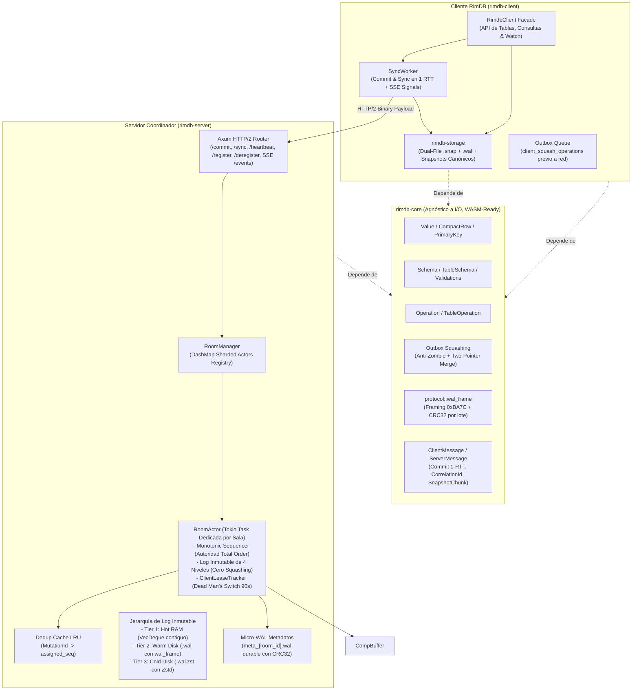

# ROADMAP.md: Hoja de Ruta de Implementación de RimDB

**Proyecto:** `RimDB` (Motor de Base de Datos Distribuida Local-First)  
**Fecha de Actualización:** 20 de Septiembre de 2026  
**Documentos Relacionados:** [README.md](file:///Users/Santiago/OtherProjects/client-distributed-db/README.md) | [ARCHITECTURE.md](file:///Users/Santiago/OtherProjects/client-distributed-db/ARCHITECTURE.md) | [Auditoría Fase 2](file:///Users/Santiago/OtherProjects/client-distributed-db/docs/audits/2026-09-fase2-audit.md) | [Propuesta Técnica Fases 2.5, 3 y 4](file:///Users/Santiago/OtherProjects/client-distributed-db/docs/proposals/2026-09-fase2_5-hardening-proposal.md)  
**Estado:** Hoja de Ruta Oficial de Desarrollo — Fase 1 & 1.5 Completadas / Fases 2 a 5 Planificadas

---

## 1. Cambios Ya Realizados

*A continuación se listan únicamente los títulos de los cambios técnicos y estructurales completados y verificados con veredicto unánime de los 4 subagentes:*

* Renombrado global del proyecto y de todos los paquetes a `rimdb` (`rimdb-core`, `rimdb-server`, `rimdb-client`).
* Eliminación total de asignaciones de cadenas en heap en `Ord for Value` mediante discriminante directo `type_order(&self) -> u8` en $O(1)$.
* Optimización de `Value` con footprint estricto de 24 bytes en 64 bits mediante boxing de variantes pesadas (`String(Box<str>)` y `Bytes(Box<[u8]>)`), reduciendo el consumo de memoria un 40% en tuplas y celdas y erradicando la doble indirección en el heap.
* Optimización de `PrimaryKey` en la pila de memoria (*stack*) a **40 bytes** utilizando `SmallVec<[Value; 1]>`, eliminando totalmente el desbordamiento de línea de caché de CPU (*Zero L1 Cache Line Split*, $40\text{B} < 64\text{B}$).
* Incorporación de variantes de datos fundamentales: `Value::Null`, `Value::Timestamp(i64)` y `Value::Bytes(Box<[u8]>)` (fat pointer 16B sin doble indirección en heap).
* Preservación del orden físico DDL de declaración en `TableSchema` (`columns: Vec<ColumnDef>`), eliminando el desorden alfabético en `CompactRow` y blindando la compatibilidad binaria en migraciones de esquema.
* Incorporación de conversiones zero-copy por movimiento en esquemas (`row_into_compact` y `compact_into_row`).
* Estructuración de tuplas posicionales densas mediante `CompactRow` (`Vec<Value>`) y mantención de `RowBuilder`.
* Validación estricta de columnas obligatorias no nulas (`nullable: false`) y rechazo de `Value::Null` explícito en `validate_row`.
* Validación exhaustiva de tipos de datos y aridad de componentes de clave primaria en `validate_update` y `validate_delete`.
* Rediseño de `Operation` desacoplando metadata plana (`table`, `pk`, `timestamp`) del payload específico en `OperationKind` (`Insert`, `Update`, `Delete`).
* Corrección del fallo crítico de pérdida de datos en `squash_operations` (Regla 5) ante inserciones retrasadas, y ampliación semántica formal con `SquashOutcome::Discarded`.
* Implementación de la Regla Anti-Zombi en `squash_operations` (rechazo formal de operaciones `Update` sobre entidades con `Delete` previo).
* Incorporación de marca de tiempo (`timestamp: u64`) en `Operation` como metadato de trazabilidad y auditoría de cliente.
* Fusión de atributos campo por campo en colisiones `Update + Update`.
* Contrato de red con identificador unívoco de mutación `MutationId: [u8; 16]` para idempotencia estricta (*Exactly-Once*) en `Commit` y `CommitAck`.
* Incorporación de identificador de correlación `CorrelationId: u64` para soporte de multiplexación asíncrona de solicitudes y respuestas.
* Mecanismos de control de flujo y paginación en streaming (`max_batch_size: u32` en `Sync` y bandera `has_more: bool` en `SyncBatch`).
* Blindaje defensivo del códec binario con límite de 16 MB contra ataques de agotamiento de memoria (DoS) mediante `bincode::DefaultOptions`.
* Ampliación de la suite de pruebas unitarias a 22 casos de prueba en `rimdb-core` cubriendo tamaño de memoria en 64 bits, L1 cache line limits, orden DDL y no-pérdida de datos.
* Limpieza total de advertencias y pase sin fallos en `cargo clippy --workspace --all-targets -- -D warnings`.
* Auditoría técnica formal multidimensional con certificación de **APROBADO** emitida unánimemente por los subagentes especialistas.
* Limpieza de directorios `.git` anidados e inicialización del repositorio Git raíz con `.gitignore` unificado.
* Centralización de `rimdb-core` en `[workspace.dependencies]` y herencia de dependencias en `rimdb-server` y `rimdb-client`.
* Activación de políticas de seguridad y lints de workspace con `unsafe_code = "forbid"` en todos los crates.
* Validación estricta y defensiva de aridad en `from_compact_row` retornando `ValidationError::CompactRowArityMismatch`.
* Incorporación de prueba unitaria negativa contra ataques DoS por mensajes que declaran exceder el límite de 16 MB.
* Formalización en arquitectura de la autoridad suprema del secuenciador central (`sequence_id`) para ordenamiento determinista Total Order.
* Implementación de Newtypes de dominio fuertemente tipados (`RoomId`, `ClientId`, `SequenceNumber`, `MutationId`, `CorrelationId`) con `#[serde(transparent)]` y ergonomía `Deref` en `rimdb-core`.
* Modelado de mutaciones posicionales de alta densidad: `ColumnUpdate { column_idx: u16, value: Value }` (32 bytes exactos) e `OperationKind` acotado estrictamente a 32 bytes en memoria.
* Desacoplamiento de metadata de tabla: unidad de almacenamiento interna `TableOperation` (`pk`, `timestamp`, `kind`) de **80 bytes exactos** (0 bytes padding), ahorrando un 47.4% de memoria en los buffers del servidor.
* Envoltorio de transporte y frontera pública `Operation` de **96 bytes exactos** (`table: Arc<str>`, `op: TableOperation`) con implementación de `Deref<Target = TableOperation>` para compatibilidad transparente y sin boilerplate.
* Particionado físico de mutaciones en memoria: estructura `TableBuffer` para aislamiento por tabla, eliminación de contención de locks entre tablas y squashing local $O(1)$ amortizado por PK.
* Invariante de orden ascendente en `ColumnUpdate` que habilita fusión determinista de deltas en $O(M + N)$ sin asignaciones de heap intermedias.
* Semántica zero-copy con transferencia por movimiento de propiedad (`drain(..)`) en `squash_table_operations`, erradicando clonaciones innecesarias de strings y bytes.
* Capa ergonómica en `TableSchema` con `SchemaUpdateBuilder`, `to_table_insert`, `to_table_update`, `to_operation_insert`, `to_operation_update`, y métodos bidireccionales `compact_update_fields` / `expand_update_fields`.
* Reducción de ancho de banda de red en más de un 50% al erradicar los nombres de columnas repetidos en cada tupla serializada en Bincode.
* Incorporación de soporte nativo para `DataType::Uuid` y `Value::Uuid([u8; 16])` con parseo de 32/36 caracteres hexadecimales, formateo canónico 8-4-4-4-12, ordenamiento e integración transparente con claves primarias sin alocación en el heap.
* Suite de pruebas unitarias ampliada a 25 pruebas en `rimdb-core` con aserciones rigurosas de `size_of` en todos los structs y pase sin advertencias en `cargo clippy`.
* Creación y configuración del nuevo crate `crates/storage` (`rimdb-storage`) con `#![forbid(unsafe_code)]` y centralización en `[workspace.dependencies]`.
* Definición del contrato formal de persistencia `StorageEngine` con semántica de movimiento (*zero-copy move semantics*) en `apply_batch`, totalmente preparado para WebAssembly (`wasm32-unknown-unknown`) mediante `#[cfg_attr(target_arch = "wasm32", async_trait(?Send))]` y concurrencia desacoplada.
* Soporte nativo para consultas complejas en almacenamiento sin inflar el motor: abstracción `KeyRange` (cubriendo toda la sintaxis de rangos de Rust: `..`, `a..b`, `a..=b`, `a..`), dirección `ScanDirection` (`Forward` / `Backward` para ordenamiento reverso `ORDER BY pk DESC`), *Limit pushdown* (`limit: Option<usize>`) y *Projection pushdown* (`projection: Option<Vec<u16>>`) devolviendo un `RowStream`.
* Implementación de `MemoryStorageEngine` con **concurrencia multihilo y aislamiento estricto por sala** (`Arc<RwLock<HashMap<RoomId, Arc<RwLock<RoomState>>>>>`), erradicando la contención de cerrojos entre salas distintas y permitiendo lecturas compartidas concurrentes simultáneas (`RwLock::read`) por sala.
* Incorporación de snapshots binarios en memoria serializados con `bincode` y método `has_table` en `Schema`.
* Implementación del motor de persistencia en disco con WAL (`DiskStorageEngine`) y arquitectura Dual-File por sala (`room_{id}.snap` + `room_{id}.wal`) con cabecera fija de 64 bytes (`RIM1`).
* Enmarcado y suma de verificación CRC32 por registro WAL (`[len: u32][crc32: u32][payload]`) para durabilidad estricta y recuperación determinista ante caídas (*torn writes*).
* Recuperación determinista por Replay: descompresión de snapshot base con Zstandard (`zstd`) y reproducción de deltas WAL hacia tablas en memoria `BTreeMap`.
* Worker de compactación local y truncado de WAL con reemplazo atómico de snapshot vía `.snap.tmp` y truncado in-place de `.wal` sin bloqueo de lecturas.
* Suite de pruebas unitarias ampliada a **45 tests en el workspace** (19 pruebas en `rimdb-storage`), con verificación de cero warnings en `clippy` y compilación hacia `wasm32-unknown-unknown`.
* Reestructuración modular completa y desacoplamiento de `crates/core` (`rimdb-core`): separación de archivos monolíticos en submódulos especializados (`value/` con `scalar.rs`, `data_type.rs`, `row.rs`; `schema/` con `column.rs`, `table.rs`, `global.rs`, `validation.rs`; `mutation/` con `op.rs`, `squash.rs`, `buffer.rs`; `protocol/` con `messages.rs`, `codec.rs`; y `crypto.rs` con el trait formal `CryptoEngine` y `NoOpCryptoEngine`).
* Extracción del 100% de tests unitarios de `crates/core/src/lib.rs` (25 tests) a suites de pruebas de integración externas en `crates/core/tests/` (`schema_validation_tests.rs`, `squashing_rules_tests.rs`, `protocol_codec_tests.rs`, `types_memory_tests.rs`), preservando retrocompatibilidad total de API con `pub mod operation` y cero advertencias de Clippy.
* Reestructuración modular completa y desacoplamiento de `crates/storage` (`rimdb-storage`): separación en submódulos de responsabilidad única (`memory/` con `state.rs`, `disk/` con `format.rs`, `wal.rs`, `recovery.rs`, `compactor.rs`, `sys.rs` con sincronización POSIX de directorio `sync_dir`, y `index/` con la abstracción `PrimaryIndex`).
* Extracción del 100% de tests de `crates/storage/src/lib.rs` (19 tests) a suites de pruebas de integración externas en `crates/storage/tests/` (`memory_engine_tests.rs`, `disk_wal_resilience_tests.rs`, `compaction_lifecycle_tests.rs`, `query_pushdowns_tests.rs`), con verificación integral de 45 tests pasando en el workspace, cero warnings en Clippy y compilación hacia `wasm32-unknown-unknown`.
* Implementación del algoritmo Two-Pointer Merge lineal en $O(M+N)$ (`merge_sorted_column_updates`) con semántica de movimiento por valor, sustituyendo la búsqueda binaria con inserción cuadrática $O(M \cdot N)$ y eliminando alocaciones repetidas en heap.
* Erradicación del `clone()` incondicional en `TableBuffer::apply` utilizando `self.pending.get_mut(&op.pk)` para verificar existencia previa antes de clonar la clave primaria.
* Manejo tipado de incompatibilidades en `TableBuffer::apply` retornando `Result<SquashOutcome, BufferError>` (`BufferError::IncompatibleOperation`), evitando el descarte silencioso de mutaciones incompatibles.
* Desacoplamiento algorítmico formal de squashing: `server_squash_table_operations` / `server_squash_operations` (orden autoritativo de llegada y asignación monotónica de `SequenceNumber` en el secuenciador) frente a `client_squash_table_operations` / `client_squash_operations` (resolución LWW por timestamp para consolidación previa en cliente).
* Atribución formal de origen en `SequencedOperation`: incorporación de los campos `client_id: ClientId` y `mutation_id: MutationId` con constructores `new` y `with_default_origin` para soporte determinista de Echo Cancellation en el pipeline de sincronización del cliente.
* Métodos ergonómicos de conversión en `MutationId` (`from_u128`, `From<u128>`) para simplificar la interoperabilidad de identificadores distribuidos.
* Extensión del contrato de red con `ClientMessage::DeregisterClient`: permite a clientes notificar su desconexión voluntaria para avanzar el cursor de retención `min_ack_seq` en el servidor sin esperar timeouts.
* Integración del ecosistema `tracing` en el workspace e instrumentación formal de `encode_message` y `decode_message` en `crates/core/src/protocol/codec.rs`.
* Aislamiento de compresión y descompresión Zstandard (`zstd::encode_all`, `zstd::decode_all`) con `tokio::task::spawn_blocking` en `compact_room_internal`, `create_snapshot`, `apply_snapshot` y `recover_room`, protegiendo el reactor Tokio contra bloqueos de CPU.
* Lectura en streaming por bloques con `tokio::io::BufReader` de 64 KB en el arranque de salas (`recover_room` / `DiskStorageEngine::open_room`), erradicando la lectura monolítica de archivos completos a RAM (`tokio::fs::read`) para prevenir picos de memoria (OOM).
* Verdadero lazy streaming en consultas `StorageEngine::scan` ($O(1)$ RAM): eliminación del `.collect()` impaciente a `Vec` en `apply_scan_transforms` retornando `ScanIterator` perezoso; streaming desacoplado mediante canal acotado `tokio::sync::mpsc::channel(64)` en `DiskStorageEngine` y paginación reactiva por batches perezosos con cursor en `MemoryStorageEngine` (compatible con WASM).
* Blindaje aritmético y anti-DoS en decodificación de registros WAL (`format.rs` y `recovery.rs`): validación estricta de `record_len <= MAX_MESSAGE_SIZE` (16 MB) y uso de suma segura `8usize.checked_add(record_len)` para prevenir desbordamientos de enteros ante datos corruptos.
* Enmarcado atómico por lote en WAL (`0xBA7C`, `encode_wal_batch`, `decode_wal_batch_from_slice`): cabecera de 14 bytes con marcador mágico, longitud, CRC32 unificado del lote y conteo de operaciones, asegurando atomicidad estricta (todo-o-nada) ante cortes de energía.
* Protección de concurrencia multi-proceso a nivel de kernel de sistema operativo con file locking exclusivo (`fs2::FileExt::try_lock_exclusive`), devolviendo `StorageError::RoomLocked(RoomId)` para impedir la apertura simultánea o corrupción de los archivos de sala por múltiples procesos.
* Sincronización POSIX del directorio padre (`sync_dir`) obligatoria y con propagación de errores en la inicialización y compactación de salas, protegiendo las entradas de directorio (*dentries*).
* Corrección de semántica de Safe Update en `StorageEngine`: se ignoran las mutaciones `Update` sobre claves primarias inexistentes en vez de fabricar tuplas sintéticas con valores nulos que violen restricciones de esquema `nullable: false`.
* Validación estricta de monotonía de secuencias (`seq == head_seq + 1`) en `StorageEngine::apply_batch` (tanto en `DiskStorageEngine` como en `MemoryStorageEngine`), rechazando brechas con `StorageError::SequenceMismatch` para impedir pérdida silenciosa de registros.
* Extensión del contrato de mensajes de red con `ClientMessage::RequestSnapshotChunk` y `ServerMessage::SnapshotChunk` y especificación formal en [`ARCHITECTURE.md`](file:///Users/Santiago/OtherProjects/client-distributed-db/ARCHITECTURE.md#multipart-chunked-snapshot-transfer-protocol--16-mb) del protocolo de bootstrapping multipart para bases de datos que superen el límite de 16 MB.
* Incorporación de identificador numérico de tabla de 2 bytes (`table_id: u16`) en `TableSchema` y catálogo bidireccional en `Schema` (`tables_by_id: BTreeMap<u16, TableSchema>`, `id_by_name: BTreeMap<String, u16>`) con métodos explícitos y sin ambigüedades: `get_table_by_id`, `get_table_by_name`, `get_table_id`, `has_table_by_id` y `has_table_by_name`.
* Unificación estructural de operaciones: reemplazo de `TableOperation` (80B) y `Operation` con `Arc<str>` (96B) por una única estructura `Operation` alocada 100% en el stack de **88 bytes exactos** (`table_id: u16`, `timestamp: u64`, `pk: PrimaryKey`, `kind: OperationKind`), erradicando cualquier asignación en el heap para metadatos de tabla en el bucle caliente de mutaciones.
* Optimización y simplificación de `SequencedOperation` a **96 bytes exactos** (`seq: SequenceNumber`, `op: Operation`), eliminando `client_id` y `mutation_id` del log histórico persistente y reduciendo 24 bytes por operación en RAM y disco (manteniéndose de forma estrictamente efímera en `Commit` / `CommitAck` para idempotencia y correlación 1-RTT).
* Adaptación integral de los motores de almacenamiento `MemoryStorageEngine` y `DiskStorageEngine` para utilizar `HashMap<u16, BTreeMap<PrimaryKey, CompactRow>>`, optimizando el consumo de memoria y la velocidad de `apply_batch`.
* Definición de la arquitectura de almacenamiento de 4 niveles para el log append-only inmutable de `rimdb-server` (RAM Hot -> Warm Disk raw `.wal` -> Cold Disk Zstd `.wal.zst` -> Evicción / `BehindCompaction`) y política de ciclo de vida configurable `RoomLifecyclePolicy`.
* Descarte total del squashing en el servidor para garantizar contigüidad estricta (`head_seq + 1`), eliminando brechas de secuencia y anomalías de tuplas zombi, y circunscribiendo el squashing exclusivamente a la cola de salida local del cliente (*Outbox Queue*).
* Clarificación del modelo de estado cero en servidor: el servidor nunca genera ni almacena snapshots de base de datos a largo plazo; la compactación a snapshot es responsabilidad exclusiva de los clientes activos, actuando el servidor como relay efímero en streaming.
* Detección y truncado automático de torn writes ante relleno de ceros al final del archivo WAL (`0x00...` por caídas de tensión en sistemas de archivos pre-alocados o sparse) tanto en el decodificador de frames como en la recuperación de sala en disco.
* Integridad criptográfica de extremo a extremo en transferencias de snapshot multipart mediante digest BLAKE3 de 256 bits (`snapshot_hash`) incorporado en `ServerMessage::SnapshotChunk`.
* Erradicación del pico de 4x de memoria RAM en la generación de snapshots mediante serialización directa por referencia con `RoomSnapshotRef<'a>` y asignación directa de árboles de tablas `RoomSnapshotPayload`.
* Encapsulación estricta de newtypes de dominio (`RoomId`, `SchemaId`, `ClientId`, `SequenceNumber`, `MutationId`, `CorrelationId`) y cumplimiento de las directrices de diseño [C-DEREF] de la API de Rust, eliminando `Deref` y ofreciendo métodos y conversiones explícitos (`as_str()`, `get()`, `as_bytes()`, `AsRef<str>`, `AsRef<[u8]>`).
* Verificación integral del workspace con 68 tests pasando (38 en `rimdb-core`, 29 en `rimdb-storage`, 1 en `rimdb-client`), cero warnings en Clippy (`-D warnings`) y compilación limpia hacia `wasm32-unknown-unknown`.
* Fase 3.5-A.1: Corrección de desfase off-by-one en catchup 1-RTT (`C-01`), propagación estricta de `BehindCompaction` sin supresión (`C-02`), idempotencia de `Commit` con entrega de mutación original (`M-02`), y rediseño de Onboarding con estado `Bootstrapping`, ancla de retención de snapshots y apretón de manos enriquecido (`C-08`).
* Fase 3.5-A.2: Autenticación universal y blindaje de Data Plane con extractor Axum `ClientAuth` (`C-03`), validación estricta de 3 vías en URL path vs token vs payload (`M-07`), comparación de firmas y secretos en tiempo constante con `subtle::ConstantTimeEq` (`M-04`) y erradicación definitiva del backdoor `dev-token` (`M-05`).
* Fase 3.5-A.3: Persistencia atómica unificada y recuperación robusta ante caídas: erradicación del Dual-WAL (`C-04`, `A-02`, `M-11`) unificando persistencia y deduplicación en `active.wal` con un solo `fsync` por commit, filtrado estricto de operaciones previas a snapshot (`C-05`), autorrecuperación y truncado limpio de torn writes en EOF con CRC fallido (`C-06`) y bufferizado de lotes multi-operación en `WalReader` (`C-07`).

---

## 2. Resumen Ejecutivo del Estado del Proyecto

RimDB ha superado con éxito la **Fase 1 y 1.5 (Reestructuración, Blindaje de Core e Higiene de Workspace)**, la **Fase 2A (Contrato Formal de Persistencia, Pushdown de Queries y Motor en Memoria)**, la **Fase 2B (Motor de Almacenamiento en Disco con WAL y Compresión Zstd)**, la **Fase 3 (Servidor de Coordinación por Actores `rimdb-server`)** y los hitos de remediación **Fase 3.5-A.1, Fase 3.5-A.2 y Fase 3.5-A.3 (Catchup 1-RTT, Onboarding con Bootstrapping, Autenticación Universal y Persistencia Atómica Unificada)**. El backend del servidor y los crates centrales se encuentran completamente verificados con pruebas unitarias y de integración end-to-end:
- Se redujo el footprint de memoria de `Value` en un 40% (24 bytes) y `PrimaryKey` a 40 bytes (ajustado a una línea de caché L1 de CPU).
- Se garantizó la estabilidad binaria de esquemas con orden DDL físico en `TableSchema` y conversiones zero-copy por movimiento.
- Se cerró la pérdida de datos y anomalías de tuplas zombi en `squash_operations`.
- Se consolidó el contrato de red con garantías formales de idempotencia y multiplexación.
- Se mantiene el desacoplamiento estricto de I/O, garantizando que tanto el núcleo como el almacenamiento compilen hacia WebAssembly (`wasm32-unknown-unknown`).
- Se formalizó en [`ARCHITECTURE.md`](file:///Users/Santiago/OtherProjects/client-distributed-db/ARCHITECTURE.md#10-architectural-decisions-time-ordering--authority) la decisión de diseño de que el **servidor es la única autoridad de ordenamiento global** mediante su `sequence_id` monótono, eliminando la complejidad innecesaria de sincronización de relojes (HLC).
- Se implementó `DiskStorageEngine` con persistencia en arquitectura Dual-File (`room_{id}.snap` + `room_{id}.wal`), WAL append-only con CRC32, compactación atómica zstd y tolerancia a fallos.
- Se implementó el servidor `rimdb-server` con arquitectura de actores Tokio (`RoomManager`, `RoomActor`), log inmutable de 4 niveles (`HotBuffer`, `WarmDiskLog`, `ColdDiskLog`), Micro-WAL y deduplicación LRU.
- Se completó el blindaje criptográfico integral del Data Plane mediante el extractor `ClientAuth`, validación de rutas en 3 vías, tiempo constante y leases activos.

El proyecto se encuentra ahora en posición para avanzar a las fases de desacoplamiento CoW e I/O asíncrono y construir la sincronización optimista reactiva en el cliente (Fase 4).

---

## 3. Arquitectura del Sistema (Consenso de 4 Crates)

El sistema se estructura en 4 crates con fronteras de responsabilidad estrictas:

```
┌─────────────────────────────────────────────────────────────────────────────────────────┐
│                                 ESPACIO DE TRABAJO RIMDB                                │
├────────────────────────────────┬────────────────────────────────────────────────────────┤
│ Crate                          │ Responsabilidad y Restricciones                         │
├────────────────────────────────┼────────────────────────────────────────────────────────┤
│ 1. `crates/core`               │ Dominio puro, tipos (`Value`, `CompactRow`), esquemas, │
│    (`rimdb-core`)              │ operaciones, squashing, protocolo binario. Cero I/O.   │
│                                │ Compatible con WASM (`wasm32-unknown-unknown`).        │
├────────────────────────────────┼────────────────────────────────────────────────────────┤
│ 2. `crates/storage`            │ Motor de persistencia tabular local. Contrato          │
│    (`rimdb-storage`)           │ `StorageEngine`, motor en memoria con aislamiento      │
│    [FASE 2A Y 2B COMPLETADAS]  │ por sala, y motor en disco Dual-File (`.snap`+`.wal`). │
├────────────────────────────────┼────────────────────────────────────────────────────────┤
│ 3. `crates/server`             │ Servidor coordinador y secuenciador monótono. Modelo de │
│    (`rimdb-server`)            │ actores Tokio por sala (*Room*), log inmutable de 4    │
│    [PENDIENTE - FASE 3]        │ niveles (RAM->Warm->Cold), dedup LRU y HTTP/2 Axum.    │
├────────────────────────────────┼────────────────────────────────────────────────────────┤
│ 4. `crates/client`             │ SDK de cliente ergonómico (`RimdbClient` -> `RoomHandle`  │
│    (`rimdb-client`)            │ -> `TableHandle`), sincronización en 1 RTT (Write-Through │
│    [PENDIENTE - FASE 4]        │ con validación en servidor), persistencia canónica en     │
│                                │ `StorageEngine`, reactividad en vivo (`watch`) y          │
│                                │ transporte dual (Reqwest HTTP/2 / WebFetch WASM).         │
└────────────────────────────────┴────────────────────────────────────────────────────────┘

```



---

## 4. Catálogo Detallado de Cambios Pendientes

A partir de los informes técnicos emitidos por los 4 subagentes especialistas, se detallan las implementaciones que restan por ejecutar en las siguientes fases:

### 4.1. Tipos de Datos Esenciales y Extensiones de Core (`rimdb-core`)

* **[COMPLETADO] Incorporación de `DataType::Uuid` y `Value::Uuid([u8; 16])`:**
  Soporte de identificadores únicos universales (UUID v4) como tipo primitivo nativo de 16 bytes sin alocación dinámica, fundamental para claves primarias en arquitecturas distribuidas, con formateo canónico 8-4-4-4-12 y parseo de cadenas sin dependencias externas.
* **Incorporación de `DataType::Decimal` y `Value::Decimal`:**
  Representación de punto fijo (`i128` mantissa, `u32` escala) o integración liviana para cálculos monetarios y contables libres de los errores de redondeo de `Float` (`f64`).
* **[COMPLETADO] Definición de `trait CryptoEngine`:**
  Puerto de abstracción para que el cliente pueda inyectar la implementación de cifrado/descifrado simétrico para columnas marcadas con `encrypted: true`, manteniendo `rimdb-core` puro y desacoplado de dependencias criptográficas pesadas. Implementado en `crates/core/src/crypto.rs` junto a `NoOpCryptoEngine`, `CryptoConcurrencyBounds` condicional para soporte de WebCrypto en `wasm32`, y soporte de datos autenticados adicionales (`aad: &[u8]`).
* **[COMPLETADO] Algoritmo Two-Pointer Merge y Squashing en Outbox Local:**
  Fusión lineal de deltas de columna en $O(M+N)$ (`merge_sorted_column_updates`) sin alocaciones repetidas en heap ni desplazamientos cuadráticos en memoria (`crates/core/src/mutation/squash.rs`). El squashing queda circunscrito exclusivamente a la cola de salida local del cliente (`client_squash` en Outbox Queue) antes de emitir a la red; en el servidor, el log histórico de deltas es 100% append-only, contiguo e inmutable para preservar la secuencia monotónica sin huecos.
* **[COMPLETADO] Erradicación de Clonaciones e Incompatibilidades en `TableBuffer`:**
  Inspección in-place mediante `get_mut(&op.pk)` previo a clonar claves primarias en `TableBuffer::apply`. Retorno tipado `Result<SquashOutcome, BufferError>` (`BufferError::IncompatibleOperation`) para evitar descarte silencioso de mutaciones.
* **[COMPLETADO] Atribución de Origen y Mensaje de Desregistro en Protocolo:**
  Enriquecimiento de `SequencedOperation` con `client_id: ClientId` y `mutation_id: MutationId` para soporte determinista de Echo Cancellation en la capa de sincronización. Extensión del protocolo con `ClientMessage::DeregisterClient`.
* **Confirmación de Decisión de Ordenamiento:**
  Se descarta la implementación de Relojes Lógicos Híbridos (HLC) complejos. La autoridad suprema de ordenamiento reside en el `sequence_id` emitido por el servidor (ver [Sección 10 de ARCHITECTURE.md](file:///Users/Santiago/OtherProjects/client-distributed-db/ARCHITECTURE.md#10-architectural-decisions-time-ordering--authority)).

---

### 4.2. Motor de Almacenamiento Local: `rimdb-storage` (Fase 2)

#### Fase 2A: Contrato de Persistencia y Motor en Memoria [COMPLETADO]
* **[COMPLETADO] Creación del crate `crates/storage` (`rimdb-storage`):**
  Configurado en el workspace heredando lints (`unsafe_code = "forbid"`), versionado y dependencias (`rimdb-core`, `async-trait`, `futures`, `tokio`, `thiserror`, `bincode`).
* **[COMPLETADO] Definición del contrato `trait StorageEngine`:**
  Interfaz asíncrona desacoplada con semántica de movimiento (*move semantics*), compatible condicionalmente con WebAssembly (`#[cfg_attr(target_arch = "wasm32", async_trait(?Send))]`):
  ```rust
  #[cfg_attr(target_arch = "wasm32", async_trait(?Send))]
  #[cfg_attr(not(target_arch = "wasm32"), async_trait)]
  pub trait StorageEngine: EngineConcurrencyBounds {
      async fn open_room(&self, room_id: &RoomId, schema: Schema) -> Result<(), StorageError>;
      async fn close_room(&self, room_id: &RoomId) -> Result<(), StorageError>;
      async fn apply_batch(&self, room_id: &RoomId, ops: Vec<SequencedOperation>) -> Result<SequenceNumber, StorageError>;
      async fn get(&self, room_id: &RoomId, table: &str, pk: &PrimaryKey) -> Result<Option<CompactRow>, StorageError>;
      async fn scan<'a>(&'a self, room_id: &RoomId, table: &str, options: ScanOptions) -> Result<RowStream<'a>, StorageError>;
      async fn get_head_seq(&self, room_id: &RoomId) -> Result<SequenceNumber, StorageError>;
      async fn create_snapshot(&self, room_id: &RoomId) -> Result<Vec<u8>, StorageError>;
      async fn apply_snapshot(&self, room_id: &RoomId, schema: Schema, snapshot: &[u8]) -> Result<SequenceNumber, StorageError>;
  }
  ```
* **[COMPLETADO] Soporte para Consultas Complejas con Pushdowns:**
  - `KeyRange`: Abstracción ergonómica sobre rangos de claves primarias (`std::ops::Bound`) con implementación `From` para rangos nativos de Rust (`..`, `a..b`, `a..=b`, `a..`).
  - `ScanOptions`: Soporte para dirección `ScanDirection` (`Forward` / `Backward` para `ORDER BY pk DESC`), `limit: Option<usize>` (*Limit pushdown*) y `projection: Option<Vec<u16>>` (*Projection pushdown*).
  - `RowStream<'a>`: Stream asíncrono para consumo eficiente de tuplas `(PrimaryKey, CompactRow)`.
* **[COMPLETADO] Implementación en memoria (`MemoryStorageEngine`):**
  - Estructura con **aislamiento y concurrencia por sala** (`Arc<RwLock<HashMap<RoomId, Arc<RwLock<RoomState>>>>>`).
  - Operaciones sobre diferentes salas 100% paralelas sin interferencias. Múltiples lectores concurrentes por sala (`read()`) y mutaciones atómicas por lote (`write()`).
  - Tablas particionadas en `BTreeMap<PrimaryKey, CompactRow>` y serialización/deserialización de snapshots binarios mediante `bincode`.

#### Fase 2B: Motor de Almacenamiento en Disco con WAL [COMPLETADO]
* **[COMPLETADO] Arquitectura Dual-File nativa por sala (`room_{id}.snap` + `room_{id}.wal`):**
  - **Archivo de Snapshot Base (`room_{id}.snap`):** Cabecera fija de 64 bytes (`RIM1`), versión de formato (`u16`), `snapshot_seq: u64`, `head_seq: u64`, longitud comprimida y CRC32. Contiene el volcado binario consolidado de las tablas comprimido con Zstandard (`zstd`).
  - **Archivo Append-Only Delta Log (`room_{id}.wal`):** Log secuencial append-only donde cada mutación local commiteada o remota recibida se agrega en lotes enmarcados (`0xBA7C`, longitud, CRC32, conteo de operaciones y payload Bincode).
* **Mecanismo Copy-on-Write (CoW) Real y Truncado de WAL In-Place:**
  Durante la compactación, una tarea en background genera el nuevo snapshot en `room_{id}.snap.tmp`, adquiere el cerrojo exclusivo (`flock`) sobre `.tmp` antes de invocar `rename()` atómico sobre `.snap` y ejecuta `sync_dir()`. Las mutaciones entrantes nunca se bloquean y continúan agregándose a `.wal`. Al consolidar el snapshot, `.wal` se trunca in-place a longitud 0 (`set_len(0)`).
* **Recuperación por Replay en Streaming:**
  Al abrir una sala, el motor desempaca el snapshot base y reproduce el log WAL secuencialmente con `BufReader` de 64 KB hacia las tablas en memoria `BTreeMap`, truncando automáticamente cualquier torn write en el extremo de `.wal`.
* **Codificación Memcomparable para Claves Primarias:**
  Serialización binaria de claves ordenables lexicográficamente directamente sobre bytes sin requerir deserializar los tipos `Value`.
* **Integridad Criptográfica de Snapshots con BLAKE3:**
  Cálculo y verificación de checksums BLAKE3 en snapshots exportados para detectar corrupciones de almacenamiento o tránsito antes de aplicarlos en el cliente.
* **Previsión de Escalabilidad (Buffer Pool / Slotted-Pages):**
  Diseño modular para facilitar a futuro la incorporación de un buffer pool con páginas ranuradas si el dataset de una sala supera la memoria física del dispositivo cliente.


---

### 4.3. Servidor de Coordinación: `rimdb-server` (Fase 3)

#### 4.3.1. Modularización Física del Crate `rimdb-server`
* **Separación Reutilizable (`lib.rs` y `main.rs`):**
  - `src/lib.rs`: Biblioteca reutilizable que exporta la máquina de actores, buffer, micro-WAL, configuración y capas de handlers HTTP/2 de Axum, permitiendo levantar servidores en memoria o sobre puertos efímeros en tests de integración multi-cliente sin lanzar procesos externos.
  - `src/main.rs`: Entrypoint ejecutable CLI que parsea argumentos, carga configuración (`ServerConfig`) y lanza el reactor Tokio con Axum.
* **Módulos Internos Especializados:**
  - `src/config.rs`: Estructura deserializable `ServerConfig` con soporte para archivos TOML y variables de entorno (`RIMDB_PORT`, `RIMDB_DATA_DIR`, `RIMDB_LEASE_TIMEOUT_SECS`, etc.).
  - `src/error.rs`: Enum tipado `ServerError` con conversiones automáticas hacia códigos de estado HTTP y respuestas binarias estructuradas (`ErrorCode::SchemaViolation`, `BehindCompaction`, `RoomLocked`, `SequenceMismatch`).
  - `src/actor/`: Subsistema de concurrencia y gestión del ciclo de vida de salas (`command.rs`, `manager.rs`, `room.rs`, `lease.rs`).
  - `src/log/`: Jerarquía de log inmutable de 4 niveles (`hot_buffer.rs`, `warm_disk.rs`, `cold_disk.rs`, `policy.rs`) y caché LRU de deduplicación (`dedup.rs`).
  - `src/micro_wal.rs`: Motor de Micro-WAL para persistencia de secuencias (`meta_{room_id}.wal`).
  - `src/api/`: Router de Axum, handlers binarios HTTP/2 y emisor de Server-Sent Events (`router.rs`, `handlers.rs`, `sse.rs`).

#### 4.3.2. Concurrencia Aislada por Actores Tokio (`RoomActor` y `RoomManager`)
* **Catálogo Centralizado de Esquemas (`SchemaRegistry`):**
  - Gestiona y cachea en memoria (`DashMap<SchemaId, Arc<Schema>>`) las plantillas de esquemas registradas por el administrador, persistidas en `meta_schema_{id}.json`.
  - Múltiples salas comparten la misma referencia `Arc<Schema>`, erradicando la duplicación en memoria.
* **Gestor Shardeado de Salas (`RoomManager`):**
  - Registro centralizado con mapa concurrente shardeado (`DashMap<RoomId, mpsc::Sender<RoomCommand>>`) que gestiona el ciclo de vida de las salas, instanciando actores de forma perezosa (*lazy spawning*) vinculados a su `SchemaId` y recolectando salas inactivas.
* **Actor Tokio Dedicado por Sala (`RoomActor`):**
  - Cada sala activa ejecuta su propio bucle de eventos en una tarea Tokio independiente con un canal acotado `mpsc::channel(1024)`, eliminando la contención de bloqueos globales (*lock-free sharding*).
* **Contrato Exhaustivo de Comandos (`RoomCommand`):**
  ```rust
  pub enum RoomCommand {
      RegisterClient {
          client_id: ClientId,
          auth_token: String,
          reply_to: oneshot::Sender<Result<(SequenceNumber, SchemaId, Schema), ServerError>>,
      },
      GetSchema {
          reply_to: oneshot::Sender<Result<(SchemaId, Schema), ServerError>>,
      },
      DeregisterClient {
          client_id: ClientId,
      },
      Commit {
          client_id: ClientId,
          mutation_id: MutationId,
          correlation_id: CorrelationId,
          last_ack_seq: SequenceNumber,
          op: Operation,
          reply_to: oneshot::Sender<Result<(SequenceNumber, Vec<SequencedOperation>, bool), ServerError>>,
      },
      Sync {
          last_ack_seq: SequenceNumber,
          max_batch_size: u32,
          reply_to: oneshot::Sender<Result<SyncBatch, ServerError>>,
      },
      Heartbeat {
          client_id: ClientId,
          last_ack_seq: SequenceNumber,
      },
      RequestSnapshotChunk {
          chunk_index: u32,
          reply_to: oneshot::Sender<Result<SnapshotChunk, ServerError>>,
      },
  }
  ```

#### 4.3.3. Secuenciador Monótono Atómico (Autoridad Absoluta de Orden)
* El actor asigna un `SequenceNumber` estrictamente incremental (`head_seq += 1`) a cada mutación válida aceptada.
* **Erradicación de Relojes de Cliente:** La precedencia de escrituras concurrentes se rige 100% por el orden de llegada al actor de la sala y la secuencia emitida, descartando cualquier sesgo temporal por relojes de usuario desincronizados.

#### 4.3.4. Micro-WAL Durable en Disco para Idempotencia Post-Crash
* **Persistencia Atómica Pre-ACK:**
  Antes de confirmar un `CommitAck` al cliente, el `RoomActor` escribe de forma síncrona en el archivo append-only `meta_{room_id}.wal` una tupla enmarcada con CRC32:
  ```text
  [seq: u64][mutation_id: [u8; 16]][client_id_len: u16][client_id_str][crc32: u32]
  ```
* **Recuperación Post-Reinicio:**
  Al iniciar el actor tras una caída o reinicio del servidor, se reproduce secuencialmente `meta_{room_id}.wal`, recuperando el último `head_seq` emitido e hidratando la caché LRU de `MutationId` en memoria para garantizar semántica **Exactly-Once** real ante reintentos de red.

#### 4.3.5. Jerarquía de Almacenamiento de 4 Niveles para el Log Inmutable
* **Estructura en 4 Niveles de Log Append-Only:**
  - **Nivel 1: RAM Hot Buffer:** Mantiene un buffer contiguo e inmutable de deltas recientes (`VecDeque<SequencedOperation>`) para resolver lecturas inmediatas de `/sync`. **Cero squashing sobre deltas secuenciados**: garantiza contigüidad estricta (`head_seq + 1`), erradicando brechas de secuencia (`SequenceMismatch`) y eliminando anomalías de tuplas zombi. Vuelca a disco cálido al expirar el TTL de RAM o alcanzar el límite de operaciones.
  - **Nivel 2: Warm Disk Log (archivo append-only `.wal` sin comprimir con Write-Through):** Lotes enmarcados con cabecera `0xBA7C`, CRC32 y longitud. **Durabilidad Write-Through estricta**: cada mutación aceptada se persiste síncronamente en `active.wal` (`sync_data()`) antes de emitir `CommitAck`, garantizando cero pérdidas de datos ante caídas del servidor o cortes de energía. Conserva la misma representación binaria que en RAM sin costo de compresión de CPU, permitiendo responder rápidamente a clientes que se reconectan tras horas o días de inactividad.
  - **Nivel 3: Cold Disk Log (archivos compactos `.wal.zst` comprimidos con Zstandard):** Compresión periódica en background de segmentos cálidos para retención de semanas con mínimo consumo de disco.
  - **Nivel 4: Límite de Retención, Poda Proactiva y Clientes Dormant (`BehindCompaction`):**
    - **Poda Proactiva Guiada por Cursores (`prune_older_than`):** Si todos los clientes registrados están en estado `Connected` y confirmaron la lectura hasta la secuencia $S$, los segmentos con `end_seq < S` se eliminan físicamente de inmediato sin esperar a los TTLs.
    - **Estados del Cliente (`Connected`, `Disconnected`, `Dormant`):**
      - `Connected`: Cliente activo enviando mutaciones/heartbeats en tiempo real.
      - `Disconnected`: Cliente offline o sin conexión temporal, pero con cursor dentro del rango disponible en disco (`last_ack_seq >= tail_seq - 1`). Al reconectarse, descarga los deltas pendientes vía `/sync` y regresa a `Connected` sin requerir snapshot.
      - `Dormant`: Cliente desconectado tanto tiempo que sus deltas pendientes fueron físicamente purgados por la política de retención (`last_ack_seq < tail_seq - 1`). No frena ninguna poda de disco. Al volver, recibe `ErrorCode::BehindCompaction` y debe solicitar obligatoriamente un snapshot consolidado.
    - **Fallback por TTL y Cuota:** Descarte final de mutaciones que superen `cold_disk_ttl` o la cuota `max_room_disk_bytes`.
* **Política de Ciclo de Vida Configurable (`RoomLifecyclePolicy`):**
  - Permite configurar los parámetros de retención según el entorno: `ram_max_ops`, `ram_ttl`, `warm_disk_ttl`, `cold_disk_ttl` y `max_room_disk_bytes`.

#### 4.3.6. Retransmisión Efímera de Snapshots (Relay Multipart sin Almacenamiento de Estado)
* **El Servidor No Genera Snapshots:**
  El servidor nunca mantiene el estado consolidado de las tablas en disco ni en RAM a largo plazo. La generación de snapshots es una responsabilidad 100% de los **clientes activos**, quienes compactan y exportan su base de datos local desde su `StorageEngine`.
* **Relay Multipart en Servidor:**
  El servidor actúa como un relay efímero en streaming para transferir chunks comprimidos (`RequestSnapshotChunk` / `SnapshotChunk`) entre el cliente donante y el cliente receptor cuando no hay conectividad directa P2P disponible.

#### 4.3.7. Gestión de Leases, Estados de Cliente y Dead Man's Switch
* **`ClientLeaseTracker` y Ciclo de Vida del Cliente:**
  - Rastrea el estado de cada cliente registrado (`Connected`, `Disconnected`, `Dormant`), su cursor `last_ack_seq` y la marca temporal del último heartbeat.
  - **Transición a `Disconnected`:** Al perderse los heartbeats o cerrarse la conexión, el cliente pasa a `Disconnected`. Sus deltas se preservan en disco según las políticas de retención. Si se reconecta antes de que sus deltas sean purgados, realiza catch-up con `/sync` y regresa a `Connected`.
  - **Transición a `Dormant` (Poda y Dead Man's Switch):** Si un cliente permanece desconectado y sus deltas expiran por TTL o cuota, su cursor queda por detrás de los logs disponibles (`last_ack_seq < tail_seq - 1`) y pasa a `Dormant`. En este estado queda excluido del cómputo de retención de log para evitar que bloquee la truncación de disco a sus pares activos.
  - **Recuperación desde `Dormant` (`BehindCompaction`):** Al reconectarse un cliente `Dormant`, el servidor responde `ErrorCode::BehindCompaction`. El cliente solicita un snapshot consolidado a un par activo (vía relay o P2P), lo aplica localmente, avanza su cursor a la secuencia del snapshot y vuelve a estado `Connected`.
* **Soporte para Desregistro Voluntario:**
  - Mediante `ClientMessage::DeregisterClient`, un cliente que abandona la sala de forma definitiva o explícita se elimina del roster de miembros de inmediato.

#### 4.3.8. Separación de Planos de Red: Control Plane (Admin) y Data Plane (Clientes)
* **Control Plane (API Administrativa REST con JSON):**
  - Autenticado mediante header `Authorization: Bearer <ADMIN_SECRET>`.
  - `POST /admin/schemas`: Registro y actualización de plantillas `Schema` asociadas a un `SchemaId`.
  - `GET /admin/schemas/{schema_id}`: Inspección del esquema en formato JSON.
  - `POST /admin/schemas/{schema_id}/columns`: Evolución de esquema *append-only* (`add_column`), forzando `nullable: true`.
  - `POST /admin/rooms`: Aprovisionamiento de sala vinculando `RoomId` a `SchemaId` y `RoomLifecyclePolicy`.
  - `GET /admin/rooms/{room_id}`: Métricas de sala (secuencia actual, uso de disco, leases activos).
  - `DELETE /admin/rooms/{room_id}`: Poda o archivado de sala y su WAL.
* **Data Plane (Endpoints Binarios HTTP/2 de Alto Rendimiento):**
  - `POST /rooms/{room_id}/register`: Handshake inicial con verificación stateless de `auth_token` (HMAC-SHA256), retorno de `head_seq` y entrega del `Schema` completo en 1 RTT.
  - `POST /rooms/{room_id}/schema`: Consulta bajo demanda del esquema vigente (`GetSchema` -> `Schema`) para refrescos ante migraciones.
  - `POST /rooms/{room_id}/deregister`: Desconexión voluntaria inmediata.
  - `POST /rooms/{room_id}/commit`: Recepción de mutación binaria con `MutationId`, secuenciación y respuesta `CommitAck`.
  - `POST /rooms/{room_id}/sync`: Pull paginado con backpressure según `max_batch_size` a partir de `last_ack_seq`.
  - `POST /rooms/{room_id}/heartbeat`: Notificación de avance de cursor para retención de buffer.
  - `POST /rooms/{room_id}/snapshot-chunk`: Transferencia de chunks multipart de snapshot para onboarding de salas $> 16\text{ MB}$.
* **Canal Server-Sent Events (Signal-Only SSE):**
  - `GET /rooms/{room_id}/events`: Canal unidireccional que emite únicamente señales livianas `Event::HeadAdvanced(head_seq)`, alertando a clientes activos para que soliciten los deltas mediante `/sync`, evitando enviar payloads voluminosos por la conexión SSE.
* **Manejo de Clientes Rezagados (`BehindCompaction`):**
  - Si un cliente solicita sincronización con un cursor anterior a la poda del buffer, el servidor responde con `ErrorCode::BehindCompaction`, forzando al cliente a descargar el snapshot consolidado de la sala.

---

### 4.3.B. Blindaje de Servidor y Remediaciones Post-Fase 3 (Fase 3.5)

#### 4.3.B.1. Fase 3.5-A.1: Catchup 1-RTT, Retención y Onboarding de Clientes
* **Corrección de Desfase Off-by-One (`C-01`):** Se eliminó el incremento artificial `last_ack_seq + 1` en `handle_commit`, pasando `last_ack_seq` directamente a `fetch_deltas(last_ack_seq, 100)`. Al respetar el contrato semántico de `from_seq` como el cursor ya conocido por el cliente, los deltas devuelven con precisión el rango `(last_ack_seq, new_seq]`, erradicando el descarte sistemático de deltas.
* **Propagación Estricta de `BehindCompaction` (`C-02`):** Se valida de forma preventiva el cursor antes de secuenciar la mutación, propagando `Err(ServerError::BehindCompaction)` si `last_ack_seq < tail_seq - 1` o si `fetch_deltas` retorna `BehindCompaction`. El servidor nunca suprime silenciosamente los errores de retención.
* **Idempotencia de Commit con Mutación Original (`M-02`):** Ante un reintento idempotente de `Commit` (mismo `mutation_id`), el actor recupera la mutación histórica y la incluye como primer elemento de `catchup_ops`, garantizando que el cliente reciba la confirmación y la operación secuenciada.
* **Rediseño de Onboarding y Ancla de Retención (`C-08`):** Introducción de estados formales en `ClientLeaseTracker` (`Bootstrapping`, `Connected`, `Dormant`). Un cliente en bootstrapping no bloquea la poda del log. La retención del log se ancla a `retention_floor = min(min_connected_ack, active_snapshot_seq)`, permitiendo descargas seguras de snapshots sin que el log avance más allá de lo recuperable.

#### 4.3.B.2. Fase 3.5-A.2: Autenticación Universal y Blindaje de Data Plane
* **Extractor Criptográfico Axum `ClientAuth` (`C-03`):** Implementación de `ClientAuth` vía `FromRequestParts` en Axum. Todos los endpoints operativos (`/commit`, `/sync`, `/ack`, `/heartbeat`, `/schema`, `/deregister`, `/events`) requieren Bearer token firmado criptográficamente (o parámetro de consulta `?token=` para EventSource SSE), retornando `VerifiedClientToken`.
* **Validación de Leases Activos en `RoomActor` (`C-03`):** El actor de sala valida activamente en `handle_commit`, `handle_sync`, `handle_ack` y `Heartbeat` que el cliente se encuentre registrado en `ClientLeaseTracker::is_registered`, impidiendo que peticiones no registradas interactúen con el estado de la sala.
* **Validación Estricta de Rutas en 3 Vías (`M-07`):** Coincidencia unívoca y forzosa entre:
  1. `room_id` del URL path vs `room_id` del token firmado.
  2. `room_id` del URL path vs `room_id` del payload binario `ClientMessage`.
  3. `client_id` del token firmado vs `client_id` del payload binario.
  Cualquier discrepancia es rechazada en el perímetro HTTP con `401 Unauthorized` / `ErrorCode::Unauthorized`.
* **Comparaciones en Tiempo Constante (`M-04`):** Integración de `subtle::ConstantTimeEq` para validaciones de firmas BLAKE3 y de la cabecera `X-Admin-Secret`, eliminando vulnerabilidades de canal lateral por análisis de tiempos de ejecución (*timing attacks*).
* **Erradicación del Backdoor `dev-token` (`M-05`):** Eliminación total de puertas traseras de desarrollo en código de producción; la verificación de tokens exige siempre firma criptográfica válida y clave secreta activa.

#### 4.3.B.3. Fase 3.5-A.3: Persistencia Atómica Unificada y Recuperación de Fallos
* **Erradicación del Dual-WAL y Unificación en `active.wal` (`C-04`, `A-02`, `M-11`):** Eliminación completa del motor secundario `MicroWal` y los archivos `meta_{room_id}.wal`. La persistencia de secuencias, mutaciones y deduplicación se unificó en el log WAL principal codificando `mutation_id: Option<MutationId>` en la trama atómica (`WalBatchPayload`). Cada commit ejecuta un único `sync_data()`, reduciendo a la mitad la latencia de fsync y eliminando por completo cualquier posibilidad de desfase o desincronización en caídas del servidor.
* **Hidratación de Caché LRU de Deduplicación desde el Log (`C-04`):** `DedupLruCache` se hidrata directamente a partir de las tuplas `(MutationId, SequenceNumber)` recuperadas cronológicamente de los segmentos Warm y Cold en el arranque, garantizando semántica Exactly-Once sin fugas de memoria.
* **Filtrado de Secuencias en Replay de Base Snapshot (`C-05`):** `recover_room` filtra estrictamente las operaciones en el WAL que tengan `op.seq <= snapshot_seq`, impidiendo que deltas históricos obsoletos sobrescriban el estado consolidado del snapshot base.
* **Auto-recuperación y Truncado de Torn Writes en EOF (`C-06`):** `decode_wal_batch_from_slice` detecta fallos de CRC32 en el registro terminal del archivo sin tramas válidas posteriores como `WalBatchDecodeResult::TornWrite`, truncando el archivo físicamente a la longitud válida previa (`valid_wal_bytes`) y permitiendo reiniciar el motor sin errores fatales de corrupción.
* **Bufferizado de Lotes Multi-Operación en `WalReader` (`C-07`):** Incorporación de una cola interna `pending_ops: VecDeque<SequencedOperation>` en `WalReader`, asegurando que `next_record()` itere y devuelva todas las operaciones de lotes agrupados sin omitir las posiciones $2..N$.

---

### 4.4. Biblioteca Cliente y Sincronización Canónica: `rimdb-client` (Fase 4)

#### 4.4.1. Modularización Física del Crate `rimdb-client`
* **Organización Modular:**
  - `src/lib.rs`: Punto de entrada público del SDK, re-exportando facades ergonómicas y tipos esenciales.
  - `src/config.rs`: `ClientConfig` con builders tipados para endpoints de servidor, intervals de heartbeat, estrategias de retry y credenciales.
  - `src/error.rs`: Enum tipado `ClientError` (ValidationError, NetworkError, StorageError, ConflictError, OfflineError).
  - `src/api/`: Facade pública de alto nivel:
    - `client.rs`: `RimdbClient` (gestor global de conexión y catálogo de salas abiertas).
    - `room.rs`: `RoomHandle` (ámbito de sala activa, schemas y despacho de mutaciones).
    - `table.rs`: `TableHandle` (operaciones declarativas CRUD, escaneos con pushdowns y suscripciones reactivas).
  - `src/sync/`: Núcleo de sincronización canónica y consistencia:
    - `syncer.rs`: Cliente de sincronización unificado (Commit & Sync en 1 RTT).
    - `worker.rs`: `SyncWorker` (tarea Tokio en background con consumo de eventos SSE, pulls `/sync` y heartbeats).
    - `reactive.rs`: `ChangeStream` y bus reactivo a tuplas en memoria.
  - `src/transport/`: Abstracción de red desacoplada:
    - `client.rs`: `trait TransportClient`.
    - `native.rs`: Adaptador HTTP/2 persistente basado en `reqwest`.
    - `wasm.rs`: Adaptador WebFetch basado en `web-sys` y `gloo-net` para navegadores.

#### 4.4.2. Feature Flags y Universalidad Multiplataforma
* **Configuración en `Cargo.toml`:**
  - `default = ["native"]`: Incluye `tokio` (full), `reqwest`, `rimdb-storage/native`.
  - `wasm = ["web-sys", "wasm-bindgen-futures", "gloo-net", "rimdb-storage/wasm"]`: Permite compilar el cliente hacia `wasm32-unknown-unknown` para su ejecución en navegadores sin arrastrar llamadas bloqueantes de sistema operativo.
* **Abstracción `CryptoConcurrencyBounds`:**
  - Condicionamiento del trait `CryptoEngine` para que en entornos nativos exija `Send + Sync`, pero en `wasm32-unknown-unknown` relaje las restricciones a `?Send`, permitiendo vincular implementaciones WebCrypto basadas en referencias de JavaScript (`JsValue`).

#### 4.4.3. Fachada Pública Ergonómica del SDK
API idiomática, tipada y declarativa para aplicaciones en Rust:
```rust
let client = RimdbClient::open(config, storage_engine).await?;
let room = client.room(RoomId::new("engineering_team")).await?;
let tasks = room.table("tasks")?;

// 1. Inserción con validación previa en servidor y sync en 1 RTT (Write-Through)
let pk = tasks.insert(row).await?;

// 2. Consulta de ultra-baja latencia sobre almacenamiento canónico local (<1ms)
let task = tasks.get(&pk).await?;

// 3. Escaneo filtrado con pushdowns
let stream = tasks.scan(ScanOptions::default().limit(50)).await?;

// 4. Suscripción reactiva en vivo
let mut live_stream = tasks.watch(&pk).await?;
tokio::spawn(async move {
    while let Some(updated_row) = live_stream.next().await {
        println!("Registro actualizado: {:?}", updated_row);
    }
});
```

#### 4.4.4. Modelo Server-Authoritative con Sincronización en 1 RTT (Write-Through)
* **Persistencia Canónica Estricta en `StorageEngine`:**
  - El motor de persistencia local (`rimdb-storage`) almacena **única y exclusivamente operaciones secuenciadas (`SequencedOperation`)** validadas y ordenadas por el servidor.
  - Esto erradica de raíz el riesgo de inconsistencias locales, tuplas zombi o estados corruptos ante rechazos de validación (aridad, esquemas, tipos o reglas de integridad).
* **Pipeline de Escritura y Sincronización en 1 RTT:**
  1. **Envío con Cursor Actual:** Al invocar `insert`, `update` o `delete`, el cliente envía la mutación al endpoint `/commit` del servidor junto con su identificador `MutationId` y su cursor actual `last_ack_seq`.
  2. **Validación Server-Side:** El servidor valida esquema y restricciones. Si alguna validación falla, retorna un error tipado (`ErrorCode::SchemaViolation`) y el almacenamiento local **permanece intacto y consistente**.
  3. **Secuenciación y Catch-Up Atómico:** Si la mutación es válida, el servidor asigna el `SequenceNumber` canónico y devuelve `CommitAck` conteniendo dicho número junto con cualquier delta remoto pendiente acumulado desde `last_ack_seq`.
  4. **Aplicación Atómica en Storage:** El cliente aplica el lote completo de deltas canónicos directamente sobre `StorageEngine::apply_batch`.
  5. **Notificación Reactiva:** Se notifican los cambios confirmados a los streams activos (`watch`).
* **Cero Complejidad de Rebase / Rollback:**
  - Al no aplicar escrituras optimistas sin confirmar sobre las tablas canónicas, se elimina la necesidad de motores de rollback/rebase en el cliente.
* **Comportamiento Offline (Modo Solo Lectura):**
  - En ausencia de conexión a red, el cliente opera en modo **Solo Lectura** de alta velocidad sobre su réplica local en `StorageEngine`. Cualquier intento de escritura sin red retorna inmediatamente `Err(ClientError::Offline)`.
  - *(Nota: La capacidad de almacenar borradores no confirmados de forma segregada queda formalmente diferida para post-v0.1, ver Sección 7).*

#### 4.4.5. Worker de Sincronización en Segundo Plano con Jitter (`SyncWorker`)
* **Escucha Reactiva de SSE:**
  - Mantiene una conexión Server-Sent Events hacia `GET /rooms/{room_id}/events`. Al recibir `Event::HeadAdvanced(new_head)`, inicia inmediatamente una consulta de pull paginado a `/sync`.
* **Reconexión Resiliente:**
  - Si la conexión se interrumpe, el worker utiliza un algoritmo de reconexión con *Exponential Backoff* y *Full Jitter*, mitigando el riesgo de tormentas de reintentos (*thundering herd*) contra el servidor.
* **Heartbeat Continuo:**
  - Emite periódicamente `ClientMessage::Heartbeat` con el `last_ack_seq` actual para renovar su lease en el servidor e impedir que el servidor lo marque como `Dormant`.

#### 4.4.6. Onboarding de Salas y Descarga Multipart de Snapshots
* Si el cliente recibe `ErrorCode::BehindCompaction` al intentar sincronizarse o se incorpora a una sala nueva:
  1. Si el snapshot base de la sala supera el límite de 16 MB, solicita chunks particionados mediante `ClientMessage::RequestSnapshotChunk`.
  2. Al completarse la recepción de todos los chunks, reensambla el archivo en un buffer temporal y lo restaura de forma atómica mediante `StorageEngine::apply_snapshot`.
  3. Establece su cursor en `snapshot_head_seq` y continúa la sincronización incremental de deltas desde `snapshot_head_seq + 1`.

#### 4.4.7. Bus de Suscripciones Reactivas en Vivo (`ChangeStream`)
* Abstracción que permite a componentes de interfaz de usuario observar cambios sobre registros específicos o rangos (`table.watch(&pk)`).
* El stream asíncrono emite notificaciones inmediatas una vez que los deltas canónicos son confirmados y aplicados en el almacenamiento local.

---

### 4.5. Pruebas de Integración de Extremo a Extremo y Verificación E2E (Fase 5)

* **Suite de integración Cliente-Servidor:**
  Simulación de red en local con múltiples instancias de `RimdbClient` interactuando contra un `rimdb-server` en Tokio.
* **Pruebas de tolerancia a particiones y modo offline:**
  Verificación de clientes que operan sin red en modo Solo Lectura, rechazo controlado de escrituras offline (`ClientError::Offline`), reconexión con el servidor y recepción ordenada de deltas acumulados sin desincronización.
* **Pruebas de estrés y límites de carga:**
  Comprobación de la barrera de 16 MB con paquetes maliciosos, límites de paginación con deltas masivos y validación de retención del buffer de compactación bajo saturación.
* **Validación de compilación cruzada hacia WebAssembly:**
  Ejecución de `cargo build --target wasm32-unknown-unknown -p rimdb-core` y `cargo check --target wasm32-unknown-unknown -p rimdb-client --no-default-features --features wasm` en el pipeline de integración continua.

---

### 4.6. Mejoras Evolutivas de Dominio

* **Tipado fuerte de dominio con Newtypes (`RoomId`, `ClientId`, `SequenceNumber`, `MutationId`, `CorrelationId`):**
  Implementado en `crates/core/src/id.rs`. Se reemplazaron las cadenas crudas y enteros primitivos por structs transparentes (`#[serde(transparent)]`) con ergonomía `Deref` e implementaciones `From`, previniendo errores de transposición de argumentos en tiempo de compilación.
* **Evaluación de política LWW a nivel de Celda (CRDT Celular):**
  Diferido para el backlog post-v0.1 según la decisión de ADR en ARCHITECTURE.md.

---

## 5. Cronograma Secuencial de Implementación (Roadmap)

```
┌─────────────────────────────────────────────────────────────────────────────┐
│ FASE 1: Core Refactoring & Hotfixes [COMPLETADA Y AUDITADA]                 │
│ [x] Corrección de Ord for Value sin alocaciones en heap (O(1)).             │
│ [x] PrimaryKey en stack con SmallVec y tuplas densas CompactRow.            │
│ [x] Tipos fundamentales Null, Timestamp y Bytes (zero-copy).                │
│ [x] Validación estricta de esquemas, columnas requeridas y tipos de PK.     │
│ [x] Implementación de Regla Anti-Zombi y timestamps simétricos en squashing.│
│ [x] Contrato de protocolo con MutationId, CorrelationId y paginación.       │
│ [x] Blindaje DoS a 16MB y 17 pruebas unitarias exhaustivas en rimdb-core.   │
├─────────────────────────────────────────────────────────────────────────────┤
│ FASE 1.5: Higiene de Workspace y Preparación Inmediata [COMPLETADA]         │
│ [x] Eliminar directorios .git anidados en crates/core, server y client.     │
│ [x] Inicializar repositorio Git unificado en la raíz con .gitignore.        │
│ [x] Centralizar rimdb-core en [workspace.dependencies] del Cargo.toml raíz. │
│ [x] Configurar [workspace.lints.rust] con unsafe_code = "forbid".           │
│ [x] Añadir validación de aridad en from_compact_row y test negativo de DoS. │
│ [x] Formalizar en ARCHITECTURE.md la autoridad suprema del secuenciador.    │
│ [x] Tipado fuerte con Newtypes (RoomId, ClientId, SeqNum, MutationId, etc.).│
├─────────────────────────────────────────────────────────────────────────────┤
│ FASE 2: Motor de Almacenamiento Local (rimdb-storage) & Persistencia        │
│ [x] Añadir tipo Value::Uuid en rimdb-core.                                  │
│ [x] Definir el contrato trait CryptoEngine para E2EE en rimdb-core.         │
│ [x] Crear el crate crates/storage (rimdb-storage) con dependencias base.    │
│ [x] Definir el contrato formal trait StorageEngine.                         │
│ [x] Implementar arquitectura Dual-File (room_{id}.snap + room_{id}.wal) RIM1│
│ [x] Implementar Write-Ahead Log (WAL) append-only con checksums CRC32.      │
│ [x] Implementar índice primario en RAM y reconstrucción vía replay.         │
│ [x] Implementar compresión/descompresión de snapshots con Zstandard (zstd). │
│ [x] Implementar storage engine mock en memoria para pruebas unitarias.      │
│ [x] Implementar worker de compactación de snapshots y truncado de WAL.      │
├─────────────────────────────────────────────────────────────────────────────┤
│ FASE 2.5: Reestructuración Modular y Endurecimiento [COMPLETADA]            │
│ [x] Reestructuración modular de crates/core (value, schema, mutation, proto)│
│ [x] Extracción de 25 tests de crates/core a suites de integración externas. │
│ [x] Reestructuración modular de crates/storage (memory, disk, sys, index).  │
│ [x] Extracción de 19 tests de crates/storage a suites de integración.       │
│ [x] Gestión de índices primarios directos y POSIX sync_dir en storage.       │
│ [x] Algoritmo Two-Pointer Merge O(M+N) lineal sin alocaciones en squashing. │
│ [x] Erradicación de clone() incondicional y manejo tipado en TableBuffer.   │
│ [x] Desacoplamiento de squashing server (total order) vs client (LWW).      │
│ [x] Atribución de origen en SequencedOperation (client_id, mutation_id).    │
│ [x] Soporte para desregistro explícito de clientes (DeregisterClient).      │
│ [x] Integración de tracing en workspace e instrumentación de códecs binarios│
│ [x] Aislamiento CPU de Zstandard con tokio::task::spawn_blocking.           │
│ [x] Lectura en streaming en startup con BufReader de 64 KB en disk storage. │
│ [x] Verdadero lazy streaming en scan (mpsc acotado y batches perezosos O(1))│
│ [x] Blindaje aritmético y anti-DoS en decodificación WAL (MAX_MESSAGE_SIZE).│
│ [x] Enmarcado atómico por lote en WAL (0xBA7C, batch framing y suma CRC32). │
│ [x] File locking exclusivo multi-proceso (flock) con RoomLocked(RoomId).    │
│ [x] Safe Update semantics en StorageEngine (ignorar updates sobre PK inexist)│
│ [x] Validación estricta de monotonía de secuencias (StorageError::Mismatch).│
│ [x] Protocolo de bootstrapping de snapshots >16MB (SnapshotChunk multipart).│
│ [x] Instrumentación tracing en StorageEngine y lints avanzados Clippy.       │
│ [x] Validación preventiva de MAX_MESSAGE_SIZE en encode_wal_batch (disco).  │
│ [x] Fallback defensivo en sync_dir para rutas de directorio vacías (""->".").│
│ [x] Homogeneización de dependencia tracing = { workspace = true } en core.  │
│ [x] Newtype SchemaId y catálogo de esquemas en protocolo (GetSchema/Schema). │
│ [x] Deserialización ergonómica de Schema y evolución DDL (add_column).       │
├─────────────────────────────────────────────────────────────────────────────┤
│ FASE 2.8: Endurecimiento de Contratos Core y Storage [COMPLETADA]           │
│ [x] Contrato 1-RTT: last_ack_seq en Commit y catchup_ops/has_more en Ack.   │
│ [x] Arquitectura Dual-File: room_{id}.snap y room_{id}.wal en disk storage. │
│ [x] Extracción de enmarcado físico wal_frame (0xBA7C, CRC32) en rimdb-core. │
│ [x] Truncado in-place de .wal en compactación y flock atómico pre-rename.   │
│ [x] Paginación de scan por bloques de 64 tuplas liberando locks de lectura. │
│ [x] Purga absoluta de squashing en servidor (log append-only inmutable).    │
│ [x] Trait condicional CryptoConcurrencyBounds y soporte de AAD en Crypto.   │
│ [x] Purga de la abstracción huérfana PrimaryIndex en rimdb-storage.         │
│ [x] Optimización de Value::Bytes(Box<[u8]>) erradicando doble indirección.  │
│ [x] Validadores posicionales en O(C) (validate_operation y column_updates). │
│ [x] Tolerancia de aridad compact_into_row y redimensionamiento en storage.  │
│ [x] Rechazo estricto de trailing bytes (reject_trailing_bytes) en el códec. │
│ [x] Detección de torn writes por ceros al EOF y truncado en recuperación.   │
│ [x] Integridad BLAKE3 en SnapshotChunk (snapshot_hash) de extremo a extremo.│
│ [x] Streaming zero-copy de snapshots (RoomSnapshotRef) erradicando 4x RAM.  │
│ [x] Encapsulación de newtypes y cumplimiento C-DEREF (eliminación de Deref).│
├─────────────────────────────────────────────────────────────────────────────┤
│ FASE 3: Servidor Coordinador y Secuenciador (rimdb-server) [COMPLETADA]     │
│ [x] Modularizar crate en src/lib.rs (reusable) y src/main.rs (CLI binario). │
│ [x] Struct de configuración ServerConfig (TOML y variables de entorno).     │
│ [x] Tipado formal ServerError y mapeo a códigos HTTP y binarios.            │
│ [x] Catálogo centralizado de plantillas de esquemas (SchemaRegistry).        │
│ [x] Gestor shardeado RoomManager (DashMap) con vinculación a SchemaId.       │
│ [x] Actor Tokio dedicado por sala (RoomActor) con mpsc::channel(1024).      │
│ [x] Contrato de comandos RoomCommand (RegisterClient, GetSchema, Commit).   │
│ [x] Control Plane REST HTTP/JSON (/admin/schemas, /admin/rooms) con auth.    │
│ [x] Middleware de validación stateless de auth_token en RegisterClient.      │
│ [x] Secuenciador monótono atómico de mutaciones (head_seq += 1, Total Order)│
│ [x] Micro-WAL en disco (meta_{room_id}.wal) con CRC32 para durabilidad crash│
│ [x] Caché LRU de deduplicación de MutationId rehidratada desde Micro-WAL.   │
│ [x] HotBuffer en RAM: log contiguo e inmutable (VecDeque<SequencedOp>).     │
│ [x] WarmDisk Log en disco (.wal sin comprimir) con wal_frame de core.       │
│ [x] ColdDisk Log en disco (.wal.zst) con Zstd en spawn_blocking.            │
│ [x] Política de retención RoomLifecyclePolicy y límite BehindCompact.       │
│ [x] ClientLeaseTracker con Dead Man's Switch (timeout 90s) anti-OOM de RAM. │
│ [x] Desregistro explícito de clientes con ClientMessage::DeregisterClient.  │
│ [x] Router y handlers Axum HTTP/2 (/commit, /sync, /heartbeat, /register).  │
│ [x] Canal SSE de señalización liviana (Event::HeadAdvanced) sin payloads.   │
│ [x] Relay efímero de chunks multipart para snapshots >16MB.                 │
│ [x] Batería de pruebas de integración concurrentes con múltiples clientes.  │
├─────────────────────────────────────────────────────────────────────────────┤
│ FASE 4: SDK Local-First Reactivo y Sincronización (rimdb-client)            │
│ [ ] Modularización de crates/client (lib.rs, api/, sync/, transport/).      │
│ [ ] Feature flags en Cargo.toml: default = ["native"] y wasm = ["web-sys"]. │
│ [ ] Abstracción CryptoConcurrencyBounds condicional (?Send en wasm32).      │
│ [ ] Fachada pública ergonómica: RimdbClient, RoomHandle y TableHandle.      │
│ [ ] Operaciones declarativas CRUD (insert, update, delete) y ScanOptions.   │
│ [ ] Sincronización atómica en 1 RTT (Commit con validación y deltas).       │
│ [ ] Aplicación directa de deltas canónicos en StorageEngine (apply_batch).  │
│ [ ] SyncWorker en background con escucha reactiva SSE y pull paginado /sync.│
│ [ ] Reconexión resiliente con Exponential Backoff y Full Jitter.            │
│ [ ] Loop periódico de Heartbeat para renovación de lease en el servidor.    │
│ [ ] Onboarding de salas y reconstrucción de snapshots base (>16MB multipart)│
│ [ ] Bus de suscripciones reactivas en vivo (table.watch(pk) -> ChangeStream)│
│ [ ] Adaptadores TransportClient desacoplados (Reqwest HTTP/2 vs WebFetch).  │
│ [ ] Batería de pruebas de integración para cliente y sincronización 1-RTT.  │
├─────────────────────────────────────────────────────────────────────────────┤
│ FASE 5: Pruebas de Integración E2E y Universalidad                          │
│ [ ] Batería de pruebas E2E multi-cliente con simulación de particiones.     │
│ [ ] Pruebas de estrés y límites de carga de memoria y concurrencia.         │
│ [ ] Validación de compilación para navegadores web (wasm32-unknown-unknown).│
└─────────────────────────────────────────────────────────────────────────────┘
```

---

## 6. Matriz de Trazabilidad Técnica

La siguiente tabla mapea el origen de cada requerimiento según la recomendación del especialista correspondiente y el componente de destino:

| Requerimiento Técnico | Especialista Proponente | Crate Destino | Prioridad | Estado |
| :--- | :--- | :--- | :---: | :---: |
| Limpieza de `.git` anidados e inicialización raíz | Arquitectura / Rust | Workspace raíz | **Alta** | ✅ **Completado** |
| Centralización de `rimdb-core` en dependencias de workspace | Arquitectura | Workspace raíz | **Alta** | ✅ **Completado** |
| Activación de lint `unsafe_code = "forbid"` | Arquitectura | Workspace raíz | **Media** | ✅ **Completado** |
| Validación de aridad defensiva en `from_compact_row` | Base de Datos | `rimdb-core` | **Media** | ✅ **Completado** |
| Test unitario negativo para límite de tamaño DoS | Sistemas Distribuidos | `rimdb-core` | **Media** | ✅ **Completado** |
| Autoridad de orden por `sequence_id` del servidor | Distribuidos / Diseño | `ARCHITECTURE.md` | **Alta** | ✅ **Completado** |
| Tipado estricto con Newtypes (`RoomId`, `ClientId`, `SequenceNumber`, `MutationId`, `CorrelationId`) | Arquitectura / Rust | `rimdb-core` | **Alta** | ✅ **Completado** |
| Tipo de identificador universal `Value::Uuid` | Base de Datos | `rimdb-core` | **Media** | ✅ **Completado** |
| Creación de `trait StorageEngine` e implementación tabular | Base de Datos / Arq. | `rimdb-storage` | **Alta** | ✅ **Completado** |
| Write-Ahead Log (WAL) con suma de verificación CRC32 | Base de Datos / Arq. | `rimdb-storage` | **Alta** | ✅ **Completado** |
| Snapshots comprimidos con `zstd` | Base de Datos | `rimdb-storage` | **Alta** | ✅ **Completado** |
| Abstracción `trait CryptoEngine` para E2EE con AAD y `CryptoConcurrencyBounds` | Arquitectura | `rimdb-core` / `client` | **Media** | ✅ **Completado** |
| Purga de abstracción `PrimaryIndex` y simplificación de índices en storage | Arquitectura / DB | `rimdb-storage` | **Media** | ✅ **Completado** |
| Optimización de fat pointer en `Value::Bytes(Box<[u8]>)` a 24B exactos | Rust / Rendimiento | `rimdb-core` | **Media** | ✅ **Completado** |
| Reestructuración modular y tests externos en `rimdb-core` | Arquitectura / Rust | `rimdb-core` | **Alta** | ✅ **Completado** |
| Reestructuración modular y tests externos en `rimdb-storage` | Arquitectura / DB | `rimdb-storage` | **Alta** | ✅ **Completado** |
| Aislamiento de Zstandard con `spawn_blocking` | Rust / Rendimiento | `rimdb-storage` | **Alta** | ✅ **Completado** |
| Lectura en streaming en startup (`BufReader` 64 KB) | Base de Datos | `rimdb-storage` | **Alta** | ✅ **Completado** |
| Verdadero lazy streaming en `scan` ($O(1)$ RAM) | Rust / DB | `rimdb-storage` | **Alta** | ✅ **Completado** |
| Blindaje aritmético y anti-DoS en decodificación WAL | Sist. Distribuidos / DB | `rimdb-storage` | **Alta** | ✅ **Completado** |
| Enmarcado físico de lotes WAL (`0xBA7C`, CRC32) extraído a `rimdb-core` | Base de Datos / Rust | `rimdb-core` / `rimdb-storage` | **Alta** | ✅ **Completado** |
| Arquitectura Dual-File en disco (`room_{id}.snap` + `room_{id}.wal`) con truncado in-place | Base de Datos / Sist. | `rimdb-storage` | **Alta** | ✅ **Completado** |
| File locking exclusivo multi-proceso (`flock`) | Base de Datos / Sist. | `rimdb-storage` | **Alta** | ✅ **Completado** |
| Preservación atómica de `flock` sobre `.tmp` antes de `rename` | Base de Datos / Sist. | `rimdb-storage` | **Alta** | ✅ **Completado** |
| Scan no bloqueante con cursor en `DiskStorageEngine` liberando locks | Rust / Rendimiento | `rimdb-storage` | **Alta** | ✅ **Completado** |
| Contrato de sincronización atómica 1-RTT (`last_ack_seq`, `catchup_ops`, `has_more`) | Sist. Distribuidos / Arq. | `rimdb-core` | **Alta** | ✅ **Completado** |
| Safe Update semantics (sin tuplas sintéticas Null) | Base de Datos | `rimdb-storage` | **Alta** | ✅ **Completado** |
| Validación estricta de monotonía de secuencias | Sistemas Distribuidos | `rimdb-storage` | **Alta** | ✅ **Completado** |
| Protocolo de bootstrapping multipart para snapshots >16MB | Sist. Distribuidos / Arq. | `rimdb-core` | **Alta** | ✅ **Completado** |
| Observabilidad transversal (tracing) y lints Clippy | Rust / Arquitectura | Workspace / `rimdb-storage` | **Alta** | ✅ **Completado** |
| Validadores posicionales nativos en $O(C)$ (`validate_operation` y `validate_column_updates`) | Base de Datos / Core | `rimdb-core` | **Alta** | ✅ **Completado** |
| Tolerancia de aridad corta en `compact_into_row` y redimensionamiento dinámico en `apply_batch` | Base de Datos / Sist. | `rimdb-core` / `rimdb-storage` | **Alta** | ✅ **Completado** |
| Endurecimiento de códec binario con `reject_trailing_bytes()` | Seguridad / Red | `rimdb-core` | **Alta** | ✅ **Completado** |
| Modularización de `rimdb-server` (`lib.rs` + `main.rs`, `ServerConfig`) | Arquitectura / Rust | `rimdb-server` | **Alta** | ✅ **Completado** |
| Concurrencia por actores Tokio (`RoomManager` con `DashMap`, `RoomActor` con `mpsc(1024)`) | Sist. Distribuidos / Arq. | `rimdb-server` | **Alta** | ✅ **Completado** |
| Secuenciador monótono atómico de mutaciones (Autoridad Total Order) | Sist. Distribuidos / Diseño | `rimdb-server` | **Alta** | ✅ **Completado** |
| Micro-WAL durable en disco (`meta_{room_id}.wal` con CRC32) | Sist. Distribuidos / DB | `rimdb-server` | **Alta** | ✅ **Completado** |
| Caché LRU de deduplicación de `MutationId` respaldada en Micro-WAL | Sist. Distribuidos | `rimdb-server` | **Alta** | ✅ **Completado** |
| Log inmutable de 4 niveles en servidor (Hot RAM -> Warm Disk -> Cold Disk) | Sist. Distribuidos / DB | `rimdb-server` | **Alta** | ✅ **Completado** |
| Compactación CoW no bloqueante en background (`spawn_blocking`) | Rust / Rendimiento | `rimdb-storage` | **Alta** | ✅ **Completado** |
| `ClientLeaseTracker` con Dead Man's Switch (timeout 90s) anti-OOM | Sist. Distribuidos | `rimdb-server` | **Alta** | ✅ **Completado** |
| Router y handlers Axum HTTP/2 binarios (`/commit`, `/sync`, etc.) | Arquitectura / Red | `rimdb-server` | **Alta** | ✅ **Completado** |
| Canal SSE de señalización liviana (`Event::HeadAdvanced`) | Sist. Distribuidos | `rimdb-server` | **Alta** | ✅ **Completado** |
| Modularización de `rimdb-client` (`api/`, `sync/`, `transport/`) | Arquitectura | `rimdb-client` | **Alta** | ⏳ **Pendiente (Fase 4)** |
| Feature flags multi-target (`native` vs `wasm`) y `CryptoConcurrencyBounds` | Arquitectura / Rust | `rimdb-client` | **Alta** | ⏳ **Pendiente (Fase 4)** |
| Fachada pública ergonómica (`RimdbClient`, `RoomHandle`, `TableHandle`) | Arquitectura / Rust | `rimdb-client` | **Alta** | ⏳ **Pendiente (Fase 4)** |
| Sincronización atómica en 1 RTT (Commit con validación y deltas integrados) | Sist. Distribuidos / DB | `rimdb-client` | **Alta** | ⏳ **Pendiente (Fase 4)** |
| Persistencia canónica y aplicación directa de deltas en `StorageEngine` | Base de Datos / Arq. | `rimdb-client` | **Alta** | ⏳ **Pendiente (Fase 4)** |
| `SyncWorker` en background con SSE, backpressure y full jitter | Sist. Distribuidos | `rimdb-client` | **Alta** | ⏳ **Pendiente (Fase 4)** |
| Bus de suscripciones reactivas en vivo (`table.watch(pk)` -> `ChangeStream`) | Arquitectura / DB | `rimdb-client` | **Alta** | ⏳ **Pendiente (Fase 4)** |
| Adaptadores de transporte dual Nativo (HTTP/2) y WASM (WebFetch) | Arquitectura | `rimdb-client` | **Alta** | ⏳ **Pendiente (Fase 4)** |
| Onboarding de salas y recuperación ante `BehindCompaction` (chunks >16MB) | Sist. Distribuidos / Arq. | `rimdb-client` | **Alta** | ⏳ **Pendiente (Fase 4)** |
| Batería de pruebas E2E de partición y concurrencia | Sist. Distribuidos / Rust | Workspace / Tests | **Alta** | ⏳ **Pendiente (Fase 5)** |
| Newtype `SchemaId` y catálogo de esquemas en protocolo | Arquitectura / Rust | `rimdb-core` | **Alta** | ✅ **Completado** |
| Deserialización limpia de `Schema` y `add_column` DDL | Base de Datos | `rimdb-core` | **Alta** | ✅ **Completado** |
| `SchemaRegistry` durable en servidor (`meta_schema_{id}.json`) | Base de Datos / Arq. | `rimdb-server` | **Alta** | ✅ **Completado** |
| Control Plane REST (`/admin/schemas`, `/admin/rooms`) con Bearer auth | Red / Seguridad | `rimdb-server` | **Alta** | ✅ **Completado** |
| Verificación stateless de `auth_token` en `RegisterClient` | Seguridad / Distribuidos | `rimdb-server` | **Alta** | ✅ **Completado** |
| Handshake de Onboarding enriquecido y ancla de retención (C-08) | Sist. Distribuidos | `rimdb-server` | **Alta** | ✅ **Completado** |
| Corrección de desfase 1-RTT catchup y propagación BehindCompaction (C-01, C-02, M-02) | Sist. Distribuidos | `rimdb-server` | **Alta** | ✅ **Completado** |
| Extractor Axum `ClientAuth` y blindaje Data Plane (C-03, M-07) | Seguridad / Red | `rimdb-server` | **Alta** | ✅ **Completado** |
| Verificación timing-safe con `subtle` y eliminación de `dev-token` (M-04, M-05) | Seguridad / Cripto | `rimdb-server` | **Alta** | ✅ **Completado** |
| SDK de Administración dedicado para clientes (Admin SDK) | Arquitectura | `rimdb-client` | Baja | 💤 **Diferido (Post-v0.1)** |
| Tipo `DataType::Decimal` / `Value::Decimal` | Base de Datos | `rimdb-core` | Baja | 💤 **Diferido (Post-v0.1)** |
| Red P2P pura sin servidor / Snapshot Relay ad-hoc | Sistemas Distribuidos | `rimdb-client` | Baja | 💤 **Diferido (Post-v0.1)** |
| Integridad adicional de snapshots con BLAKE3 | Distribuidos / DB | `rimdb-storage` | Baja | 💤 **Diferido (Post-v0.1)** |
| Codificación Memcomparable para claves en disco | Base de Datos | `rimdb-storage` | Baja | 💤 **Diferido (Post-v0.1)** |
| Buffer Pool y Paginación Slotted-Pages (datasets > RAM) | Base de Datos | `rimdb-storage` | Baja | 💤 **Diferido (Post-v0.1)** |
| Evaluación de política CRDT celular (`FieldMutation`) | Base de Datos | `rimdb-core` | Baja | 💤 **Diferido (Post-v0.1)** |
| Índices secundarios no primarios (`BTreeMap<Value, BTreeSet<PK>>`) | Base de Datos | `rimdb-storage` | Baja | 💤 **Diferido (Post-v0.1)** |
| Borradores Offline Explícitos (Opción B: Staged Drafts) | Sist. Distribuidos / DB | `rimdb-client` | Baja | 💤 **Diferido (Post-v0.1)** |

---

## 7. Alcance Diferido para Versiones Futuras (Backlog Post-v0.1)

Para optimizar la velocidad de desarrollo y evitar sobre-ingeniería prematura en el MVP, los siguientes elementos identificados durante la evaluación quedan formalmente diferidos para versiones posteriores a la v0.1:

1. **`DataType::Decimal` / `Value::Decimal`:**
   - *Razón de diferimiento:* Su incorporación es 100% aditiva. Las necesidades numéricas actuales quedan cubiertas con `Int(i64)` y `Float(f64)`. Se sumará como nueva variante del enum cuando surjan casos de uso financieros o contables.
2. **Red P2P Pura y Relay Descentralizado de Snapshots:**
   - *Razón de diferimiento:* Mecanismo complejo de sincronización ad-hoc entre clientes sin pasar por servidor. Para la arquitectura de salas de RimDB, el servidor coordinador actúa como intermediario eficiente y seguro, respondiendo limpiamente con `ErrorCode::BehindCompaction` y canalizando snapshots base vía HTTP/2 multipart.
3. **`Buffer Pool` y Paginación en Disco (*Slotted-Pages*):**
   - *Razón de diferimiento:* Las salas de RimDB manejan de 2 a 50 participantes (5 a 100 MB de datos promedio), entrando holgadamente en la memoria RAM de dispositivos modernos. El índice en RAM con WAL append-only en disco es la solución idónea para esta escala.
4. **Integridad Criptográfica Adicional con BLAKE3:**
   - *Razón de diferimiento:* La biblioteca Zstandard (`zstd`) ya incluye sumas de verificación de integridad (checksums) nativas por bloque y frame en la descompresión, y el WAL implementa CRC32 por lote, haciendo redundante una tercera capa criptográfica en esta etapa.
5. **Codificación Memcomparable para Claves Primarias:**
   - *Razón de diferimiento:* Solo necesaria para motores LSM o B-Trees que ordenen bytes crudos directamente en páginas de disco sin deserializar. En RimDB, las búsquedas e índices residen en memoria RAM y comparan en $O(1)$ sin alocaciones con `type_order`.
6. **CRDT Celular (`FieldMutation` con timestamps por columna):**
   - *Razón de diferimiento:* La arquitectura adopta formalmente la autoridad del `sequence_id` del servidor como único árbitro determinista para orden total y resolución Last-Write-Wins (LWW) a nivel de mutación.
7. **Índices Secundarios No Primarios (`BTreeMap<Value, BTreeSet<PrimaryKey>>`):**
   - *Razón de diferimiento:* Para la v0.1 el almacenamiento indexa eficientemente por clave primaria (`PrimaryKey`) mediante `BTreeMap<PrimaryKey, CompactRow>` directo por tabla, soportando búsquedas en $O(1)$ amortizado y escaneos de rangos (`KeyRange`). La gestión de índices secundarios en memoria y su mantenimiento atómico durante compactación y replay de WAL es 100% aditiva y se abordará tras estabilizar la sincronización cliente-servidor.
8. **Borradores Offline Explícitos (Opción B: Staged Drafts):**
   - *Razón de diferimiento:* Para la v0.1 se garantiza la integridad estricta del motor de almacenamiento mediante el modelo *Server-Authoritative Write-Through con Sync en 1 RTT*: toda mutación se valida y secuencia primero en el servidor antes de ingresar al almacenamiento canónico (`StorageEngine`). Esto erradica de raíz el riesgo de inconsistencias locales por validaciones fallidas o estados huérfanos. El soporte para retener borradores no confirmados mientras el cliente esté offline es 100% aditivo y se incorporará como un gestor de borradores segregado (`DraftManager` o tabla de staging `__rimdb_drafts`), sin alterar el motor de persistencia canónico ni el protocolo del servidor.
9. **SDK de Administración Dedicado para Clientes (Admin SDK):**
   - *Razón de diferimiento:* El Control Plane opera sobre HTTP REST estándar con payloads JSON (`/admin/...`), permitiendo aprovisionar esquemas y salas desde cualquier herramienta (`curl`, scripts bash, Postman, o backends en Node/Python/Go/Rust). Si el backend de aplicación está escrito en Rust, puede utilizar directamente la biblioteca del servidor (`rimdb_server::lib`) en modo embebido sin costo de red. Construir un SDK cliente tipado dedicado es un wrapper de conveniencia que se implementará de forma aditiva una vez estabilizados los endpoints HTTP.


