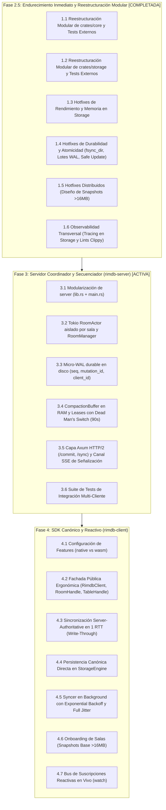

# PROPUESTA TÉCNICA UNIFICADA Y ESTRUCTURA DETALLADA DEL PROYECTO — RIMDB

**Documento:** Propuesta de Arquitectura, Estructura Modular y Plan de Ejecución  
**Fecha:** 21 de Septiembre de 2026  
**Referencia:** Complemento al informe multidisciplinar [2026-09-fase2-audit.md](../audits/2026-09-fase2-audit.md)  
**Estado:** Propuesta Técnica de Consenso para Fases 2.5 (Endurecimiento), 3 (Server Actors) y 4 (Client SDK)

---

## 1. SÍNTESIS ARQUITECTÓNICA Y RESOLUCIÓN DE COMPROMISOS (TRADE-OFFS)

A partir de las deliberaciones de los cuatro especialistas técnicos (Rust de Sistemas, Bases de Datos, Sistemas Distribuidos y Arquitectura de Software), se han resuelto formalmente los compromisos técnicos identificados:

```
┌────────────────────────────────────────────────────────────────────────────────────────┐
│                        ARQUITECTURA CANÓNICA UNIFICADA RIMDB                           │
├────────────────────────────────────────────────────────────────────────────────────────┤
│                                                                                        │
│   [ rimdb-core ] (Zero I/O, WASM nativo, dominio puro)                                 │
│    ├── Dominio: RoomId, ClientId, SequenceNumber, MutationId, CorrelationId           │
│    ├── Modelado: Value (24B), CompactRow, PrimaryKey (40B, L1), TableOperation (80B)   │
│    ├── Esquemas: TableSchema, ColumnDef, validación estricta y aridad                 │
│    ├── Consistencia: ClientSquash (ts) vs ServerSquash (seq), Reglas Anti-Zombi        │
│    ├── Criptografía: trait CryptoEngine (E2EE agnóstico a transporte)                  │
│    └── Protocolo: Mensajes binarios Bincode con límite de 16MB y Echo Cancellation     │
│                                                                                        │
│   [ rimdb-storage ] (Persistencia tabular, índices y snapshots)                        │
│    ├── trait StorageEngine (Async, zero-copy move semantics, universal)                │
│    ├── MemoryStorageEngine (Aislamiento por sala para WASM y tests)                    │
│    └── DiskStorageEngine (Nativo WAL con CRC32, cabecera RIM1, compactación CoW)       │
│                                                                                        │
│   [ rimdb-server ] (Coordinador y secuenciador monótono)                               │
│    ├── Capa de Red: Axum HTTP/2 (/commit, /sync, /heartbeat) + SSE (Signal Only)       │
│    ├── Concurrencia: Tokio RoomActor dedicado por sala (Cero cerraduras globales)      │
│    ├── Durabilidad: Micro-WAL en disco para (seq, mutation_id, client_id)              │
│    ├── Amortiguación: CompactionBuffer en RAM + Dead Man's Switch (Leases 90s)         │
│    └── Observabilidad: Tracing estructurado y correlación con CorrelationId            │
│                                                                                        │
│   [ rimdb-client ] (SDK Canónico y Reactivo)                                           │
│    ├── Fachada Pública: RimdbClient -> RoomHandle -> TableHandle                       │
│    ├── Persistencia Canónica: Delegada a rimdb-storage (Disk o Memory)                 │
│    ├── Sincronización en 1 RTT: Commit con validación server-side + deltas integrados  │
│    ├── Consistencia Total: Cero riesgo de corrupción local por rechazo de mutación     │
│    ├── Transporte Dual: Reqwest HTTP/2 (Nativo) vs WebFetch (WASM)                     │
│    └── Reactividad: Streams asíncronos en vivo (live query / watch)                    │
│                                                                                        │
└────────────────────────────────────────────────────────────────────────────────────────┘
```

---

## 2. DECISIONES TÉCNICAS CLAVE Y RESOLUCIÓN DE RIESGOS

### 2.1. Resolución de la Autoridad Temporal: Precedencia Estricta por Secuenciador
* **Problema Resuelto:** El algoritmo de squashing utilizaba el `timestamp` del cliente, permitiendo que relojes desincronizados usurparan la autoridad del servidor.
* **Decisión:** Establecer que la precedencia Last-Write-Wins (LWW) opera en el actor de la sala y asigna orden **estrictamente por el orden de llegada al actor y el `SequenceNumber` emitido**, erradicando cualquier dependencia de los relojes de cliente para resolver conflictos.

### 2.2. Resolución de Identificación de Origen: Enriquecimiento de `SequencedOperation`
* **Problema Resuelto:** Los clientes necesitan asociar unívocamente sus solicitudes de mutación con las operaciones secuenciadas devueltas por el servidor.
* **Decisión:** Enriquecer `SequencedOperation` con la atribución de origen:
  ```rust
  #[derive(Debug, Clone, PartialEq, Serialize, Deserialize)]
  pub struct SequencedOperation {
      pub seq: SequenceNumber,
      pub client_id: ClientId,
      pub mutation_id: MutationId,
      pub op: Operation,
  }
  ```
  Esto permite que el cliente verifique la confirmación de su propia mutación (`mutation_id`), aplique las mutaciones en `StorageEngine` sin ambigüedad y notifique a las consultas reactivas activas.

### 2.3. Resolución de Idempotencia Durable Post-Crash: Micro-WAL de Secuencia y Mutaciones
* **Problema Resuelto:** Una caché LRU de `MutationId` puramente en memoria pierde el estado tras un reinicio del servidor, rompiendo la garantía *Exactly-Once*.
* **Decisión:** El `RoomActor` registrará de forma persistente cada asignación en `meta_{room_id}.wal`:
  ```rust
  #[derive(Serialize, Deserialize)]
  struct MicroWalEntry {
      seq: SequenceNumber,
      mutation_id: MutationId,
      client_id: ClientId,
  }
  ```
  Al reiniciar o recuperar la sala, el actor reproduce el Micro-WAL, reconstruye su `head_seq` y repuebla la caché LRU en RAM.

### 2.4. Resolución de Latencias de Compactación: Non-Blocking Copy-on-Write (CoW)
* **Problema Resuelto:** Retener el `RwLockWriteGuard` durante la compresión Zstd y el `sync_all` congelaba todo el motor de almacenamiento ("stop-the-world").
* **Decisión:**
  1. Al alcanzarse el umbral de compactación, el hilo de almacenamiento clona la vista inmutable de las tablas (`Arc<BTreeMap>`) y captura `compacting_seq = head_seq`.
  2. La serialización Bincode, la compresión Zstd y la escritura en `.rimdb.tmp` se ejecutan en segundo plano vía `tokio::task::spawn_blocking`, sin retener cerrojos sobre `DiskRoomState`.
  3. Las lecturas y escrituras continúan operando normalmente sobre el archivo activo.
  4. Al concluir la tarea en background, se toma el cerrojo de escritura durante menos de $1\text{ ms}$ para anexar los deltas generados entre `compacting_seq` y el nuevo `head_seq`, ejecutar `rename` atómico y sustituir el descriptor de archivo.

### 2.5. Resolución de Durabilidad POSIX: Sincronización de Directorio (`fsync_dir`)
* **Problema Resuelto:** Cortes de energía tras `rename` o creación de archivos provocaban la pérdida de la entrada de directorio (*dentry*) en sistemas POSIX.
* **Decisión:** Implementar la función de sistema `sync_dir(&path)` invocada obligatoriamente tras la creación del archivo `room_{id}.rimdb` y tras cada `rename` atómico de compactación.

### 2.6. Resolución de Integridad de Lotes: Enmarcado Atómico de Lote en WAL
* **Problema Resuelto:** Un corte de energía en medio de un lote multi-operación recuperaba deltas parciales.
* **Decisión:** Enmarcar el lote completo con cabecera de transacción y suma CRC32 unificada:
  ```text
  [BATCH_MAGIC: u16 = 0xBA7C][batch_len: u32][batch_crc32: u32][ops_count: u32][payload_ops]
  ```
  Si se interrumpe la escritura, el lote completo se clasifica como torn-write y se descarta atómicamente.

### 2.7. Abstracción Formal para Cifrado E2EE (`CryptoEngine`)
* **Decisión:** Añadir a `crates/core` el trait formal:
  ```rust
  #[cfg_attr(target_arch = "wasm32", async_trait(?Send))]
  #[cfg_attr(not(target_arch = "wasm32"), async_trait)]
  pub trait CryptoEngine: Send + Sync {
      async fn encrypt(&self, room_id: &RoomId, plaintext: &[u8]) -> Result<Vec<u8>, CryptoError>;
      async fn decrypt(&self, room_id: &RoomId, ciphertext: &[u8]) -> Result<Vec<u8>, CryptoError>;
  }
  ```

---

## 3. ESTRUCTURA DETALLADA DEL PROYECTO Y ORGANIZACIÓN MODULAR

A continuación se detalla la estructura modular definitiva de todo el workspace, agrupada por responsabilidades limpias:

```text
rimdb/
├── Cargo.toml                       # Manifest raíz con workspaces, lints y dependencias
├── ARCHITECTURE.md                  # Especificación arquitectónica y ADRs
├── ROADMAP.md                       # Hoja de ruta de desarrollo actualizada
├── README.md                        # Documento de inicio, estado y navegación
│
├── docs/
│   ├── audits/                      # Informes de auditorías multidisciplinares
│   └── proposals/                   # Propuestas técnicas detalladas
│
└── crates/
    ├── core/                        # [rimdb-core] Dominio Puro, Zero I/O, WASM
    │   ├── Cargo.toml
    │   ├── tests/                   # Pruebas de integración externas
    │   └── src/
    │       ├── lib.rs               # Exports públicos limpios y facades
    │       ├── id.rs                # Newtypes: RoomId, ClientId, SequenceNumber, MutationId, CorrelationId
    │       ├── crypto.rs            # trait CryptoEngine, CryptoError, NoOpCryptoEngine
    │       ├── value/               # scalar.rs (Value 24B), data_type.rs, row.rs (PrimaryKey 40B, CompactRow)
    │       ├── schema/              # column.rs, table.rs, global.rs, validation.rs
    │       ├── mutation/            # op.rs (TableOperation 80B, Operation 96B), squash.rs, buffer.rs
    │       └── protocol/            # messages.rs (Deregister, Origin Attribution), codec.rs (16MB DoS limit, tracing)
    │
    ├── storage/                     # [rimdb-storage] Persistencia Tabular y Snapshots
    │   ├── Cargo.toml               # Features: default = ["native"], wasm = []
    │   ├── tests/                   # Pruebas de integración externas
    │   └── src/
    │       ├── lib.rs               # Contrato StorageEngine y re-exports
    │       ├── error.rs             # StorageError con causas contextualizadas
    │       ├── engine.rs            # Definición formal de StorageEngine y RowStream
    │       ├── options.rs           # KeyRange, ScanDirection, ScanOptions (Limit/Projection)
    │       ├── memory/              # MemoryStorageEngine (Aislamiento concurrente por sala)
    │       ├── disk/                # DiskStorageEngine (Format RIM1 64B, WAL, recovery, compactor CoW)
    │       ├── index/               # PrimaryIndex en memoria y extensiones de indexado
    │       └── sys.rs               # Utilidades de bajo nivel: fsync_dir (sync_dir)
    │
    ├── server/                      # [rimdb-server] Secuenciador y Coordinador (Fase 3)
    │   ├── Cargo.toml
    │   └── src/
    │       ├── lib.rs               # Biblioteca reutilizable del servidor (facilita tests)
    │       ├── main.rs              # Punto de entrada ejecutable CLI
    │       ├── config.rs            # ServerConfig (puertos, micro-wal dir, timeouts)
    │       ├── error.rs             # ServerError y conversión a códigos HTTP / ErrorCode
    │       ├── actor/               # Concurrencia por actores Tokio por sala
    │       │   ├── mod.rs
    │       │   ├── command.rs       # RoomCommand enum y canales oneshot
    │       │   ├── manager.rs       # RoomManager (Sharded Registry con DashMap)
    │       │   ├── room.rs          # RoomActor (Secuenciación, squashing determinista, leases)
    │       │   └── lease.rs         # ClientLeaseTracker (Heartbeats y Dead Man's Switch a 90s)
    │       ├── buffer/              # Amortiguación en RAM
    │       │   ├── mod.rs
    │       │   ├── compaction.rs    # CompactionBuffer (BTreeMap ordenado por SequenceNumber)
    │       │   └── dedup.rs         # LRU Cache para MutationId respaldada por Micro-WAL
    │       ├── wal.rs               # MicroWAL durable (seq, mutation_id, client_id)
    │       └── api/                 # Capa de transporte de red Axum HTTP/2 + SSE
    │           ├── mod.rs
    │           ├── router.rs        # Configuración del Router de Axum
    │           ├── handlers.rs      # Handlers: /commit, /sync, /heartbeat, /register
    │           └── sse.rs           # Canal de señalización liviana (Signal-Only SSE)
    │
    └── client/                      # [rimdb-client] SDK Canónico y Reactivo (Fase 4)
        ├── Cargo.toml               # Features: default = ["native"], wasm = ["web-sys", ...]
        └── src/
            ├── lib.rs               # Exports públicos del SDK
            ├── config.rs            # ClientConfig (Server URLs, credenciales, retries, jitter)
            ├── error.rs             # ClientError (ValidationError, NetworkError, StorageError)
            ├── api/                 # Fachada pública ergonómica
            │   ├── mod.rs
            │   ├── client.rs        # RimdbClient (Gestor global de conexión y salas)
            │   ├── room.rs          # RoomHandle (Contexto de una sala activa)
            │   └── table.rs         # TableHandle (Operaciones CRUD, Scans y Live Queries)
            ├── sync/                # Motor de sincronización canónica en 1 RTT
            │   ├── mod.rs
            │   ├── syncer.rs        # SyncClient (Commit & Sync en 1 RTT)
            │   └── reactive.rs      # ChangeStream y suscripciones reactivas a tuplas
            └── transport/           # Abstracción de red desacoplada
                ├── mod.rs
                ├── client.rs        # trait TransportClient
                ├── native.rs        # Implementación Reqwest HTTP/2 persistente
                └── wasm.rs          # Implementación WebFetch para navegadores
```

---

### 4.2. `crates/storage`: Endurecimiento de Durabilidad y Concurrencia

#### A. Sincronización POSIX del Directorio (`crates/storage/src/sys.rs`):
Invocado en `open_room` (tras crear el archivo nuevo) y en `compact_room_internal` (inmediatamente después del `rename`).

#### B. Compactación Asíncrona sin Pausa ("Non-Blocking CoW Compactor"):
Mover la compresión Zstandard y la escritura de archivo fuera del lock exclusivo hacia `tokio::task::spawn_blocking`, asegurando que `get()` y `scan()` se ejecuten con latencias $< 1\text{ ms}$ en todo momento.

#### C. Corrección de Semántica de `Update` Ciego en Storage:
En `crates/storage/src/memory/state.rs` y `disk/mod.rs`: Si llega un `Update` para un PK que no existe previamente, **rechazar la mutación o ignorarla**, en lugar de fabricar una tupla con valores nulos que violen restricciones de esquema `nullable: false`.

---

### 4.3. `crates/server`: Coordinador Asíncrono de Actores (Fase 3)

#### A. Modelo de Actores Tokio por Sala (`RoomActor`):
* **Canal de Comandos Acotado:** `mpsc::channel(1024)`.
* **Procesamiento Monotónico Determinista:**
  ```rust
  pub enum RoomCommand {
      Commit {
          client_id: ClientId,
          mutation_id: MutationId,
          correlation_id: CorrelationId,
          op: Operation,
          reply_to: oneshot::Sender<Result<SequenceNumber, ServerError>>,
      },
      Sync {
          last_ack_seq: SequenceNumber,
          max_batch_size: u32,
          reply_to: oneshot::Sender<Result<SyncBatch, ServerError>>,
      },
      Heartbeat {
          client_id: ClientId,
          last_ack_seq: SequenceNumber,
      },
  }
  ```
* **Micro-WAL de Secuencia y Mutaciones:**
  Cada `Commit` escribe en `meta_{room_id}.wal` el registro `[seq: u64][mutation_id: [u8; 16]][client_id: len+str]` con CRC32 antes de confirmar al cliente.
* **Leases de Clientes y Dead Man's Switch:**
  Los clientes inactivos por más de 90 segundos pasan a estado `Dormant`, liberando el cómputo de `min_ack_seq` para evitar fugas de memoria.

#### B. Capa de Transporte Axum:
* `POST /rooms/:room_id/commit`: decodifica `ClientMessage::Commit`, envía al actor vía `oneshot`, responde `CommitAck`.
* `POST /rooms/:room_id/sync`: solicita deltas al actor y responde `SyncBatch`.
* `POST /rooms/:room_id/heartbeat`: renueva lease del cliente.
* `GET /rooms/:room_id/events`: emite eventos SSE (`Event::HeadAdvanced`) para alertar al cliente de nuevos deltas.

---

### 4.4. `crates/client`: SDK Canónico y Reactivo (Fase 4)

#### A. Jerarquía Ergonómica de API de Usuario:
```rust
let client = RimdbClient::open(config, storage_engine).await?;
let room = client.room(RoomId::new("engineering_team")).await?;
let tasks = room.table("tasks")?;

// 1. Inserción con validación previa en servidor y sync en 1 RTT
let task_id = tasks.insert(row).await?;

// 2. Consulta local canónica de alta velocidad (<1ms)
let task = tasks.get(&task_id).await?;

// 3. Suscripción reactiva en vivo
let mut live_stream = tasks.watch(&task_id).await?;
tokio::spawn(async move {
    while let Some(updated_row) = live_stream.next().await {
        println!("Tarea actualizada: {:?}", updated_row);
    }
});
```

---

## 5. PLAN DE EJECUCIÓN SECUENCIAL DETALLADO



---

### Paso 2: Fase 3 — Servidor Coordinador y Secuenciador (`rimdb-server`)

* **3.1. Modularización del Crate `rimdb-server`:**
  * Separar el crate en `src/lib.rs` (biblioteca reusable con lógica de actores y handlers para pruebas de integración completas) y `src/main.rs` (entrypoint CLI binario que parsea configuración y levanta el servidor).
  * Implementar struct deserializable `ServerConfig` con soporte para configuración por TOML y variables de entorno.
* **3.2. Arquitectura de Concurrencia por Actores Tokio (`RoomActor`):**
  * Implementar `RoomManager` como registro shardeado (`DashMap<RoomId, mpsc::Sender<RoomCommand>>`) que gestiona el ciclo de vida de los actores y los despierta a demanda.
  * Implementar `RoomActor` en una tarea dedicada de Tokio por sala comunicada mediante canales acotados `mpsc::channel(1024)`, eliminando cerraduras globales.
* **3.3. Micro-WAL Durable en Disco para Idempotencia Post-Crash:**
  * Implementar `MicroWal` en archivo `meta_{room_id}.wal` registrando cada asignación `(seq, mutation_id, client_id)` con CRC32 antes de devolver el ACK al cliente, garantizando *Exactly-Once* estricto incluso tras caídas súbitas del proceso.
* **3.4. CompactionBuffer en RAM y Leases de Clientes (Anti-OOM):**
  * Implementar `CompactionBuffer` en memoria respaldado por `BTreeMap<SequenceNumber, SequencedOperation>` e índice rápido de claves primarias.
  * **Squash de Servidor:** Parametrizar `TableBuffer` con política `server_squash_table_operations` (orden autoritativo por secuencia/llegada) para que el `RoomActor` no aplique LWW de cliente.
  * **Compactación CoW sin Pausa:** El actor clona la vista inmutable (`Arc<BTreeMap>`) y libera el lock de la sala de inmediato para seguir procesando escrituras en el WAL mientras Zstd comprime en `spawn_blocking`, re-adquiriéndolo solo $< 1\text{ ms}$ al final para volcar los deltas acumulados y renombrar.
  * **Preservación Atómica de `flock`:** Tomar el bloqueo exclusivo sobre `.rimdb.tmp` *antes* del `rename` para que el nuevo inodo ya nazca bloqueado a nivel de sistema operativo sin micro-ventanas de carrera.
  * Implementar `ClientLeaseTracker` con *Dead Man's Switch* (timeout de 90s) para degradar a clientes inactivos a estado `Dormant`, liberando el cómputo de `min_ack_seq` y permitiendo la poda continua de la RAM.
* **3.5. Capa de Red Axum HTTP/2 y Canal Liviano SSE:**
  * Implementar handlers HTTP/2: `POST /rooms/:room_id/commit`, `POST /rooms/:room_id/sync`, `POST /rooms/:room_id/heartbeat`, `POST /rooms/:room_id/register` y `POST /rooms/:room_id/deregister`.
  * Implementar canal de señalización liviana SSE (`GET /rooms/:room_id/events`) que únicamente emite notificaciones (`Event::HeadAdvanced`), delegando la transferencia de datos masivos al pull paginado `/sync` con backpressure.
* **3.6. Suite de Pruebas de Integración Concurrente:**
  * Implementar pruebas de integración multi-cliente simulando concurrencia real, fallos de red simulados, reinicio del servidor y verificación de no-duplicación de mutaciones.

---

### Paso 3: Fase 4 — SDK Canónico y Reactivo (`rimdb-client`)

* **4.1. Configuración de Feature Flags para Compilación Multiplataforma:**
  * Configurar `crates/client/Cargo.toml` con features `default = ["native"]` y `wasm = ["web-sys", "wasm-bindgen-futures", "gloo-net"]`, asegurando que dependencias nativas como `tokio/full` y `reqwest` no rompan la compilación WebAssembly.
  * Implementar trait condicional `CryptoConcurrencyBounds` para `CryptoEngine` (`Send + Sync` en nativo, relajado a `?Send` en `wasm32`) para soportar objetos WebCrypto / JavaScript.
* **4.2. Fachada Pública Ergonómica del SDK:**
  * Implementar la jerarquía de usuario: `RimdbClient` (gestor de conexión global) -> `RoomHandle` (ámbito de sala) -> `TableHandle` (operaciones CRUD declarativas sobre tablas).
  * Implementar struct `ClientConfig` con builders tipados.
* **4.3. Sincronización Server-Authoritative en 1 RTT (Write-Through):**
  * Para garantizar integridad absoluta y evitar estados corruptos por rechazos de validación: toda mutación local se envía al endpoint `/commit` junto con `last_ack_seq`.
  * El servidor valida reglas de esquema, tipos y aridad. Si falla, el cliente recibe un error tipado y el almacenamiento local **permanece intacto y canónico**.
  * Si es aprobada, el servidor responde con el `SequenceNumber` asignado y los deltas remotos acumulados (commit + sync en 1 solo RTT).
* **4.4. Persistencia Canónica Directa en `StorageEngine`:**
  * El almacenamiento local opera exclusivamente con datos canónicos secuenciados (`SequencedOperation`), eliminando por completo la necesidad de motores de rollback/rebase en el cliente.
  * En modo offline, el cliente opera en **Solo Lectura** de ultra-alta velocidad ($<1\text{ ms}$). Cualquier escritura offline retorna `Err(ClientError::Offline)`. *(La capacidad de retener borradores offline no confirmados queda formalmente diferida a post-v0.1 como una capa segregada).*
* **4.5. Worker de Sincronización en Segundo Plano con Jitter:**
  * Implementar `SyncWorker` que escuche las señales SSE y ejecute pulls paginados hacia `/sync`.
  * Implementar reconexión automática con *Exponential Backoff* y *Full Jitter* para evitar tormentas de reintentos (*thundering herd*).
* **4.6. Onboarding de Salas y Snapshots Base:**
  * Implementar flujo de onboarding para clientes rezagados (`BehindCompaction`) o nuevos mediante descarga de snapshots comprimidos con Zstandard y restauración atómica en `StorageEngine::apply_snapshot`.
* **4.7. Bus de Suscripciones Reactivas en Vivo (`watch`):**
  * Implementar método `table.watch(pk)` que retorne un stream asíncrono (`ChangeStream`) que emita actualizaciones en tiempo real una vez que las mutaciones son confirmadas y aplicadas en el almacenamiento canónico.
