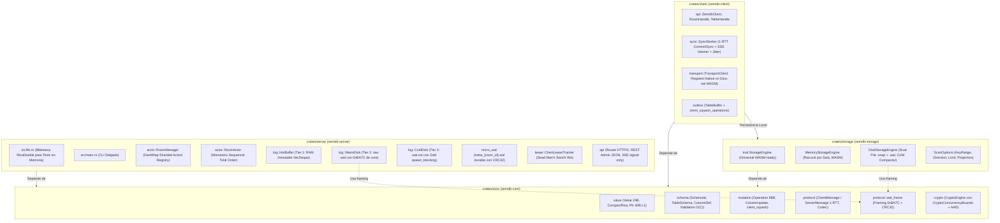

# PROPUESTA TÉCNICA UNIFICADA Y PLAN DE EVOLUCIÓN ARQUITECTÓNICA — ZEMDB (FASE 3 - MIDPOINT)

**Documento:** Propuesta de Evolución, Arquitectura Unificada y Plan de Acción  
**Fecha:** 24 de Septiembre de 2026  
**Referencia:** Complemento al informe de auditoría [2026-09-fase3-audit.md](../audits/2026-09-fase3-audit.md)  
**Estado:** Propuesta Técnica Aprobada de Consenso para el Cierre de Core/Storage (Fase 2.8), Construcción del Servidor (Fase 3) e Implementación del SDK de Cliente (Fase 4)  
**Premisa del Proyecto:** Versión v1 en desarrollo inicial; **no se requiere retrocompatibilidad**, lo que habilita la reestructuración profunda de contratos binarios y módulos para alcanzar la máxima excelencia técnica.

---

## 1. RESOLUCIÓN DE TENSIONES TÉCNICAS Y COMPROMISOS DE DISEÑO

A partir de los hallazgos y deliberaciones de los 4 especialistas (Rust, Motores de Bases de Datos, Sistemas Distribuidos y Arquitectura), se establecen las siguientes resoluciones arquitectónicas canónicas:

### 1.1. Tensión 1: Sincronización en 1 RTT vs. Monotonía Estricta en Storage [RESUELTO - FASE 2.8 ✅]
* **Conflicto:** Si un cliente commitea una mutación en un estado rezagado respecto a otros clientes concurrentes, el servidor le confirmaba la secuencia asignada (`CommitAck`) sin entregarle los deltas intermedios generados por terceros. Al intentar persistir su propia mutación en su almacenamiento local, `StorageEngine::apply_batch` abortaba inmediatamente por `SequenceMismatch`, ya que la secuencia no era contigua (`head_seq + 1`).
* **Resolución Canónica:** Se rediseña el contrato de red en `crates/core/src/protocol/messages.rs`:
  - `ClientMessage::Commit` incorpora obligatoriamente el cursor actual del cliente: `last_ack_seq: SequenceNumber`.
  - `ServerMessage::CommitAck` incorpora los deltas remotos acumulados: `catchup_ops: Vec<SequencedOperation>`.
  - El servidor valida la mutación, asigna la nueva secuencia canónica $S_{\text{new}}$, y empaqueta en el `CommitAck` todas las operaciones ocurridas en el rango $(last\_ack\_seq .. S_{\text{new}}]$ (incluyendo la propia mutación confirmada al final).
  - El cliente aplica este lote contiguo directamente en una sola llamada atómica a `StorageEngine::apply_batch`, logrando confirmación, sincronización de pares y consistencia local en exactamente **1 RTT**.
* **Estado de Implementación:** ✅ **Completado.** Modificado `ClientMessage::Commit` y `ServerMessage::CommitAck` en `crates/core/src/protocol/messages.rs` con suites de pruebas en `crates/core/tests/protocol_codec_tests.rs`.

### 1.2. Tensión 2: Persistencia en Disco: Archivo Monolítico (`.zemdb`) vs. Arquitectura Dual-File (`.snap` + `.wal`) [RESUELTO - FASE 2.8 ✅]
* **Conflicto:** El especialista en bases de datos demostró que colocar el snapshot base y el WAL en un solo archivo `room_{id}.zemdb` hace imposible truncar el WAL *in-place*, forzando una compactación stop-the-world que bloquea todas las escrituras y lecturas mientras se reescribe todo el fichero.
* **Resolución Canónica:** Se adopta para `DiskStorageEngine` la **arquitectura Dual-File**:
  - `room_{id}.snap`: Archivo inmutable del snapshot consolidado (cabecera de 64B, compresión Zstandard y checksum CRC32/BLAKE3).
  - `room_{id}.wal`: Log secuencial append-only de deltas enmarcados con cabecera `0xBA7C`.
  - **Mecanismo CoW Real:** Durante la compactación, una tarea en background clona en memoria la referencia lógica de las tablas, escribe el nuevo snapshot en `room_{id}.snap.tmp`, ejecuta `sync_all()`, `rename()` atómico a `.snap` y `sync_dir()`. Las mutaciones entrantes **nunca se bloquean** y continúan agregándose a `room_{id}.wal`. Al concluir el snapshot, el archivo WAL se trunca o rota atómicamente.
* **Estado de Implementación:** ✅ **Completado.** Implementada arquitectura Dual-File en `crates/storage/src/disk/` (`mod.rs`, `compactor.rs`, `recovery.rs`) con truncado in-place (`set_len(0)`), adquisición atómica de `flock` sobre `.tmp` previo a `rename`, y scan paginado por bloques de 64 tuplas liberando cerrojos de lectura. Verificado con `test_dual_file_storage_layout_and_compaction_truncation`.

### 1.3. Tensión 3: Ubicación del Enmarcado Físico WAL (`0xBA7C`) [RESUELTO - FASE 2.8 ✅]
* **Conflicto:** El formato de enmarcado de lotes WAL reside actualmente en `crates/storage/src/disk/format.rs`. Sin embargo, el servidor (`zemdb-server`) necesita esa misma lógica binaria para su Tier 2 (Warm Disk Log), pero no debe depender del crate de almacenamiento tabular del cliente.
* **Resolución Canónica:** Se extrae el subsistema de enmarcado físico a `crates/core/src/protocol/wal_frame.rs`. `zemdb-core` asume formalmente la propiedad de todos los formatos y framing binarios. Tanto `zemdb-storage` como `zemdb-server` consumen `wal_frame` desde el core sin duplicar código ni acoplar dependencias cruzadas.
* **Estado de Implementación:** ✅ **Completado.** Creado `crates/core/src/protocol/wal_frame.rs` con enmarcado `0xBA7C`, cabecera de 14B, CRC32 por lote, decodificación y replay streaming. `crates/storage/src/disk/format.rs` refactorizado para delegar en `wal_frame`.

### 1.4. Tensión 4: Squashing en Servidor vs. Log Inmutable de 4 Niveles [RESUELTO - FASE 2.8 ✅]
* **Conflicto:** El roadmap mantenía referencias ambiguas a un "CompactionBuffer con squashing autoritativo de servidor", lo que destruiría la contigüidad monotónica del log y generaría brechas de secuencia irreparables para los clientes que se reconectan.
* **Resolución Canónica:** Se purga de forma absoluta el squashing en el servidor. El log histórico de mutaciones del servidor es **100% append-only, contiguo e inmutable** a través de su jerarquía de 4 niveles (Hot RAM -> Warm Disk -> Cold Disk -> Detrás de Compactación). El squashing queda circunscrito **exclusivamente a la cola de salida local del cliente (*Outbox Queue*)**, previo a su despacho por red.
* **Estado de Implementación:** ✅ **Completado.** Purgadas todas las referencias a squashing en el servidor en `ROADMAP.md` y `ARCHITECTURE.md`. Formalizado el diseño del log de 4 niveles (`HotBuffer` en RAM -> `WarmDisk` `.wal` -> `ColdDisk` `.wal.zst` -> `BehindCompaction`).

### 1.5. Tensión 5: Universalidad WebAssembly y Criptografía de Dominio [RESUELTO - FASE 2.8 ✅]
* **Conflicto:** `CryptoEngine` requería `Send + Sync` incondicionalmente, rompiendo la compilación hacia `wasm32-unknown-unknown` para implementaciones WebCrypto. Asimismo, carecía de contexto de datos autenticados adicionales (AAD).
* **Resolución Canónica:**
  - Se define `CryptoConcurrencyBounds` condicional (`Send + Sync` en nativo, vacío en `wasm32`), de forma análoga a `EngineConcurrencyBounds`.
  - Se incorpora soporte de AAD en los métodos de cifrado/descifrado:
    ```rust
    async fn encrypt(&self, room_id: &RoomId, aad: &[u8], plaintext: &[u8]) -> Result<Vec<u8>, CryptoError>;
    async fn decrypt(&self, room_id: &RoomId, aad: &[u8], ciphertext: &[u8]) -> Result<Vec<u8>, CryptoError>;
    ```
    El cliente suministra `(table_id, pk, column_idx)` como AAD, blindando criptográficamente la base contra ataques de sustitución de columnas cifradas.
* **Estado de Implementación:** ✅ **Completado.** Definido `CryptoConcurrencyBounds` en `crates/core/src/crypto.rs` (`Send + Sync` en nativo, relajado en `wasm32`), actualizado `CryptoEngine` con parámetro `aad: &[u8]`, e implementado en `NoOpCryptoEngine` con suite de pruebas en `crates/core/tests/crypto_tests.rs` y compilación validada hacia `wasm32-unknown-unknown`.

### 1.6. Tensión 6: Destino de `PrimaryIndex` [RESUELTO - FASE 2.8 ✅]
* **Resolución Canónica:** El struct `PrimaryIndex` en `crates/storage/src/index/primary.rs` se purga del repositorio. Tanto `MemoryStorageEngine` como `DiskStorageEngine` continuarán operando directamente sobre `HashMap<u16, BTreeMap<PrimaryKey, CompactRow>>`, eliminando capas de indirección innecesarias y código muerto.
* **Estado de Implementación:** ✅ **Completado.** Eliminado el archivo `crates/storage/src/index/primary.rs` y el módulo `crates/storage/src/index/`, y removidas sus exportaciones en `crates/storage/src/lib.rs`.

### 1.7. Tensión 7: Optimización de Punteros en `Value::Bytes` [RESUELTO - FASE 2.8 ✅]
* **Resolución Canónica:** Se reemplaza `Value::Bytes(Box<Bytes>)` por `Value::Bytes(Box<[u8]>)`. El fat pointer `(ptr, usize)` ocupa exactamente 16 bytes, manteniendo el footprint de `Value` en 24 bytes exactos, erradicando una segunda indirección en el heap y alocaciones redundantes durante clonaciones.
* **Estado de Implementación:** ✅ **Completado.** Actualizado `Value::Bytes(Box<[u8]>)` en `crates/core/src/value/scalar.rs` con implementaciones `From`, verificando el tamaño de 24 bytes y tests de ordenación/hashing en `crates/core/tests/types_memory_tests.rs`.

---

## 2. ARQUITECTURA UNIFICADA Y ESTRUCTURA OBJETIVO DEL WORKSPACE

El espacio de trabajo converge en 4 crates desacoplados con responsabilidades matemáticas y de sistemas estrictas:



### Organización Física de Archivos en el Repositorio

```text
zemdb/
├── Cargo.toml                      # Workspace manifest con forbid(unsafe_code)
├── ARCHITECTURE.md                 # Especificación arquitectónica y ADRs canónicos
├── ROADMAP.md                      # Hoja de ruta secuencial actualizada
├── docs/
│   ├── audits/                     # Auditorías multidisciplinares (2026-09-fase3-audit.md)
│   └── proposals/                  # Propuestas unificadas (2026-09-fase3-proposal.md)
│
├── crates/
│   ├── core/                       # [zemdb-core] Dominio puro, Cero I/O, WASM
│   │   ├── Cargo.toml
│   │   ├── src/
│   │   │   ├── lib.rs
│   │   │   ├── id.rs               # Newtypes: RoomId, SchemaId, ClientId, SeqNum, etc.
│   │   │   ├── value/              # scalar.rs (Value 24B), row.rs (PK 40B, CompactRow)
│   │   │   ├── schema/             # table.rs, global.rs, validation.rs (Validación O(C))
│   │   │   ├── mutation/           # op.rs (Operation 88B), squash.rs (Two-pointer merge), buffer.rs
│   │   │   ├── protocol/
│   │   │   │   ├── messages.rs     # ClientMessage::Commit y ServerMessage::CommitAck 1-RTT
│   │   │   │   ├── codec.rs        # Codec con reject_trailing_bytes() y límite 16MB
│   │   │   │   └── wal_frame.rs    # Enmarcado 0xBA7C, cabecera 14B, CRC32 por lote
│   │   │   └── crypto.rs           # CryptoEngine con CryptoConcurrencyBounds y AAD
│   │   └── tests/                  # 4 suites de tests externos
│   │
│   ├── storage/                    # [zemdb-storage] Persistencia tabular local
│   │   ├── Cargo.toml              # Target cfg: tokio nativo vs tokio wasm
│   │   ├── src/
│   │   │   ├── lib.rs
│   │   │   ├── engine.rs           # trait StorageEngine (get/scan por table_id / TableRef)
│   │   │   ├── error.rs            # StorageError tipado
│   │   │   ├── options.rs          # KeyRange, ScanOptions, ScanDirection
│   │   │   ├── sys.rs              # sync_dir POSIX
│   │   │   ├── memory/             # state.rs, mod.rs (MemoryStorageEngine)
│   │   │   └── disk/
│   │   │       ├── mod.rs          # DiskStorageEngine (scan no bloqueante con cursor)
│   │   │       ├── format.rs       # Header ZEM1 de 64B y schema fingerprint
│   │   │       ├── wal.rs          # Gestor de log append-only (.wal)
│   │   │       ├── recovery.rs     # Replay con BufReader 64KB y truncado de torn writes
│   │   │       └── compactor.rs    # Compactor CoW background con flock atómico
│   │   └── tests/                  # 4 suites de tests externos
│   │
│   ├── server/                     # [zemdb-server] Coordinador y secuenciador
│   │   ├── Cargo.toml              # Dependencias de workspace
│   │   ├── src/
│   │   │   ├── lib.rs              # [NUEVO] Motor reutilizable para tests de integración
│   │   │   ├── main.rs             # CLI de producción
│   │   │   ├── config.rs           # ServerConfig (TOML y env vars)
│   │   │   ├── error.rs            # ServerError y mapeo a códigos HTTP / binarios
│   │   │   ├── actor/
│   │   │   │   ├── mod.rs
│   │   │   │   ├── command.rs      # RoomCommand (Commit, Sync, Heartbeat, Register)
│   │   │   │   ├── manager.rs      # RoomManager con DashMap<RoomId, Sender<RoomCommand>>
│   │   │   │   ├── room.rs         # RoomActor Tokio task (Secuenciador Monótono)
│   │   │   │   └── lease.rs        # ClientLeaseTracker (Dead Man's Switch 90s)
│   │   │   ├── log/
│   │   │   │   ├── hot_buffer.rs   # Tier 1: VecDeque<SequencedOperation> contiguo en RAM
│   │   │   │   ├── warm_disk.rs    # Tier 2: raw .wal con wal_frame de core
│   │   │   │   ├── cold_disk.rs    # Tier 3: .wal.zst con Zstd en spawn_blocking
│   │   │   │   └── policy.rs       # RoomLifecyclePolicy
│   │   │   ├── micro_wal.rs        # meta_{room_id}.wal durable con CRC32
│   │   │   ├── dedup.rs            # Caché LRU de MutationId
│   │   │   ├── schema_registry.rs  # DashMap<SchemaId, Arc<Schema>>
│   │   │   ├── relay.rs            # Streaming relay de chunks de snapshot (> 16 MB)
│   │   │   └── api/
│   │   │       ├── router.rs       # Router Axum principal
│   │   │       ├── control_plane.rs# REST JSON Admin (/admin/schemas, /admin/rooms) con Bearer
│   │   │       ├── data_plane.rs   # HTTP/2 binario (/commit, /sync, /heartbeat, etc.)
│   │   │       └── sse.rs          # Canal SSE signal-only (Event::HeadAdvanced)
│   │   └── tests/                  # Tests de integración multi-cliente en memoria
│   │
│   └── client/                     # [zemdb-client] SDK Local-First reactivo
│       ├── Cargo.toml              # features: default = ["native"], wasm = ["web-sys"]
│       ├── src/
│       │   ├── lib.rs              # Re-exports ergonómicos (ZemdbClient, RoomHandle, TableHandle)
│       │   ├── config.rs           # ClientConfig
│       │   ├── error.rs            # ClientError
│       │   ├── api/
│       │   │   ├── client.rs       # ZemdbClient
│       │   │   ├── room.rs         # RoomHandle
│       │   │   └── table.rs        # TableHandle (CRUD y scans con pushdown)
│       │   ├── sync/
│       │   │   ├── syncer.rs       # Pipeline atómico 1-RTT Commit & Sync (Write-Through)
│       │   │   ├── worker.rs       # SyncWorker (SSE consumer + full jitter backoff)
│       │   │   └── reactive.rs     # ChangeStream bus para table.watch(pk)
│       │   ├── transport/
│       │   │   ├── trait.rs        # trait TransportClient
│       │   │   ├── native.rs       # Adaptador HTTP/2 Reqwest
│       │   │   └── wasm.rs         # Adaptador WebFetch para navegadores
│       │   └── outbox.rs           # TableBuffer outbox con client_squash_operations
│       └── tests/                  # Tests de cliente y sincronización reactiva
```

---

## 3. LISTADO CANÓNICO DE BUENAS PRÁCTICAS Y ESTÁNDARES DE DESARROLLO

Todo desarrollo a partir de este punto debe cumplir de forma no negociable con los siguientes estándares:

### 3.1. Seguridad y Ergonomía de Memoria
1. **Política Zero Unsafe:** Prohibición absoluta de bloques `unsafe` (`#![forbid(unsafe_code)]` forzado a nivel de workspace).
2. **Alineación a Líneas de Caché de CPU:** Toda estructura clave en el bucle caliente debe diseñarse respetando los límites de hardware: `PrimaryKey` $\le 40\text{B}$ ($< 64\text{B}$ L1 cache line), `Value` $\le 24\text{B}$, `Operation` $\le 88\text{B}$, `SequencedOperation` $\le 96\text{B}$.
3. **Cero Alocaciones en Comparaciones:** Prohibido comparar enums o tipos de datos mediante formateo o conversión a cadenas de texto (`ToString`, `format!`). Utilizar discriminantes numéricos directos en $O(1)$ (`type_order(&self) -> u8`).
4. **Encapsulación Estricta de Newtypes:** Los tipos de identidad (`RoomId`, `SchemaId`, etc.) no deben exponer sus campos internos (`pub(crate)` o privados). Se prohíbe implementar `Deref` en tipos que no sean punteros inteligentes canónicos (directriz Rust [C-DEREF]); se proveerán métodos explícitos (`as_str()`, `get()`) e implementaciones de `AsRef<str>` y `From`.

### 3.2. Concurrencia y Durabilidad Asíncrona
1. **Cero Retención de Bloqueos a través de Canales Tokio:** Ninguna tarea de base de datos puede retener un `RwLockReadGuard` o `RwLockWriteGuard` mientras realiza operaciones `.await` sobre canales `mpsc` o I/O de red. Los escaneos deben paginarse por batches atómicos (ej. 64 elementos) liberando el cerrojo entre iteraciones.
2. **Preservación Atómica de `flock`:** En cualquier flujo de reemplazo atómico de archivos (*write-tmp-and-rename*), el cerrojo exclusivo del kernel (`flock`) debe adquirirse sobre el archivo temporal `.tmp` **antes** de invocar `rename()`.
3. **Aislamiento de Cargas de CPU:** Toda operación de compresión o descompresión intensiva (Zstandard) o cálculo de sumas pesadas debe ejecutarse en el thread pool de cómputo mediante `tokio::task::spawn_blocking`.
4. **Group Commit en Disco:** Las escrituras de múltiples solicitudes concurrentes deben agruparse en una sola operación de E/S (`write_all` + `sync_data`), maximizando el throughput físico del disco.

### 3.3. Protocolos de Red y Consistencia Distribuida
1. **Write-Through 1-RTT Estricto:** El cliente nunca escribe mutaciones optimistas no confirmadas en su motor de almacenamiento persistente (`zemdb-storage`). Toda mutación se valida y secuencia en el servidor en 1 RTT y se persiste localmente únicamente cuando es canónica.
2. **Contigüidad Absoluta del Log del Servidor:** El servidor jamás aplica squashing sobre deltas secuenciados. Cada operación incrementa exactamente en uno la secuencia global ($seq_{k+1} = seq_k + 1$).
3. **Rechazo Estricto de Bytes Residuales:** Los decodificadores de protocolo deben utilizar `reject_trailing_bytes()` para detectar desincronizaciones de tramas o payloads truncados.
4. **Dead Man's Switch en Leases:** Los clientes inactivos sin heartbeat durante 90 segundos pasan automáticamente a estado `Dormant`, liberando la retención de memoria en el servidor.
5. **Reconexión Resiliente con Jitter:** Todo reintento de conexión del cliente debe aplicar *Exponential Backoff* con *Full Jitter*, previniendo avalanchas (*thundering herd*) contra el servidor.

---

## 4. PLAN DE ACCIÓN E IMPLEMENTACIÓN POR FASES

El plan de trabajo se estructura en **3 fases secuenciales**, comenzando por los hotfixes inmediatos que desbloquean la construcción del servidor y el cliente:

```mermaid
gantt
    title Plan de Implementación ZemDB (Fases 2.8 a 5)
    dateFormat  YYYY-MM-DD
    section Fase 2.8: Hotfixes Core & Storage
    Contrato 1-RTT (last_ack_seq & catchup_ops)     :done, f28_1, 2026-09-25, 1d
    Scan no bloqueante en DiskStorageEngine         :done, f28_2, 2026-09-25, 1d
    Preservación flock atómico pre-rename           :done, f28_3, 2026-09-26, 1d
    Reubicar wal_frame a zemdb-core                 :done, f28_4, 2026-09-26, 1d
    Purga server-squash & docs Dual-File            :done, f28_10, 2026-09-26, 1d
    Validación nativa Operation en Schema           :done, f28_5, 2026-09-27, 1d
    CryptoConcurrencyBounds para WASM               :done, f28_6, 2026-09-27, 1d
    Aridad compact_into_row en add_column           :done, f28_7, 2026-09-28, 1d
    Rechazo trailing bytes en codec (H8)            :done, f28_8, 2026-09-28, 1d
    Torn writes por ceros en EOF (wal_frame)        :done, f28_11, 2026-09-28, 1d
    SnapshotChunk hash BLAKE3 (messages.rs)         :done, f28_12, 2026-09-28, 1d
    Zero-copy snapshot streaming (anti-4x RAM)      :done, f28_13, 2026-09-29, 1d
    Encapsular Newtypes & erradicar Deref (id.rs)   :done, f28_14, 2026-09-29, 1d
    section Fase 3: zemdb-server
    Modularizar server en lib.rs y main.rs          :active, f3_1, 2026-09-30, 2d
    RoomManager shardeado (DashMap) & RoomActor     :f3_2, 2026-10-01, 3d
    Secuenciador Monótono & Micro-WAL con CRC32     :f3_3, 2026-10-04, 2d
    Log inmutable de 4 niveles (Hot RAM -> Warm)    :f3_4, 2026-10-06, 3d
    ClientLeaseTracker & Dead Man's Switch 90s      :f3_5, 2026-10-09, 2d
    Router Axum HTTP/2 binario & SSE signal-only    :f3_6, 2026-10-11, 3d
    Tests de integración concurrentes en memoria    :f3_7, 2026-10-14, 2d
    section Fase 4: zemdb-client
    Modularización de zemdb-client & feature flags  :f4_1, 2026-10-16, 2d
    Fachadas públicas: ZemdbClient, Room, Table     :f4_2, 2026-10-18, 3d
    Syncer atómico 1-RTT (Commit & Catch-Up)        :f4_3, 2026-10-21, 3d
    SyncWorker en background (SSE + Backoff Jitter) :f4_4, 2026-10-24, 2d
    Adaptadores TransportClient (Reqwest vs WASM)   :f4_5, 2026-10-26, 3d
    section Fase 5: Verificación E2E
    Tests E2E multi-cliente con simulación de red   :f5_1, 2026-10-29, 3d
    Verificación de compilación cruzada a WASM      :f5_2, 2026-11-01, 2d
```

### Detalle de Tareas:

#### Fase 2.8: Endurecimiento y Hotfixes Desbloqueantes (Inmediato)
1. **[COMPLETADO ✅] H1 (Core):** Modificar `ClientMessage::Commit { ..., last_ack_seq: SequenceNumber }` y `ServerMessage::CommitAck { ..., catchup_ops: Vec<SequencedOperation>, has_more: bool }` en `crates/core/src/protocol/messages.rs`.
2. **[COMPLETADO ✅] H2 (Storage):** Refactorizar `DiskStorageEngine::scan` para adoptar el patrón de paginación por bloques de 64 tuplas de `MemoryStorageEngine`, liberando el cerrojo de lectura tras cada bloque para impedir la inanición de escritores.
3. **[COMPLETADO ✅] H3 (Storage):** En `compact_room_internal`, adquirir el `flock` exclusivo sobre `tmp_path` antes de invocar `rename(&tmp_path, &room.file_path)`.
4. **[COMPLETADO ✅] H4 (Core & Storage):** Trasladar el enmarcado WAL `0xBA7C` y las funciones `encode_wal_batch` y `decode_wal_batch_from_slice` desde `crates/storage/src/disk/format.rs` hacia `crates/core/src/protocol/wal_frame.rs`.
5. **[COMPLETADO ✅] H5 (Core):** Implementar en `TableSchema` los validadores de mutaciones posicionales en $O(C)$: `validate_operation(&self, op: &Operation)` y `validate_column_updates(&self, updates: &[ColumnUpdate])`.
6. **[COMPLETADO ✅] H6 (Core):** Condicionar el trait `CryptoEngine` con `CryptoConcurrencyBounds` (`Send + Sync` en nativo, vacío en `wasm32-unknown-unknown`) e incorporar AAD en su firma.
7. **[COMPLETADO ✅] H7 (Core & Storage):** Ajustar `compact_into_row` para permitir `compact.len() <= self.columns.len()` rellenando columnas omitidas con `Value::Null`, y en `apply_batch` redimensionar tuplas ante `Update` sobre columnas añadidas dinámicamente.
8. **[COMPLETADO ✅] H8 (Core):** Sustituir `.allow_trailing_bytes()` por `.reject_trailing_bytes()` en `crates/core/src/protocol/codec.rs`.
9. **[COMPLETADO ✅] H9 (Storage):** Purgar la abstracción huérfana `crates/storage/src/index/primary.rs` y el submódulo `crates/storage/src/index/`.
10. **[COMPLETADO ✅] H10 (Roadmap & Docs):** Actualizar `ROADMAP.md` y `ARCHITECTURE.md` purgando cualquier mención a squashing en el servidor y formalizando la arquitectura del log inmutable append-only y persistencia Dual-File (`.snap` + `.wal`).
11. **[COMPLETADO ✅] H11 (Core & Storage):** Detección y truncado de torn writes ante relleno de ceros al EOF en WAL (`wal_frame.rs` y `recovery.rs`). Si al inicio de un lote se detecta un bloque de ceros residuales (`\0\0...`) producto de una caída abrupta de tensión, clasificarlo como `WalBatchDecodeResult::TornWrite` y truncar en el último byte válido, en lugar de abortar con `WalFrameError::Corruption`.
12. **[COMPLETADO ✅] H12 (Core):** Integridad criptográfica en snapshots multipart. En `crates/core/src/protocol/messages.rs`, incorporar `snapshot_hash: [u8; 32]` (BLAKE3) en `ServerMessage::SnapshotChunk` y proveer helper `compute_snapshot_hash` para permitir al cliente validar la integridad de extremo a extremo antes de llamar a `apply_snapshot`.
13. **[COMPLETADO ✅] H13 (Storage):** Eliminación de la amplificación de memoria 4x en snapshots (`memory/mod.rs` y `disk/mod.rs`). Serializar tablas directamente por referencia hacia el compresor Zstd vía `RoomSnapshotRef` en lugar de clonar toda la base a estructuras intermedias, e hidratar `payload.tables` directamente en memoria.
14. **[COMPLETADO ✅] H14 (Core):** Encapsulación estricta de Newtypes y erradicación de `Deref` inseguro en `crates/core/src/id.rs`. Privatizar campos internos (`RoomId`, `SchemaId`, `ClientId`, `SequenceNumber`, `MutationId`, `CorrelationId`) y proveer `as_str()`, `get()` e implementaciones de `AsRef<str>`, `AsRef<[u8]>` y `From`, alineándose con la directriz [C-DEREF] de Rust API Guidelines.
15. **[COMPLETADO ✅] H15 (Core):** Optimización de punteros en `Value::Bytes(Box<[u8]>)` erradicando la doble indirección en heap y garantizando un fat pointer de 16 bytes con un footprint de 24 bytes exactos para `Value`.

#### Fase 3: Construcción del Servidor Coordinador (`zemdb-server`)
1. **Arquitectura Reutilizable:** Crear `src/lib.rs` exportando el motor de coordinación y convertir `src/main.rs` en CLI liviano.
2. **Gestor de Salas por Actores:** Implementar `RoomManager` con `DashMap<RoomId, mpsc::Sender<RoomCommand>>` y `RoomActor` en tareas Tokio dedicadas con canal acotado `mpsc::channel(1024)`.
3. **Secuenciador y Durabilidad Pre-ACK:** Implementar secuenciación atómica monotónica (`head_seq += 1`) y Micro-WAL en disco (`meta_{room_id}.wal` con CRC32) para garantizar *Exactly-Once* post-reinicio.
4. **Log Inmutable de 4 Niveles:** Construir `HotBuffer` en RAM (`VecDeque<SequencedOperation>`), volcado a disco en Tier 2 (`WarmDisk` usando `wal_frame`), compresión periódica en Tier 3 (`ColdDisk` con Zstd) y manejo de `BehindCompaction` en Tier 4.
5. **Gestión de Leases:** Implementar `ClientLeaseTracker` con Dead Man's Switch a 90 segundos.
6. **Capa de Red Axum:** Router HTTP/2 con endpoints binarios `/commit`, `/sync`, `/heartbeat`, `/register`, Control Plane REST JSON `/admin/...` con Bearer token, y emisor SSE signal-only.
7. **Suites de Tests:** Tests de integración concurrentes en memoria levantando servidores efímeros con múltiples actores.

#### Fase 4: SDK de Cliente y Sincronización Canónica (`zemdb-client`)
1. **Modularización y Multi-Target:** Configurar features `native` (Tokio, Reqwest) vs `wasm` (WebFetch, gloo-net, web-sys).
2. **Fachadas Ergonómicas:** Implementar `ZemdbClient`, `RoomHandle` y `TableHandle` con métodos declarativos CRUD (`insert`, `update`, `delete`, `get`, `scan`, `watch`).
3. **Pipeline 1-RTT Write-Through:** `Syncer` que despacha el commit con `last_ack_seq`, recibe `CommitAck` con deltas remotos acumulados y aplica el lote directamente en `StorageEngine::apply_batch`.
4. **SyncWorker en Background:** Tarea Tokio que escucha el canal SSE, ejecuta pulls con backpressure a `/sync` ante `HeadAdvanced`, renueva heartbeats y reconecta con Exponential Backoff y Full Jitter.
5. **Reactividad Local:** Bus de eventos en memoria emitiendo cambios confirmados a los streams `table.watch(pk)`.

#### Fase 5: Verificación de Extremo a Extremo (E2E) y Universalidad
1. **Simulación de Particiones y Concurrencia:** Batería de pruebas E2E multi-nodo validando que múltiples clientes escribiendo simultáneamente converjan en exactamente el mismo estado canónico.
2. **Modo Offline:** Verificación de comportamiento solo lectura en ausencia de conexión y confirmación de escrituras tras reconexión.
3. **Certificación WASM en CI:** Pipeline automatizado validando compilación limpia para `wasm32-unknown-unknown` de `zemdb-core` y `zemdb-client`.

---

## 5. CONCLUSIÓN

La auditoría técnica multidimensional confirma que ZemDB posee una base arquitectónica de alto calibre en hardware y sistemas. Aprovechando que el proyecto se encuentra en su **versión v1 inicial sin restricciones de retrocompatibilidad**, la ejecución inmediata de los hotfixes de la **Fase 2.8** cerrará todas las inconsistencias de contratos y riesgos de concurrencia detectados, permitiendo que la construcción del servidor coordinador (**Fase 3**) y el SDK de cliente (**Fase 4**) se desarrolle sobre cimientos de ingeniería indestructibles, predecibles y de ultra-alto rendimiento.
